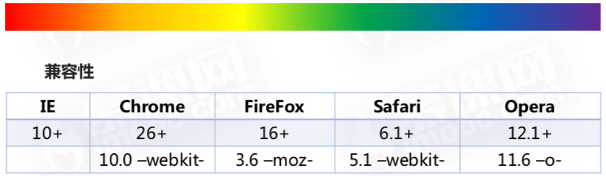
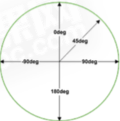

#	CSS3基础
##		C3选择器
###	子元素选择器
+	子元素选择器只能选择某元素的子元素
+ 	语法: 父元素 > 子元素
+  兼容性: ie8以上

###	相邻兄弟元素选择器
+	相邻兄弟选择器可以选择紧接在另一个元素后的元素, 而且他们具有一个相同的父元素
+ 	语法: 元素 + 兄弟相邻元素
+  兼容性: ie8以上

###	通用兄弟选择器
+	选择某元素后面的所有兄弟元素, 而且他们具有一个相同的父元素
+	语法: 元素 ~ 后面所有兄弟相邻元素
+ 	兼容性: ie8 以上

###	群组选择器
+	群组选择器是将具有相同样式的元素分组在一起, 每个选择器之间使用,隔开
+ 	语法: 元素1, 元素2,...,元素n
+  兼容性: ie6以上

###	属性选择器
+	对带有指定属性的html 元素设置样式
	-	使用C3属性选择器, 你可以只指定元素的某个属性, 或者你还可以同时指定元素的某个属性和其对应的属性值

####	Element[attribute]
+	选择所有带有attribute属性元素
+ 	兼容性: ie8以上

####	Element[attribute="value"]
+	选择所有带有attribute="value"属性元素
+ 	兼容性: ie8以上

####	Element[attribute~="value"]
+	选择attribute属性包含单词"value" 的元素
+ 	兼容性: ie8以上

####	Element[attribute^="value"]
+	选择attribute属性以单词"value" 开头的元素
+ 	兼容性: ie8以上

####	Element[attribute$="value"]
+	选择attribute属性以单词"value" 结尾的元素
+ 	兼容性: ie8以上

####	Element[attribute*="value"]
+	选择attribute属性包含"value" 所有的元素
+ 	兼容性: ie8以上

####	Element[attribute|="value"]
+	选择attribute属性以"value" 或"-value"开头的元素
+ 	兼容性: ie8以上

###	伪类选择器
####	动态伪类
这些伪类并不存在html中, 只有当用户和网站交互的时候才能体现出来

+	锚点伪类
	-	:link
	- 	:visited
+	用户行为伪类
	-	:hover
	- 	:active
	-  :focus

####	UI元素状态伪类
+	我们把 :enabled, :disabled, :checked 伪类称为ui元素状态伪类
+	ie9+

####	css3结构类
+	c3的:nth选择器
	-	我们把c3的:nth选择器也称为c3结构类

#####	element:first-child
+	选择属于其父元素的首个子元素的每个element元素
+	ie8+

#####	element:last-child
+	选择属于其父元素的最后一个子元素的element元素
+	ie8+

#####	element:nth-child(N)
+	:nth-child(N) 选择器匹配属于其父元素的第N个子元素, 不论元素的类型
+	ie9+, firefox4+

#####	关于参数(N)
+	element:nth-child(number)
	-	选择某元素下的第number(具体数字)个element元素
+	element:nth-child(n)
	-	n是一个简单表达式, 取值从0开始计算, 这里只能是n, 不能用其他字母代替
+	element:nth-child(odd),element:nth-child(even)
	-	odd, even是可用于匹配下标是奇数或者偶数的element元素的关键字

#####	element:nth-last-child(N)
+	匹配属于其元素的第N个子元素的每个元素, 不论元素的类型,从最后一个子元素开始计数
+ 	兼容性: ie9+, firefox4+

#####	element:nth-of-type(N)
+	:nth-of-type(N)选择器匹配属于父元素的特定类型的第N个子元素的每个元素
+ 	兼容性: ie9+, firefox4+

#####	element:nth-last-of-type(N)
+	匹配属于父元素的特定类型的第N个子元素的每个元素, 从最后一个子元素开始计数
+ 	兼容性: ie9+, firefox4+

#####	element:first-of-type
+	:first-of-type 选择器匹配属于其元素的特定类型的首个子元素的每个元素
+ 	兼容性: ie9+

#####	element:last-of-type
+	: last-of-type 选择器匹配属于其元素的特定类型的最后一个子元素的每个元素
+ 	兼容性: ie9+

#####	element:only-child
+	:only-child 选择器匹配属于其父元素的唯一子元素的每个元素
+ 	兼容性: ie9+

#####	element:only-of-type
+	:only-of-type 选择器匹配属于其父元素的特定类型的唯一子元素的每个元素
+ 	兼容性: ie9+, firefox4+

#####	element:empty
+	:empty 选择器匹配没有子元素(包括文本节点)的每个元素
+ 	兼容性: ie9+

#####	否定选择器(:not)
+	:not(Element/selector) 选择器匹配非指定元素/选择器的每个元素
+ 	语法: 父元素:not(Element/selector)
+ 	兼容性: ie9+

####	伪元素
+	css伪元素用于向某些选择器设置特殊效果
+ 	语法: 元素::伪元素 
+ 	兼容性: ie9+

#####	伪元素-Element::first-line
+	根据first-line 伪元素中的样式对 Element 元素的第一行文本进行格式化
+	first-line 伪元素只能用于块级元素

#####	伪元素-Element::first-letter
+	用于向文本的首字母设置特殊样式
+	first-letter 伪元素只能用于块级元素

#####	伪元素-Element::before
+	在元素的内容前面插入新内容
+	常用content配合使用

#####	伪元素-Element::after
+	在元素的内容后面插入新内容
+	常用content配合使用, 多用于清除浮动

#####	伪元素-Element::selection
+	用于设置在浏览器中选中文本后的背景色和前景色
+	::selection 在ie家族中, 只有ie9+版本支持, 在firefox中需要加上其前缀"-moz"

###	css权重
####	什么是权重
当很多的规则被应用到某一个元素上时, 权重是一个决定哪种规则生效, 或者是优先级的过程

####	权重等级与权重
行内样式(1000) > id选择器(100) > 类, 属性选择器和伪类选择器(10) > 元素和伪元素(1) > *(0)

####	权重计算口诀
从0开始, 一个行内样式+1000, 一个id+100, 一个属性选择器,class或者伪类 + 10, 一个元素名或者伪元素+1

###	权重规则
+	包含更高权重选择器的一条规则拥有更高的权重
+ 	id选择器的权重比属性选择器高
+  带有上下文关系的选择器比单纯的元素选择器权重更高
+  与元素挨得近的规则生效
+  最后定义的这条规则则会覆盖上面与之冲突的规则
+  无论多少个元素组成的选择器,都没有一个class选择器权重高
+  通配符选择器的权重是0, 被继承的css属性也带有权重, 权重也是0

##	背景
###	背景图像区域
+	background-clip 属性指定背景绘制区域
+ 	语法: background-clip:border-box | padding-box | content-box
+  兼容性: ie9+

###	背景图像定位
+	background-origin 指定background-position属性应该是相对位置
+ 	语法: background-origin:border-box | padding-box | content-box
+  兼容性: ie9+, firefox4+, safari5+

###	背景图像大小
+	background-size 属性指定背景图片大小
+ 	语法: background-size: length | percentage | cover | contain
+  兼容性: ie9+, firefox4+, safari5+

###	多重背景图像
+	css3允许为元素使用多个背景图像
+ 	语法: background-imgage: url(),url()

###	背景属性整合
+	背景缩写属性可以在一个生命中设置所有的背景属性
+ 	语法: background: color position size repeat origin clip attachment image;

## 渐变
渐变可以在两个或多个指定的颜色之间显示平稳的过度


###	线性渐变
+	是沿着一根轴线改变颜色,从起点到终点颜色进行顺序渐变(从一边拉向另一边)
+	语法: background: linear-gradient(direction, color1, color2...)

####	从上到下(默认)
background: linear-gradient(color1, color2...)

####	从左到右
```css
background:  	-webkit-linear-gradient(begin-direction, color1, color2...)
background: 		-moz-linear-gradient(end-direction, color1, color2...)
background: 		  -o-linear-gradient(end-direction, color1, color2...)
background: 			  linear-gradient(to end-direction, color1, color2...)
```

####	对角
```css
background:  	-webkit-linear-gradient(begin-level begin-vertical, color1, color2...)
background: 		-moz-linear-gradient(end-level end-vertical, color1, color2...)
background: 		  -o-linear-gradient(end-level end-vertical, color1, color2...)
background: 			  linear-gradient(to end-level end-vertical, color1, color2...)

```
#### 使用角度
+	语法: background :linear-gradient(angle, color1, color2...)
+	角度是指水平线和渐变线之间的角度, 逆时针方向计算, 0deg将创建一个从下到上的渐变, 90deg将创建一个从左到右的渐变



####	颜色节点
+	语法: background :linear-gradient(color1 length | percentage, color2 length | percentage,...)

####	重复渐变
+	语法: background :repeating-linear-gradient(color1 length | percentage, color2 length | percentage,...)

###	径向渐变
+	从起点到终点颜色从内到外进行圆形渐变(从中间向外拉)
+	语法: background : radial-gradient(center, shape size, start-color, last-color)

####	颜色节点均匀分布(默认)
background : radial-gradient(start-color, last-color)

####	颜色节点不均匀分布
background : radial-gradient(color1 length | percentage, color2 length | percentage,...)

####	设置形状
background : radial-gradient(shape size, start-color, last-color)

+	circle 圆形
+ 	ellipse	椭圆(默认)

####	尺寸大小关键字
background : radial-gradient(size, start-color, last-color)

+	closest-side: 最近边
+ 	farthest-side: 最远边
+  closest-corner: 最近角
+  farthest-Corner: 最远角

####	重复渐变
background : repeating-radial-gradient(color1 length | percentage, color2 length | percentage,...)


##	 边框和圆角
###	border-radius属性
+	一个最多可指定四个border-*-redius属性的复合属性, 这个属性允许你为元素添加圆角边框
+	border-radius:1-4 length|% / 1-4 length | %
+ 	兼容性: ie9+, firefox4+, safari5+

###	指定每个圆角
####	多值
+	四个值:	左上角, 右上角, 右下角, 左下角
+ 	三个值:	左上角, 右上角和左下角, 右下角
+  两个值:	左上角和右下角, 右上角和左上角
+  一个值:四个圆角值相同

#### 属性
+	border-top-left-radius:			定义了左上角的弧度
+	border-top-right-radius:		定义了右上角的弧度
+	border-bottom-right-radius:	定义了右下角的弧度
+	border-bottom-left-radius:		定义了左下角的弧度


###	边界图片
+	使用border-image-* 属性来构建美丽的可扩展按钮
+	语法 border-image: source slice width outset repeat;
+ 	兼容性: ie不兼容, safari6+

####	border-image-source
+	border-image-source属性指定要使用的图像, 而不是由border-style属性设置的边框样式
+	border-image-source: none | image

####	border-image-slice
+	border-image-slice属性指定图像的边界向内偏移
+	border-image-slice: number | % | fill

####	border-image-width
+	border-image-width属性指定图像的边界的宽度
+	border-image-width: number | % | auto

####	border-image-outset
+	border-image-outset 用于指定在边框外部绘制border-image-area的量
+	border-image-outset: number | length

####	border-image-repeat
+	border-image-repeat 属性指定图像的边界是否重复(repeated), 拉伸(stretched), 铺满(rounded)
+	border-image-repeat: stretch | repeat | round | initial | inherit

##	盒阴影
+	box-shadow属性可以设置一个或多个下拉阴影的框
+	语法: box-shadow: h-shadow v-shadow blur spread color inset;
+ 	兼容性: ie9+, firefox4+, safari5+

##	文本样式
###	文本阴影 text-shadow
+	语法: text-shadow: h-shadow v-shadow blur color;
+ 	兼容性: ie10+, firefox3.5+, chrome4+, safari4+, opera9.5+

###	换行- word-break
+	规定自动换行的处理方法
+	语法: word-break:normal | break-all | keep-all
+ 	兼容性: ie5.5+, firfox 15+, chrome4+, safari3.1+, opera15+

###	换行- word-wrap
+	允许长单词或url地址换行到下一行
+	语法: word-break:normal | break-word 
+ 	兼容性: ie5.5+, firfox 3.5+, chrome23+, safari6.1+, opera12.1+

###	新文本属性 text-align-last
+	规定如何对齐文本的最后一行
+	text-align-last: auto | left | right |center |justify | start | end | initial | inherit;
+ 	兼容性: ie支持, firfox加前缀-moz, chrome50+
+  注意: text-align-last只有在text-align属性设置为justify时才起作用

###	新文本属性 text-emphasis
+	向元素的文本应用重点标记以及重点标记的前景色
+	text-emphasis: text-emphasis-style text-emphasis-color;
+ 	兼容性: 任何浏览器都不支持

###	新文本属性 text-justify
+	规定当text-align被设置为justify 时的对齐方式
+	text-justify: auto | inter-word | inter-ideograph | inter-cluster| distribute | kashida | trim;
+ 	兼容性: 只有ie支持

###	新文本属性 text-overflow
+	规定当文本溢出包含元素时发生的事情
+	text-overflow:  clip | ellipsis | string
+ 	兼容性: ie6.0+ firefox7+, chrome4+, safari3.1+, opera11.1+

##	过渡
+	允许css的属性值在一定的时间区间内平滑的过渡
+ 	在鼠标单击, 获得焦点, 被点击或对元素任何改变中触发, 并圆滑的以动画效果改变css的属性值
+  兼容性: ie10+, firefox16+, chrome26+, safari6.1+, opera12.1+

###	transition-property
检索或设置对象中的参与过渡的属性

+	语法:transition-property: none|all|property
+ 	none: 没有属性改变
+  all: 所有属性改变, 默认值
+  property: 元素属性名

###	transition-duration
检索或设置对象过渡的持续时间

+	语法:transition-duration: time
+ 	规定完成过渡效果需要的时间(秒或毫秒)
+  默认值0

###	transition-timing-function
检索或设置对象过渡的动画类型

+	语法:transition-timing-function: ease | linear | ease-in | ease-out | ease-in-out
+	参数
	-	linear	线性过渡
	- 	ease	平滑过渡
	-  ease-in	由慢到快
	-  ease-out	由快到慢
	-  ease-in-out	由慢到快再到慢
	-  cubic-bezier(n,n,n,n) 特定的贝塞尔曲线类型, 4个值在[0,1]区间内

###	transition-delay
检索或设置对象延迟过渡的时间

+	语法:transition-delay: time
+ 	规定秒或毫秒数之前要等待切换效果开始
+  默认值0

###	transition
复合属性, 检索或设置对象变换时的过渡

+	语法:transition: property duration timing-function delay

##	动画
+	动画可以定义为使用绘画的手法, 创造生命运动的艺术
+	兼容性: ie10+, firefox16+, chrome43+, safari9+, opera30+, android(-webkit-) 
+	使元素从一种样式逐渐变化为另一种样式的效果

###	视觉暂留原理
人类具有 视觉暂留 的特性, 人的眼睛看到一幅画或一个物体后, 在0.34秒内不会消失

###	动画原理
通过把人物的表情, 动作, 变化等分解后画成许多动作瞬间的画幅, 利用视觉暂留的原理, 在一幅画还没有消失前播放下一幅画, 就会给人造成一种流畅的视觉变化的效果

### animation-duration
+	检索或设置对象动画的持续时间
+	animation-duration: time
+ 	time指定动画播放完成花费的时间, 默认值为0, 意味着没有动画效果


### animation-timing-function
+	检索或设置对象动画的过渡类型
+	animation-timing-function: ease | linear | ease-in | ease-out | ease-in-out
+	参数
	-	linear	线性过渡
	- 	ease	平滑过渡
	-  ease-in	由慢到快
	-  ease-out	由快到慢
	-  ease-in-out	由慢到快再到慢
	-  cubic-bezier(n,n,n,n) 特定的贝塞尔曲线类型, 4个值在[0,1]区间内

###	animation-delay
检索或设置对象动画的延迟时间

+	语法:transition-delay: time
+ 	可选. 定义动画开始前等待的时间, 以秒或毫秒计, 默认值为0

###	animation-iteration-count
检索或设置对象动画的循环次数

+	语法:animation-iteration-count:infinite | <number>
+ 	number为数字, 默认为1, infinite为无限次数循环

###	animation-direction
检索或设置对象动画在循环中是否反向运动

+	语法:animation-direction:normal | reverse | alternate | alternate-reverse | initial | inherit;
+ 	normal: 正常方向
+ 	reverse:反方向运行
+ 	alternate:	动画先正常运行在反方向运行, 并持续交替运行
+ 	alternate-reverse:	动画先反向运行在正方向运行, 并持续交替运行

###	animation-fill-mode
规定当动画不播放时(当动画完成或当动画有延迟未开始播放时), 要应用到元素的样式

+	语法:animation-fill-mode: none| forwards | backwards| both | initial | inherit
+ 	normal: 默认值, 不设置对象动画之外的状态
+ 	forwards:设置对象状态为动画结束时的状态
+ 	backwards:	设置对象状态为动画开始时的状态
+ 	both:	设置对象状态为动画结束活开始的状态

###	animation-play-state
指定动画是否正在运行或已暂停

+	语法:animation-play-state: paused | running
+ 	paused:指定暂停动画
+  running:默认值, 指定正在运行的动画

###	animation
animation: name duration timing-function delay iteration-count direction fill-mode play-state

###	@keyframes
关键帧, 可以指定任何顺序排列来决定animation动画变化的关键位置

+	使用说明
	-	使用@keyframes规则创建动画, 通过逐步改变从一个css样式设定到另一个
	- 	在动画过程中可以通过@keyframes规则多次更改css样式的设定

#### 语法
```css
@keyframes animationname{
	keyframes-selector{
		css-styles;
	}
}
```

+	animationname: 必填项, 定义动画的名称
+ 	keyframes-selector:	必填项, 动画持续时间的百分比, 1-100%, from(0%), to(100%)
+  css-styles: 必填项, 一个或多个合法的css样式属性

##	转换
###	transform
+	让元素在一个坐标系统中变形, 这个属性包含一系列变形函数, 可以移动, 旋转, 和缩放元素
+	语法: transform: none | transform-function
+ 	兼容性: ie10+, firefox16+, chrome36+, safari16+, opera23+

###	2D转换
####	rotate
+	通过制定的角度参数对原元素制定一个2D rotation(2d旋转)
+	语法: transform: rotate(angle)
+ 	参数说明: angle指旋转角度, 正数标示顺时针旋转, 负数标示逆时针旋转

####	移动translate
translate()方法, 根据左(x轴)和顶部(Y轴)位置给定的参数, 从当前元素位置移动

+	translateX(x) 仅水平方向移动, X轴移动
+	translateY(y) 仅垂直方向移动, Y轴移动
+	translate(x,y) 水平方向,和垂直方向同时移动(也就是X轴和Y轴同时移动)

###	缩放scale
scale()方法, 指定对象的2d scale (2d缩放)

+	transform: scaleX(x) 元素仅水平方向缩放(x轴缩放)
+	transform: scaleY(y) 元素仅垂直方向缩放(y轴缩放)
+	transform: scale(x,y) 使元素水平方向和垂直方向同时缩放(x,y轴同时缩放)


