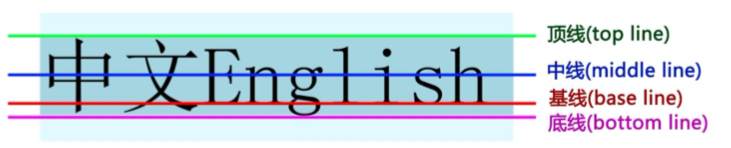
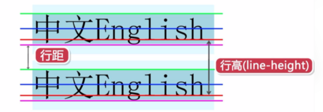
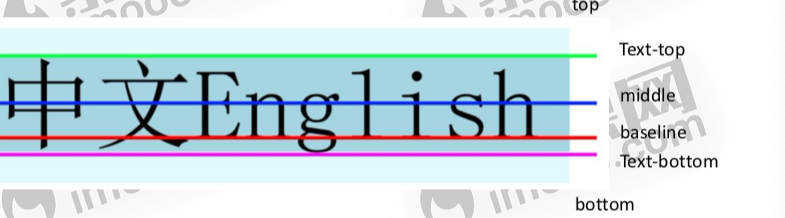
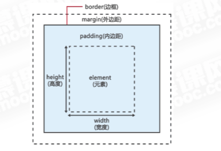

#	css基础
##	html, css, js的关系
+	html是网页内容的载体
+ 	css样式是表现(外观控制)
+  js是行为, 用来实现网页的特效效果

##	什么是css
+	css 层叠样式表(Cascading Style Sheets)
+ 	用于定义html内容在浏览器内的显示样式

##	为什么使用css
+	css简化html相关标签, 网页体积小, 下载快
+ 	解决内容与实现分离的问题
+  	更好的维护网页, 提高工作效率

##	css样式规则
+	css规则由两部分构成: 选择器, 声明
``` 选择器 {属性: 值} ```

##	css引用
+	写在head标签内

```css
<style type="text/css">
	css样式
</style>
```

##	css注释
+	``` /* 注释内容 */ ```

##	如何引用css样式
+	行内样式(内联样式)
+ 	内部样式表(嵌入样式)
+  外部样式表(link链入)
+  导入式(@import)

###	行内样式
在开始标签内添加style样式属性

```css
<p style="color:red;">内容</p>
```

###	内部样式
+	内部样式, 把css样式代码卸载style标签内
+ 	style标签放在head标签之间

```css
<style type="text/css">
	样式
</style>
```

###	css外部样式
+	外部样式表, 把css样式代码写在独立的文件中
+ 	扩展名 css文件名.css
+  引入外部文件```<link href="xx.css" rel="stylesheet" type="text/css">```
+  link标签放在head标签之间

###	css导入式
+	@import "外部css样式"
+ 	@import url(外部css样式)
+  @import 写在style标签内最开始

###	css使用方法区别

| 类别|引入方法|位置 | 加载|
| :-- | :-- | :-- | :-- |
|行内样式 | 开始标签内style | html文件内 | 同时 |
|内部样式| head中style内 | html文件内 | 同时 |
|外部样式| head中link内	| css样式文件与html文件分离 | 页面加载时, 同时加载css样式|
| 导入式@import | 在样式代码最开始处 | css样式文件与html文件分离 | 在读取完HTML文件之后加载|

##	css使用方法优先级
##	 行内样式 > 内部样式 > 外部样式
+	链入外部样式表与内部样式表之间的优先级取决于所处位置的先后
+ 	最后定义的优先级最高(就近原则)

##	css选择器
###	标签选择器
+	以HTML标签作为选择器

```css
p{font-size: 30px;}
```

###	全局选择器
+	所有标签设置样式

```css
*{color: blue}
```

###	类选择器
+ 	为html标签添加class属性, 通过类选择器来为具有此class属性的元素设置css样式

```css
<p class="red">内容</p>
.red{color: red}
```

+	可对不用类型元素的同一个名称的类选择器设置不同的样式规则

```css
<h1 class="red">h1</h1>
<p class="red">pp</p>

p.red{font-size: 40px;}
h1.red{font-size: 20px;}
```

+	同一个元素可以设置多个类, 之间用空格隔开

```html
<p class="red fsize">ppp</p>
```
###	群组选择器
+	集体统一设置样式

```css
p,h1,h2{font-size: 40px}
```

###	ID选择器
+	为html标签添加id属性

```html
<p id="p1">内容</p>
```

+	通过id选择器来为具有此id的元素设置css规则

```css
#p1{color: red}
```
###	后代选择器
+	使用后代选择器设置, 之间用空格隔开

```css
p em{font-size: 40px}
```

+	后代选择器可以多层

```css
p a em{...}
#p1 em {...}
p.red a em{...}
```

## 伪类
###	伪类链接
链接的4种状态: 激活状态(:active), 已访问状态(:visited), 未访问状态(:link), 和鼠标悬停状态(:hover)

###	伪类:hover和:active
+	:hover用于访问的鼠标经过某个元素时
+ 	:active用于一个元素被激活时,(即按下鼠标之后放开鼠标之前的时间)

```css
p:hover{color:red}
p:active{font-size: 20px;}
```

+	ie6及更早版本, 支持a元素的4中状态
+ 	Ie6浏览器不支持其他元素的:hover和:active

###	链接伪类的顺序
+	:link > :visited > :hover > :active
+ 	a:hover 必须置于a:link 和 a:visited之后,才有效
+  a:active 必须置于a:hover之后才有效
+  伪类名称对大小写不敏感

##	css继承和重叠
###	css继承
+	从父元素那集成部分css属性

###	css层叠
+	可以定义多个样式
+ 	不冲突时, 多个样式可层叠为一个
+  冲突时,按不同样式规则优先级来应用样式

###	css优先级
+	行内样式 > 内部样式 > 外部样式
+ 	链入外部样式表与内部样式表之间的优先级取决于所处位置的先后
+  最后定义的优先级最高(就近原则)

###	css优先级规则
同一样式表中

+	权值相同: 就近原则
+ 	权值不同: 根据权值来判断css样式, 哪种css样式权值高, 就是用哪种样式

###	选择器权值
+	标签选择器: 权值为1
+ 	类选择器和伪类: 权值为10
+  id选择器: 权值为100
+  通配符选择器: 权值为0
+  行内样式: 权值为1000

###	权值规则
+	统计不用选择器的个数
+ 	每类选择器的个数乘以相应权值
+  把所有的值相加得出选择器的权值

```css
#main div.warning h2{...}
id: 1 => 1 * 100 = 100
class: 1 => 1 * 10 = 10
标签:2 => 2 * 1 = 2 
权值: 100 + 10 + 2 = 112
```

###	!important规则
+	可调整样式规则的优先级
+ 	添加在样式规则之后, 中间用空格隔开

```css
div{color: red !important;}
```

###	css优先级总结
+	!important声明最高
+ 	css使用方法的优先级
	-	行内样式> 内部样式 > 外部样式
	- 	link链入外部样式和style内部样式优先级, 取决于先后顺序
+	样式表中优先级
	-	id选择器 > class选择器 > 标签选择器 > 通配符

###	css样式命名规则
+	采用英文字母, 数字, 以及 - 和 _ 命名
+ 	以小写字母开头, 不能以数字和 - 或 _ 开头
+  命名形式: 单字, 连接符, 下划线, 驼峰

##	字体和文本样式
###	文字样式属性
| 类型 | 属性 |
|:-- | :-- |
| 字体 | font-family |
|文字大小| font-size |
|文字颜色|font-color |
|文字粗细|font-weight |
|文字样式|font-style |

####	font-family字体属性
定义元素内文字以什么字体来显示

+	语法
	-	font-family:[字体1][,字体2][...]
+	说明
	-	含空格字体名和中文, 用英文引号(")括起来
	- 	多个字体, 用英文逗号 , 隔开
	-  引号嵌套, 外使用双引号, 内使用单引号
+	font-family属性值: 具体属性名, 字体集
	-	Serif
	- 	Sans-serif
	-  Monospace
	-  Cursive
	-  Fantasy

```css
span{font-family : "微软雅黑","宋体"}
p.serif{font-family:"Times New Roman",Times,serif;}
p.sansserif{font-family:Arial,Helvetica,sans-serif;}
```

####	font-size文字大小
定义元素内文字大小: font-size: 绝对单位 | 相对单位

+	开发中没有用绝对单位的cm之类的
+ 	相对单位 px, em , % => 见名知意

####	color文字颜色
定义元素内文字颜色: color: 颜色名 | 十六进制 | RGB

####	文字粗细
+	为元素内文字设置粗细
+	语法
	-	font-weight: normal | bold | bolder | lighter | 100~900
	- 	默认值 normal
	-  400 等同于normal
	-  700 等同于bold
	-  根据浏览器 设备原因, 某些数值看起来并没有区别

####	font-style 文字样式
为元素内文字设置样式: font-style: normal | italic | oblique

####	font-variant字体变形
设置元素中文本为小型大写字母: font-variant: normal | small-caps

####	font属性(简写)
+	font: font-style font-variant font-weight font-size/line-height font-family
+ 	值之间空格隔开
+  注意书写顺序

##	css文本样式
###	text-align
+	设置元素内文本的水平对齐方式
+ 	text-align: left, right, center, justify
+  该属性对块级元素设置有效

###	line-height属性
+	设置元素中文本行高
+ 	line-height: 长度值 | 百分比
+  一行文字的高度, 行高指文本行的基线间的距离
+  基线并不是汉字文字的下沿



####	行高和行距


###	vertical-align属性
+	设置元素内容的垂直方式
+	vertical-align: baseline | sub | super | top | text-top | middle | bottom | text-bottom | 长度 | 百分比



### css文本样式属性
| 字体属性 | 描述 | 
| :-- | : -- |
| word-spacing | 设置元素内单词之间的间距 |
|letter-spacing | 设置元素内字母之间间距 |
| text-transform | 设置元素内文本的大小写capitalize | uppercase | lowercase | none |
|text-decoration | 设置元素内文本的装饰 underline | overline | line-through | blink | none |


##	盒子模型



###	宽度
+	宽度: width: 长度值 | 百分比 | auto
+ 	最大宽度: max-width: 长度值 | 百分比 | auto
+  最小宽度: min-width: 长度值 | 百分比 | auto

###	高度
+	高度: height: 长度值 | 百分比 | auto
+ 	最大高度: max-height: 长度值 | 百分比 | auto
+  最小高度: min-height: 长度值 | 百分比 | auto

###	哪些html元素可以设置高和宽
+	块级元素
	-	p, div, h1~h6, ul, li, ol, dl , dt, dd......
+	替换元素(行内元素)
	-	img, input, textarea...

###	边框属性
+	边框宽度: border-width: thin | medium | thick | 长度值
+ 	边框颜色: border-color: 颜色 | transparent
+  边框样式: border-style: 值 | none | hidden

| 值| 描述 | 
| :-- | :-- |
|none | 定义无边框, 默认值 | 
|hidden | 与none相同, 除非在表格元素中解决边框冲突时 | 
|dotten | 定义点状边框, 在大多数浏览器中是取为实线 | 
|dashed|定义虚线, 在大多数浏览器中取为实线 | 
|solid | 定义实线 | 
|double| 定义双线 | 

####	不同方向表示
border-[left | right | top | bottom]-width | color | style

####	边框缩写
border:[宽度] [样式] [颜色]

#####	不同方向
border-top | left | right | bottom: [宽度] [样式] [颜色]


###	内边距
+	设置元素的内容与边框之间的距离
+	padding-top| left | right | bottom: 长度值 | 百分比 (值不能为负值)

####	缩写
+	padding: 值1 // 4个方向都是值1
+	padding: 值1 值2 // 上下=值1, 左右=值2
+ 	padding: 值1 值2 值3 // 上=值1, 左右=值2, 下=值3
+  padding: 值1 值2 值3 值4 // 上=值1, 右=值2, 下=值3, 左=值4

###	外边距
+	设置元素与元素之间的距离
+ 	margin-top| left | right | bottom: 长度值 | 百分比 (值可以能为负值)

####	缩写
+	margin: 值1 // 4个方向都是值1
+	margin: 值1 值2 // 上下=值1, 左右=值2
+ 	margin: 值1 值2 值3 // 上=值1, 左右=值2, 下=值3
+  margin: 值1 值2 值3 值4 // 上=值1, 右=值2, 下=值3, 左=值4

####	外边距属性
+	默认情况下, 相应html块级元素存在外边距(body, h1~h6,p......)
+ 	声明margin属性, 覆盖默认样式
	-	body, h1,...{margin:0}

+	margin值为auto, 实现水平方向居中显示效果
+ 	垂直方向, 两个相邻元素都设置外边距, 外边距会发生合并
+  合并后外边距高度=两个发生合并外边距的高度中的最大值

###	盒子模型计算
+	在css中, width和height指的是内容区域的宽度和高度
+ 	增加内边距, 边框,外边距不会影响内容区域的尺寸
+  但会增加元素框的总尺寸
+  盒子在页面中所占的宽度 = 左边距+左边框+左填充 + 内容宽度 +右填充+右边框+右边距


####	display属性
+	inline
	-	元素将显示为内联元素, 元素前后没有换行符
+	block
	-	元素将显示为块级元素, 元素前后会带有换行符
+	inline-block
	-	行内快元素, 元素呈现为inline, 具有block相应特性
+	none
	-	此元素不会被显示

###	样式继承关系
|样式属性 | 继承 | 说明 | 
| :-- | :-- | :-- |
|width, height | 不继承, 块级元素, 替换元素 | 对于样式属性, 通过设置值为inherit,指定从父元素继承相对的属性值
|padding | 不继承 | div{padding: 10px;} |
|margin | 不继承 | div p{padding:inherit;}|
|border| 不继承| 


