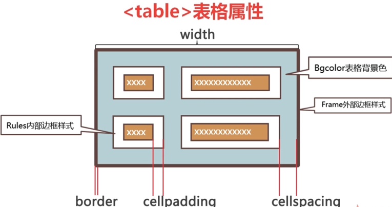

# 什么是HTML
HTML (Hypertext Markup Language) 即超文本标记语言

##	HTML 的特点
+ 不需要编译, 直接由浏览器执行
+ 是一个文本文件
+ 必须使用html或这htm为后缀
+ 大小写不敏感

##	HTML基本结构
+ 头部信息	
  + head标签内
+ 网页内容
  + 在body标签内

### 文本元素
  标签开始 + 内容 + 标签结束 = 一个元素

###	标签属性
  <标签名 属性名1="属性值">...</标签名>

## 	声明文档类型
+ ```<!DOCTYPE> ```声明必须放在HTML文档第一行
+ ```<!DOCTYPE>``` 声明不是HTML标签

##	网页编码设置
+ 在```<head></head>``` 标签中添加
+ ```<meta http-equiv="Content-Type" content="text/html;charset=utf-8">```

##	文字和段落
###	标题标签 
```<h1></h1>...<h6></h6>```

###	段落标签
```<p></p>```

###	换行
```<br/>```

###	文字斜体
```<i></i>, <em></em>```

###	加粗
```<b></b>, <strong></strong>```

###	上标, 下标
```<sub></sub> <sup></sup>```

###	插入内容, 删除内容
```<ins></ins> <del></del>```

###	特殊符号
 
| 属性 | 显示结果 | 描述 |
| :--  | :--		| :-- |
| &lt	 |    <    |小于号或显示标记 |
| &gt	 |    >    |大于号或显示标记 |
| &reg	 |    @R    |已注册 |
| &copy	 |    @C    |版权 |
| &trade	 |    ™    |商标 |
| &nbsp	 |    space    |不断行的空白 |

###	无序列表
+ ```<ul><li></li></ul>```
+ 更换前面的小图标 type值
  + disc 圆点
  + square 正方形
  + circle 空心圆

###	有序列表
+ ```<ol><li></li></ol>```
+ 更换前面的小图标
  + 1 数字1,2,3...
  + a 小写字母a,b,c...
  + A 大写字母A,B,C...
  + i 小写罗马数字
  + I 大写罗马数字

##	列表标签
+ 用```<dl>...</dl>``` 定义列表
+ 描述会自动缩进

```html
<dl>
	<dt>标题<dt>
	<dd>描述<dd>
  <dd></dd>
  <dt><dt>
	<dd><dd>
</dl>

```

##	图像标签
+ ``````
+ img的属性
  + src 必写 url 图片的地址
  + alt 文字, 图像代替文本
    + 网速太慢
    + src属性错误
    + 浏览器禁用图像
    + 用户无法查看图像, alt属性可以代替图像显示在浏览器中的内容
  + height 数值或百分比, 图像的高度
  + width 数值或百分比, 图像的宽

##	超链接标签
+ ```<a href="" >内容</a>```
+ href : 链接地址, 可以是内部链接活外部链接
  -	 如果要使用空连接,将href="#" 即可
+ target链接的目标窗口(_self, _blank, _top, _parent)
+ title 链接提示文字
+ name 链接命名(锚链接的原理)

### 定义锚链接
+ 定义锚链接```<a href="" name="锚名1">内容</a>```
+ 使用锚链接```<a href="#锚名1">内容</a>```

###	电子邮件链接
+ ```<a href="mailto:邮件地址">...</a>```

##	表格
+ table 代表表格
+ tr代表行
+ td代表单元格
+ th 代表表头, 内容居中, 加粗显示
+ caption 代表标题, 一个表格只能有一个标题, 且居中显示, 在table标签下面, tr之前定义

### 表格结构
+ 在html中table是作为一个整体进行渲染的, 如果表格够复杂就会延长渲染时间
+ 需要使用表格划分, 一块一块的加载进行展示

### 表格划分: 表头, 主体, 脚注
+ thead 表格的头, 放在表格的表头
+ tbody 表格的主体, 放数据主体
+ tfoot 表格的脚, 放表格的脚注
+ 以上三个并不会影响表格的外观 

###	表格属性
| 属性 | 值| 描述 |
| :--  | :--		| :-- |
|width	 |pixels, % | 规定表格的宽度|
|align	 |left, center, right| 表格相对周围元素的对齐方式|
|border	 |pixels| 规定表格边框的宽度|
|bgcolor	 |rgb(x,x,x), #xxx, colorname | 表格的背景颜色|
|cellpadding	 |pixels, % | 单元边沿与其他内容之间的空白|
|cellspacing	 |pixels, % | 单元格之间的空白|
|frame	 |属性值 | 规定外边框的哪个部分是可见的|
|rules	 |属性值 | 规定内边框的哪个部分是可见的|

####	frame 属性
| 值| 描述 |
| :--		| :-- |
|void| 不显示外侧边框|
|above| 显示上部的外侧边框|
|below| 显示下部的外侧边框|
|hsides| 显示上部和下部的外侧边框|
|vsides| 显示左边和右边的外侧边框|
|lhs| 显示左边的外侧边框|
|rhs|显示右边的外侧边框|
|box| 在所有四个边上显示外侧边框|
|border| 在所有四个边上显示外侧边框|

####	rules 属性
| 值| 描述 |
| :--		| :-- |
|none| 没有线条|
|groups| 位于行组合列组之间的线条|
|rows| 位于行之间的线条|
|cols| 位于列之间的线条|
|all| 位于行和列之间的线条|



###	tr属性
| 属性 | 值| 描述 |
| :--  | :--		| :-- |
|align	 |    left, center,right,justify, char    | 行内容的水平对齐 |
|valign	 |top, middle, bottom, baseline| 行内容的垂直对齐 |
|bgcolor	 |.rgb(x,x,x), #xxx, colorname(red)| 行的背景颜色 |

###	td和th标签属性
| 属性 | 值| 描述 |
| :--  | :--		| :-- |
|align	 |    left, center,right,justify, char    | 行内容的水平对齐 |
|valign	 |top, middle, bottom, baseline| 行内容的垂直对齐 |
|bgcolor	 |.rgb(x,x,x), #xxx, colorname(red)| 行的背景颜色 |
|width	 |%, pixels | 单元格的宽度 |
|height	 |%, pixels | 单元格的高度 |

###	thead, tbody, tfoot标签属性
| 属性 | 值| 描述 |
| :--  | :--		| :-- |
|align	 |    left, center,right,justify, char    | 行内容的水平对齐 |
|valign	 |top, middle, bottom, baseline| 行内容的垂直对齐 |

###	跨行,跨列
+	跨行属性: colspan
+ 	跨列属性: rowspan

##	表单
###	工作原理
+	访问一个包含表单的页面, 输入数据后, 提交表单
+ 	浏览器将用户在表单中输入的数据进行打包, 并发送给服务器
+  服务器接收数据并转由程序处理

###	语法
```js
<form action="" method="" name="">
	表单元素
</form>
```

| 属性 | 值 |描述 |
| :--  | :--		|:--		|
|action|url| 提交表单时向何处发送表单数据| 
|method|get, post| 设置表单以何种方式发送到指定页面| 
|name|form_name| 表单的名称| 
|target|_blank, _self, _parent, _top| 在何处打开action url| 
|enctype|application/x-www-form-urlencoded,multipart/form-data,text/plain| 在发送表单数据之前如何对其进行编码| 

####	post 和get的区别
+	Get: 使用url传递参数对所发送信息的数量也有限制, 一般用于信息获取
+ 	POST: 表单数据作为http请求体的一部分对所发送信息的数量无限制, 一般用于修改服务器上的资源

###	常用表单元素
| 标签 | 描述 |
| :--  | :--		|
|input	 |表单输入标签| 
|select|菜单和列表标签|
|option|菜单和列表项目标签|
|textarea|文字域标签|
|optgroup|菜单和列表项目分组标签|

#### input标签
| Type属性值 | 描述 |
| :--  | :--		|
|text	 |文字域| 
|password	 |密码域| 
|file	 |文件域| 
|checkbox	 |复选域| 
|redio	 |单选域| 
|button	 |按钮| 
|submit	 |提交按钮| 
|reset	 |重置按钮| 
|image	 |图像域| 
|hidden	 |隐藏域| 

####	单行文本域
| 属性 | 描述 |
| :--  | :--		|
|name	 |文字域的名称| 
|maxlength	 |指用户输入的最大字符长度| 
|size	 |指定文本框的宽度, 以字符个数为单位, 文本框的缺省宽度是20个字符| 
|value	 |指定文本框的默认值| 
|placeholder	 |规定用户填写输入字段的提示| 

#### 下拉菜单和列表标签
```js
<select>
	<option value="">选项</option>
</select>
```

#####	select标签属性
| 属性 | 描述 |
| :--  | :--		|
|name	 |设置下拉菜单和列表的名称| 
|multiple	 |设置可选择多个选项| 
|size	 |设置列表中可见选项的数目| 

#####	option标签属性
| 属性 | 描述 |
| :--  | :--		|
|selected	 |设置选项初始选中状态| 
|value	 |定义送往服务器的选项值| 

####	分组下拉菜单和列表标签
```js
<select>
	<optgroup label="组1">
		<option value="">选项</option>
		<option value="">选项</option>
	</optgroup>
</select>
```

####	多行文本域textarea
```js
<textarea name="" rows="" cols=""></textarea>
```

| 属性 | 描述 |
| :--  | :--		|
|name |设置文本区的名称| 
|placeholder	 |设置描述文本区域预期值的简短提示| 
|rows	 |设置文本区内的可见行数| 
|cols	 |设置文本区内的可见宽度| 

## div 和 span标签
+	div: 是一个区块容器标记, ```<div></div>``` 之间是一个容器, 可以包含段落, 表格, 图片等各种HTML元素
+ 	span: 没有实际意义, 为了应用样式

###	块级标签, 行内标签
+	块级标签: 占据一行 换行
+ 	行内标签: 在一行	不换行

###	常用的块级元素
div, ul, ol, li, dl, dt, dd, h1~h6, p, form , hr......

###	常用的行内元素
b, em, img, input, a, sup, sub, textarea, span......

## 标签嵌套规则
+	块级元素可包含行内元素和某些块级元素
+ 	行内元素不能包含块元素, 只能包含其他行内元素
+  块级元素不能放在p标签内
+  特殊块级元素只能包含行内元素, 不能在包含块级元素,如 h1~h6,p, dt
+  块级元素与块级元素并列, 行内元素和行内元素并列