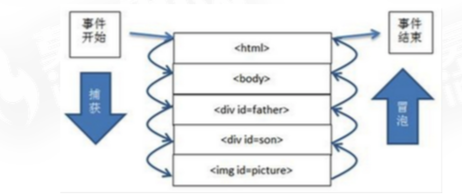
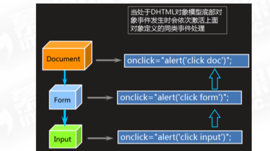

#	JS 基础
+	JavaScript 是一种基于对象和事件驱动的客户端脚本语言, 最初的设计是为了检验HTML表单输入的正确性
+ 	完整的JavaScript 是由ECMAScript(语法), Browser Object(DOM, BOM)特性组成的

##	使用JS
可以在head 或body中使用```<script>``` 嵌入JS脚本

##	JS注释与分号
```js
// 单行注释

/**/ 多行注释
```

语句结束使用分号, 如果省略, 则由解析器确定语句的结尾

##	JS的语法
ECMAScript 中的一切(变量, 函数名, 操作符) 都区分大小写

##	JS的标识符
+	变量, 函数, 属性的名字, 或者函数的参数
+ 	命名规则
	-	由字母, 数组, 下划线或者美元符号组成
	- 	不能以数字开头
	-  不能使用关键字, 保留字符作为标识符

###	变量
+	ECMAScript 的变量是松散类型
+ 	松散类型: 可以用来保存任何类型的数据 => 换句话说, 每个变量仅仅是一个用于保存值的占位符而已

####	变量的声明与赋值
+	变量声明: 变量的声明要使用var操作符, 语法: var 变量名
+ 	变量赋值: 声明的同时赋值: var 变量名 = 值
	-	先声明后赋值: 变量名 = 值
+	省略var声明的变量是全局变量
+ 	不推荐省略var操作符来定义全局变量
+  一次声明多个变量, 用逗号隔开
	-	```var id , sex, age, name = "marry"```

##	JS数据类型
+	ECMAScript 中有5种简单数据类型(也称为基本数据类型)
	-	Undefined, Null, Boolean, Number和String
+	复杂数据类型
	-	Object

###	typeof
+	语法: typeof 变量 或 typeof(变量)
+ 	功能: 检测变量类型
+  返回值: String类型, 值有可能是: string, number, boolean, object, undefined, function

###	undefined
+	undefined 类型只有一个值, 即特殊的undefined
+ 	一般而言, 不存在需要显示地把一个变量设置为undefined值的情况

###	null
+	null值表示一个空对象指针
+ 	如果定义的变量准备在将来用于保存独享, 那么最好将该变量初始化为null而不是其他值
+  undefined 值是派生自null 值的, 所以 undefined == null 的返回值是true

###	Number
+	表示整数和浮点数
+ 	NaN: 即非数值(Not a Number) 是一个特殊的数值
+  任何涉及NaN的操作(例如: NaN/10) 都会返回NaN
+  NaN与任何值都不相等, 包括NaN本身

####	isNaN()
+	语法: isNaN(n)
+ 	功能: 检测n是否是 "非数值" 返回值: boolean
+  参数: 参数n可以是任何类型
+  说明: isNaN()在接收到一个值之后, 会尝试将这个值转换为数值
+  某些不是数值的值会直接转换为数值 => "123"  == 123

####	数值转换
有3个函数可以把非数值转换为数值: Number(), parseInt() 和 parseFloat(). 其中Number()可以用于任何数据类型, 而parseInt()和parseFloat()则专门把字符串转换成数值

#####	parseInt()
+	会忽略字符串前面的空格, 直至找到第一个非空格字符
+	parseInt(): 转换空字符串返回NaN
+ 	parseInt(): 这个函数提供第二个参数: 转换时使用的基数(多少进制)

#####	parseFloat()
+	从第一个字符开始解析每个字符,直至遇到一个无效的浮点数字符为止
+ 	除了第一个小数点有效外, parseFloat()与parseInt()的第二个区别在于它始终都会忽略前导的零
+  如果字符串中包含有效的十六进制格式, parseInt('0xf')将'0x'转换为相同大小的十进制数值而parseFloat('0xf')只会输出0


###	String
String类型用于表示由零或多个16位Unicode字符组成的字符序列, 即字符串, 字符串可以由双引号(") 或单引号(')表示

####	toString()
+	语法: str.toString()
+ 	功能: 将str转换为字符串
+  返回值: str的一个副本
+  参数:	str是要转换的内容, 可以是数值, 布尔值,对象, 字符串
+  说明: 	在不知道要转换的值是不是null 或 undefined 的情况下, 还可以使用String() 函数, 他能够将任何类型的值转换为字符串

###	Boolean
用于表示真假的类型, 即true表示真, false表示假

####	类型转换
+	除0之外的所有数字, 转换为布尔型都为true
+ 	除""之外的所有字符,转换为布尔值都是true
+  null和undefined 转换为布尔型为false

##	表达式
将同类型的数据(常量, 变量, 函数), 用运算符号按一定的规则连接起来的, 有意义的式子称为表达式

###	递增和递减
####	递增
+	++a 与a++ 都是对a进行递增的操作
	-	++a先返回递增之后的a的值
	- 	a++先返回a的原值, 在返回递增之后的值
+	递减同理

##	操作符
###	赋值操作符
+	简单赋值: =
+ 	复合赋值: +=, -=, *=, /=, %=

###	比较操作符
+	==: 相等, 之比较值是否相等
+ 	===: 全等, 比较值的同时 比较数据类型是否相等
+  !=: 不相等, 比较值是否不相等
+  !==: 不全等, 比较值的同事比较数据类型是否不相等
+  返回值都是boolean型

###	三元操作符
+	语法
	-	``` 条件 ? 执行代码1 : 执行代码2 ```
+	说明
	-	可代替简单的if语句
	- 	如果条件成立, 执行代码1, 否则执行代码2

###	逻辑操作符
+	&& : 与
+ 	||	: 或
+  	! : 非

####	逻辑与
+	&& 与(只要有一个条件不成立, 返回false)
+	在有一个操作数不是布尔值的情况, 逻辑与操作就不一定返回值, 此时他遵循下列规则
	-	如果第一个操作数隐式类型转换后为true, 则返回第二个操作数
	- 	如果第一个操作数隐式类型转换后为false, 则返回第一个操作数
	-	如果有一个操作数是null, 则返回null
	- 	如果有一个操作数是NaN, 则返回NaN
	-  如果有一个操作数是undefined, 则返回undefined

#### 逻辑或
+	|| 或(只要有一个条件成立, 返回true)
+	在有一个操作数不是布尔值的情况, 逻辑或操作就不一定返回值, 此时他遵循下列规则
	-	如果第一个操作数隐式类型转换后为true, 则返回第一个操作数
	- 	如果第一个操作数隐式类型转换后为false, 则返回第二个操作数
	-	如果有两个操作数是null, 则返回null
	- 	如果有两个操作数是NaN, 则返回NaN
	-  如果有两个操作数是undefined, 则返回undefined

#### 逻辑非
+	无论操作数是什么数据类型, 逻辑非都会返回一个布尔值
+ 	!!同时使用两个逻辑非操作符时:
	-	第一个逻辑非操作会基于无论什么操作数返回一个布尔值
	- 	第二个逻辑非则对该布尔值求反


##	函数
通过函数可以封装任意多条语句,而且可以在任何地方,任何时候调用执行

###	函数的定义
+	函数使用function声明, 后跟一组参数以及函数体, 
+	语法 ```function name([arg0,arg1...argn]){statements}```
+ 	说明:	
	-	name 是要定义的函数名, 属于标识符
	- 	[]中arg0, arg1.... 为函数的参数, 不是必须的
	-  []只说明里面的内容不是必须的, 他不是语法

###	函数的调用
函数名(参数列表)

###	函数的返回值
+	任何函数在任何时候都可以通过return 语句后跟要返回的值来实现返回值
+	说明:
	-	函数会在执行完return语句之后停止并立即退出
	- 	return语句也可以不带有任何返回值, 一般用于需要提前停止函数执行而又不需要返回值的情况下

###	函数的参数
+	ECMAScript 中的参数在内部用一个数组来表示, 在函数体内通过arguments对象来访问这个数组参数
+	说明:
	-	arguments对象只是与数组类似, 并不是Array的实例
	- 	[]语法访问他的每一个元素
	-  length属性确定传递参数的个数


##	事件
事件是可以被JavaScript侦测到的行为, 通俗的讲就是当用户与web页面进行某些交互时, 解释器就会创建相应的event对象以描述事件信息

###	事件周期
+	解释器创建一个event对象后, 会按如下过程将其在html元素间进行传播
	-	第一阶段: 事件捕获, 事件独享沿DOM树向下传播
	- 	第二阶段: 目标出发, 运行事件监听函数
	-  第三阶段: 事件冒泡, 事件沿DOM树向上传播
	-  IE的事件模型中没有"事件捕获" 阶段



###	事件的冒泡处理机制



###	事件句柄
又称(事件处理函数, 事件监听函数), 指用于响应某个事件而调用的函数, 每一个事件均对应一个事件句柄, 在程序执行时, 将相应的函数或语句指定给事件句柄, 则在该事件发生时, 浏览器便执行指定的函数或语句

###	事件定义
####	直接在html中定义元素的事件相关属性
确定: 违反了 "内容与行为相分离" 的原则, 应尽可能少用
 
```
<button onclick="alert('hello')">按钮</button>
<body onload="init()">...</body>
```

####	DOM0级事件
+	在JavaScript 中为元素的事件相关属性赋值
+	缺点: 此语法实现了 "内容与行为相分离", 但是元素仍只能绑定一个监听函数
```
document.getElementById('btn').onclick=function(){}
document.body.onload = init
```

####	DOM2级事件
+	高级事件处理方式, 一个事件可以绑定多个监听函数
+	此语法可以为一个元素绑定多个监听函数, 但是需要注意浏览器兼容性问题

```js
btn.addEventListener('click', function(){},false)
btn.attachEvent('onclick', fucntion(){}) // IE
document.body.addEventListener("load", init)
document.body. btn.attachEvent("onload", init)
```

####	DOM0与DOM2级区别
+	DOM2支持同一dom元素注册多个同种事件
+ 	DOM2新增了捕获和冒泡的概念
+  DOM0级事件绑定: 只能给一个元素的某一个行为绑定一次方法, 第二次绑定的会把前面的覆盖掉
+  DOM2: 可以给某一个元素的同一个行为绑定多个不同的方法
+  说明(为什么没有DOM1级DOM): 1级DOM标准中并没有定义事件相关的内容所以没有所谓的1级DOM事件模型

#### DOM 事件流
#####	添加事件
+	语法: element.addEventListener(event, handler, useCapture)
+ 	功能: 用于向指定元素添加事件句柄, 可以为元素添加多个时间处理程序, 触发时会按照调价顺序依次中调用
+  参数
	-	event, 必须, 字符创, 指定事件名
	- 	handler, 必须, 指定要事件触发时执行的函数
	-  useCapture, 可选, 布尔值, 指定事件是否在捕获或冒泡阶段执行(默认false) true则表示在捕获阶段调用, false表示在冒泡阶段调用

#####	移除事件
+	语法: element.removeEventListener(event, handler, useCapture)
+	功能: 移除addEventListener() 方法添加的事件句柄, 不能移除匿名添加的函数
+ 	参数:
	-	event, 必须, 字符串, 要移除的事件名称
	- 	handler, 必须, 指定要移除的函数
	-  useCapture, 可选, 布尔值, 指定移除事件句柄的阶段

####	IE事件流
#####	添加事件
+	语法: element.attachEvent(event, handler)
+ 	功能: 用于向指定元素添加事件句柄, 可以为元素添加多个事件处理程序, 触发时会按照添加顺序依次调用
+  参数
	-	event, 必须, 字符创, 指定事件名, 必须加"on"前缀
	- 	handler, 必须, 指定要事件触发时执行的函数

#####	移除事件
+	语法: element.detachEvent(event, handler)
+	功能: 移除attachEvent() 方法添加的事件句柄, 不能移除匿名添加的函数
+ 	参数:
	-	event, 必须, 字符串, 要移除的事件名称
	- 	handler, 必须, 指定要移除的函数

####	兼容主浏览器的事件处理程序
```js
function addHandler(element, type, handler){
	if(element.addEventListener){
		element.addEventListener(type, handler, false)
	}else if(element.attachEvent){
		element.attachEvent('on'+type,handler)
	}else {
		element['on'+type] = handler
	}
}
```

####	event对象常用的属性和方法
| 属性 |	描述 |
| :-- | :-- |
| type | 事件类型 |
| srcElement/target | 事件源, 就是发生事件的元素|
| cancelBubble| 布尔属性, 设置为true的时候,将停止事件进一步冒泡到包容层次的元素, e.cancelBubble = true 相当于e.stopPropagation() |
|	returnValue | 布尔属性, 设置为false的时候可以组织浏览器执行默认的事件动作, e.returnValue = false, 相当于e.preventDefault() |
|clientX/clientY | 事件发生的时候, 鼠标相对于浏览器窗口可视文档区域的左上角的位置| 
| offsetX, offsetY | 事件发生的时候, 鼠标相对于事件源元素左上角的位置 | 

说明: event对象的所有属性列表可以在浏览器控制台中输出查看

####	常用事件类型
| 事件类型 |	描述 |
| :-- | :-- |
| onclick| 当用户点击某个对象时调用的事件句柄|
| onfocus| 元素获得焦点|
| onblur| 元素失去焦点|
| onmouseover| 鼠标移到某元素之上|
| onmouseout | 鼠标从某元素移开|
| onmousedown |鼠标按钮被按下 |
| onmousemove |鼠标被移开 |
| onmouseup | 鼠标按键被松开|
| onresize| 窗口或框架被重新调整大小|
| onsubmit| 表单提交|
| onkeydown| 某个键盘按键被按下|
| onkeypress| 某个键盘按键被按下并松开|
| onkeyup| 某个键盘按键被松开|
| touchstart| 手指触摸屏幕|
| touchmove| 手指在屏幕上滑动|
| touchend| 手指在屏幕上移开|

## 	JS内置对象
###		数组
创建数组的基本方式有两种

+	使用Array构造函数(new Array())
	-	预先知道数组要保存的项目数量
	- 	想Array构造函数中传递数组应包含的项
+	使用数组字面量表示法
	-	由一对包含数组项的方括号[] 表示, 多个数组项之间以逗号隔开

####	数组元素的读写
读取和设置值时, 使用方括号[] 并提供相应的索引(索引是从0开始的正整数)

####	数组的长度
+	语法: array.length
+ 	功能: 获取数组array的长度
+  返回值: number
+	说明: 
	-	通过设置length可以从数组的末尾移除项或向数组中添加新项
	-	当把一个值放在超出当前数组大小的位置上时, 数组就会重新计算其长度值, 长度值等于最后一项的索引 + 1

####	方法
#####	push
+	语法: arr.push(new1, new2...)
+ 	功能: 把他的参数顺序的添加到arr的尾部
+  返回值: 把指定的值添加到数组后的新长度

##### unshift()
+	语法: arr.unshift(new1, new2...)
+ 	功能: 把他的参数顺序添加到arr的开头
+  返回值: 把指定的值添加到数组后的新长度

#####	pop()
+	语法:	arr.pop()
+ 	功能: 删除arr的最后一个元素
+  返回值:  被删除的那个元素

##### shift()
+	语法: arr.shift()
+ 	功能: 删除arr中的第一个元素
+  返回值: 被删除的那个元素
 
##### join()
+	语法: arr.join(separator)
+ 	功能: 用于数组中的所有元素放入一个字符串以separator分割
+  返回值: 字符串

##### reverse()
+	语法: arr.reverse()
+ 	功能: 用于颠倒数组中元素的顺序
+  返回值: 数组

##### sort()
+	语法: arr.sort(sortby)
+ 	功能: 用于对数组的元素进行排序
+  	返回值: 数组
+   说明:
	-	即使数组中的每一项都是数值, sort()方法比较的也是字符串
	- 	sort() 方法可以接受一个比较函数作为参数

##### concat()
+	语法: arr.concat(arr1, arr2...)
+ 	功能: 用于连接两个或多个数组
+  返回值: 数组

##### slice()
+	语法:	arr.slice(start, end)
+ 	功能:	从已有的数组中返回选定的元素
+  参数: 
	-	start(必须): 规定从何处开始选取, 如果是负数, 那么它规定从数组尾部开始算起的位置
	- 	end(可选): 规定从何处结束选取, 该参数是数组片段结束处的数组下标
+	说明
	-	如果没有指定end, 那么切分的数组包含从start到数组结束的所有元素
	- 	如果slice() 方法的参数中各有一个负数, 则用数组长度加上该树来确定相应的位置
+  返回值:数组

##### splice()
######	删除
+	语法:	arr.splice(index,count)
+ 	功能:	删除从index处开始的0或多个元素
+  返回值:	含有被删除的元素的数组
+	说明: count是要删除的项目数量, 如果设置为0, 则不会删除项目, 如果不设置, 则删除从index开始的所有值

######	插入
+	语法: arr.aplice(index, 0, item1, item2,...)
+ 	功能:	在指定位置出入值
+  参数
	-	index: 起始位置
	- 	0	要删除的项数
	-  item1... 要插入的项
+  返回值: 数组


######	替换
+	语法:	arr.splice(index, count, item1, item2...)
+ 	功能:	在指定位置插入值, 且同时删除任意数量的项
+  参数
	-	index: 起始位置
	- 	count: 要删除项数
	-  item1, item2: 要出入的项
+  返回值: 从原始数组中删除的项(如果没有删除任何项, 则返回空数组)

##### 	indexOf()
+	语法:	arr.indexOf(searchValue, startIndex)
+ 	功能:	从数组的开头(位置0),或者startIndex 开始向后查找
+  参数
	-	searchValue: 必须, 要查找的项
	- 	startIndex: 可选, 起点位置的索引
+  返回值:	number, 查找的项在数组中的位置, 没有找到的情况下返回-1

#####  lastIndexOf()
+	语法:	arr.lastIndexOf(searchValue, startIndex)
+ 	功能:	从数组的末尾开始向前查找
+  参数
	-	searchValue: 必须, 要查找的项
	- 	startIndex: 可选, 起点位置的索引
+  返回值:	number, 查找的项在数组中的位置, 没有找到的情况下返回-1

##### 说明
+	在比较第一个参数与数组中的每一项时, 会使用全等操作符, 即要求查找的项必须严格相等
+ 	数组的位置方法是ECMAScript5为数组实例新增, 所以支持的浏览器有(ie9+, 其他现代浏览器)

###	String
####	charAt()
+	语法:	str.charAt(index)
+ 	功能:	返回str中index位置的字符
+  说明:	ECMAScript5中可使用"方括号加字符索引" 来访问字符串中特定的字符, 但是IE7及更早的浏览器会返回undefined

####	charCodeAt()
+	语法:	str.charCodeAt(index)
+ 	功能:	返回str中index位置的字符编码
+  说明:	ECMAScript5中可使用"方括号加字符索引" 来访问字符串中特定的字符, 但是IE7及更早的浏览器会返回undefined


####	indexOf()
+	语法:	str.indexOf('o')
+ 	功能:	从一个字符串中搜索给定的子字符串, 返回子字符串的位置
+  返回值: 数值
+  说明: 如果没有找到该子字符串,返回-1

####	lastIndexOf()
+	语法:	str.lastIndexOf('o')
+ 	功能:	从一个字符串中搜索给定的子字符串, 返回子字符串的位置
+  返回值: 数值
+  说明: 如果没有找到该子字符串,返回-1

####	slice()
+	语法: str.slice(start, end)
+ 	功能: 截取子字符串
+  参数
	-	start, 必须, 指定子字符串的开始位置
	- 	end, 可选, 表示子字符串到哪里结束, end本身不在截取范围之内, 省略时截取至字符串末尾
	-  当参数为负数时, 会将传入的负值与字符串的长度相加

####	substring()
+  说明: 语法及功能同slice完全一样
+  区别: 
	-	当参数为负数时, 自动将参数转换为0
	- 	substring()会将较小的树作为开始位置, 将较大的数作为结束位置

####	substr()
+	语法:	str.substr(start,len)
+ 	功能: 截取子字符串
+  参数
	-	start, 必须, 指定子字符串开始位置
	- 	len, 可选, 表示截取的字符总数, 省略时截取至字符串的末尾
	-  当start为负数时, 会将传入的负值与字符串的长度相加
	-  当len为负数时, 返回空字符串

####	split()
+	语法:	str.split(separator)
+ 	功能:	把一个字符串分割成字符串数组
+  说明: separator: 必须, 分隔符
+  返回值: Array

####	replace()
+	语法: str.replace(regexp/substr, replacement)
+ 	功能: 在字符串中用一些字符替换另一些字符, 或替换一个与正则表达式匹配的子串
+  返回值: String
+  参数
	-	regexp: 必须, 规定子字符串或要替换的模式的RegExp对象
	- 	replacement: 必须, 一个字符串值

####	toUpperCase() toLowerCase()
+	语法: str.toUpperCase()
+ 	功能: 把字符串转换为大写
+	语法: str.toLowerCase()
+ 	功能: 把字符串转换为小写

### Math
####	min()
+	语法: Math.min(num1, num2,...numN)
+ 	功能: 	求一组数中的最小值
+  返回值:	Number

####	max()
+	语法: Math. max(num1, num2,...numN)
+ 	功能: 	求一组数中的最大值
+  返回值:	Number

####	ceil()
+	语法: Math.ceil(num1)
+ 	功能: 	向上取整, 即返回大于num的最小整数
+  返回值:	Number

####	floor()
+	语法: Math.floor(num1)
+ 	功能: 	向下取整, 即返回num的整数部分
+  返回值:	Number

####	round()
+	语法: Math.round(num1)
+ 	功能: 	将数值四舍五入为最接近的整数
+  返回值:	Number

####	abc()
+	语法: Math.abs(num1)
+ 	功能: 	返回num的绝对值
+  返回值:	Number

####	random()
+	语法: Math.random()
+ 	功能: 	返回大于等于0小于1的一个随机数
+  说明:	求n到m之间的随机整数的公式

```js
random  = Math.floor(Math.random() * (m - n + 1) + n)
```

###	Date对象
####	创建日期对象
+	语法: new Date()
+ 	功能: 创建一个日期时间对象
+  返回值: 不传参的情况下, 返回当前的日期时间对象
+  说明: 
	-	如果想根据特定的日期和时间创建日期对象, 必须传入表示该日期的毫秒数或者是一组用逗号隔开的表示年月日时分秒的参数

####	获取年月日时分秒及星期的方法
+	getFullYear() : 返回4位数的年份
+ 	getMonth(): 		返回日期中的月份, 返回值是0-11
+  getDate(): 	返回月份中的天数
+  getDay():	返回星期, 返回值为0-6
+  getHours():	返回小时
+  getMinutes():	返回分
+  getSeconds():	返回秒
+  getTime(): 返回表示日期的毫秒数

####	设置年月日时分秒及星期的方法
+	setFullYear(year)	:	设置4位数的年份
+ 	setMonth(mon):	设置日期中的月份, 从0开始, 0 表示1月
+  setDate(): 设置日期
+  setDay(): 设置星期 ,从0 开始, 0 表示星期日
+  setHours():	设置小时
+  setMinutes():	设置分
+  setSeconds(): 设置秒
+  setTime() : 以毫秒数设置日期, 会改变整个日期


##	BOM
BOM(browser object model ) 浏览器对象模型

###	window
window是浏览器的一个实例, 在浏览器中, window对象有双重角色, 它既是通过JavaScript访问浏览器窗口的一个接口, 又是ECMAScript规定的Global对象

####	alert
+	语法:	window.alert(”content”) 
+ 	功能:显示带有一段消息和一个确认按钮的警告框 

####	confirm
+	语法:window.confirm(“message") 
+ 	功能:显示一个带有指定消息和OK及取消按钮的对话框 
+  返回值:
	-	如果用户点击确定按钮，则confirm()返回true
	-	如果用户点击取消按钮，则confirm()返回fals

####	prompt
+	语法:window.prompt(“text,defaultText") 
+ 	参数说明: 
	-	text:要在对话框中显示的纯文本(而不是HTML格式的文本) 
	- 	defaultText:默认的输入文本 
+	返回值:
	-	如果用户单击提示框的取消按钮，则返回null
	-	如果用户单击确认按钮，则返回输入字段当前显示的文本

####	open
+	语法:window.open(pageURL,name,parameters) 
+ 	功能:打开一个新的浏览器窗口或查找一个已命名的窗口 
+  参数说明:
	-	pageURL:子窗口路径
	-	name:子窗口句柄。
	-	parameters :窗口参数(各参数用逗号分隔)

####	close
+	语法:window.close( ) 
+ 	功能:关闭浏览器窗口

####	超时调用
+	语法:setTimeout(code,millisec) 
+ 	功能:在指定的毫秒数后调用函数或计算表达式
+	参数说明:
	-	1、code:要调用的函数或要执行的JavaScript代码串 
	- 	2、millisec:在执行代码前需等待的毫秒数 
+	说明:
	-	setTimeout()只执行code一次。如果要多次调用，请使用
	-	setInterval()或者让code自身再次调用setTimeout()

####	清除超时调用
+	语法:clearTimeout(id_of_settimeout) 
+ 	功能:取消由setTimeout()方法设置的timeout 
+  参数说明:
	-	1、 id_of_settimeout :由setTimeout()返回的ID值，该值标识要取消的延迟执行代码块

####	间歇调用
+	语法:setInterval(code,millisec) 
+ 	功能:每隔指定的时间执行一次代码
+	参数说明:
	-	1、code:要调用的函数或要执行的代码串。 
	- 	2、millisec:周期性执行或调用code之间的时间间隔，以毫秒计

####	清除间歇调用
+	语法:clearInterval(id_of_setInterval) 
+ 	功能:取消由clearInterval()方法设置的timeout 
+  参数说明:
	-	1、 id_of_setInterval :由clearInterval()返回的ID值，该值标识要取消的延迟执行代码块

###	 location对象
location对象提供了与当前窗口中加载的文档有关的信息，还提供了一些导航的功能，它既是window对象的属 性，也是document对象的属性

####	 location对象的常用属性
##### href
+	语法:location.href
+	功能:返回当前加载页面的完整URL
+	说明: location.href与window.location等价 

##### hash
+ 	语法:location.hash
+	功能:返回URL中的hash(#号后 跟零或多个字符)，如果不包含 则返回空字符串。

##### host
+	语法:location.host 
+ 	功能:返回服务器名称和端口号(如果有)

##### hostname
+	语法:location.hostname 
+ 	功能:返回不带端口号的服务器名称。

##### pathname
+	语法:location.pathname 
+ 	功能:返回URL中的目录和(或)文件名。

##### port 
+ 	语法:location.port 
+  	功能:返回URL中指定的端口号，如果没有，返回空字符串。

##### protocol
+ 	语法:location.protocol
+ 	功能:返回页面使用的协议。

##### search
+ 	语法:location.search 
+  	功能:返回URL的查询字符串。这个字符串以问号开头。

#####  replace
+ 	语法:location.replace(url)
+	功能:重新定向URL。
+	说明: 使用location.replace不会在历史记录中生成新纪录。 

#####  reload
+	语法:location.reload()
+	功能:重新加载当前显示的页面。
+	说明:
	-	location.reload()有可能从缓存中加载
	-	location.reload(true)从服务器重新加载

###	 history历史对象
####	back
+	语法:history.back() 
+ 	功能:回到历史记录的上一步 
+  	说明:相当于使用了history.go(-1)

####	forward
+	语法:history.forward() 
+ 	功能:回到历史记录的下一步 
+  	说明:相当于使用了history.go(1)

####	go
+	语法:history.go(-n) 
+ 	功能:回到历史记录的前n步
+	语法:history.go(n) 
+ 	功能:回到历史记录的后n步

###	 Screen对象属性
####	availWidth 
+	语法:screen.availWidth 
+ 	功能:返回可用的屏幕宽度 

####	availHeight
+ 	语法:screen.availHeight 
+ 	功能:返回可用的屏幕高度

###	 Navigator
UserAgent:用来识别浏览器名称、版本、引擎 以及操作系 统等信息的内容

##	错误调试与处理
###	语法错误
+	简单来说, 语法错误就是不符合js语法的错误
+	当出现语法错误的时候, 控制台一般会报相应的错误并告知出错的行号
	-	符号漏打, 多打, 少打, 错打
	- 	使用了不合语法的变量名
	-  语句写错, 没写完等

###	运行时错误
+	运行时错误(Runtime Error), 是指代码没有语法错误, 而在运行的时候才发生的错误, 运行时错误是一个统称
+ 	常见的运行时错误
	-	ReferenceError, 变量引用异常触发
	- 	TypeError,	类型使用错误时触发
	-  RangeError, 不太常见, 一般会在递归爆栈时触发, 即递归深度太深

###	逻辑错误
+	逻辑错误一般就是写的代码有问题

###	try catch finally语句
+	当谢一段代码有潜在的错误时, 如何处理
	-	使用try catch 语句, 捕捉程序在运行时可能出现的异常
	- 	他能保证处理运行时错误但不能保证处理语法错误

####	主动触发错误
+	当发生一些不可避免的错误时, 可以使用throw语句来抛出这个错误

####	某些运行时错误不可避免
+	使用try catch


