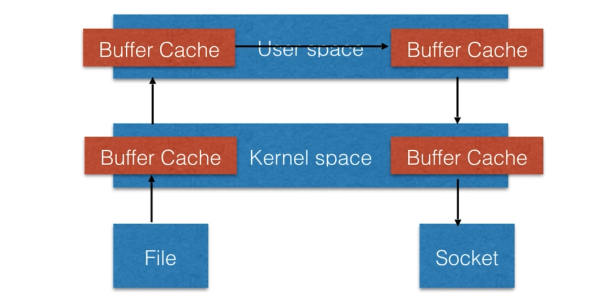
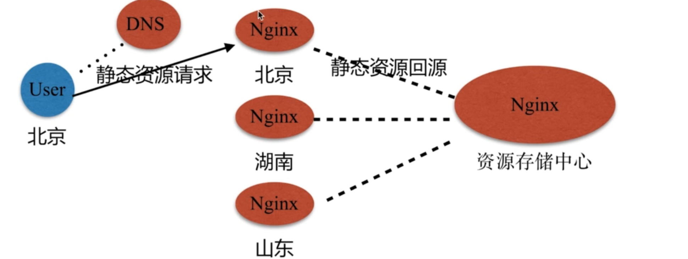
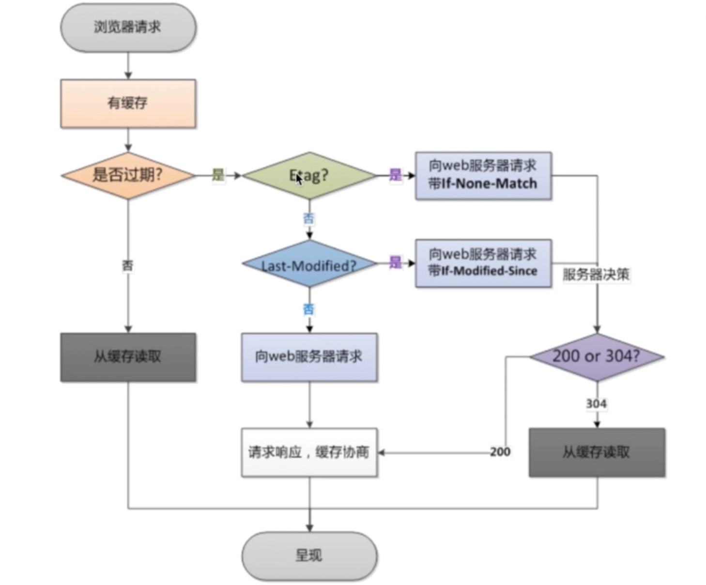
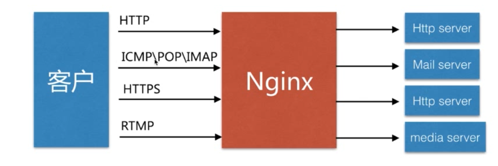
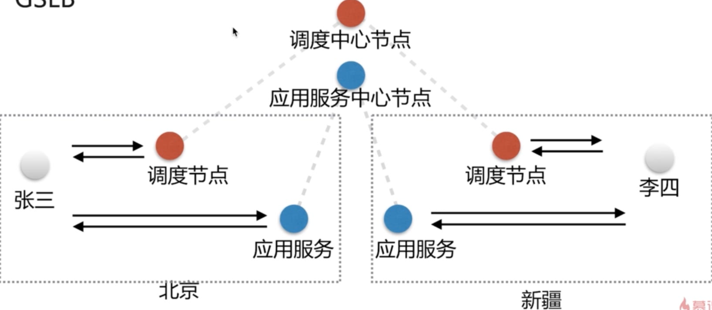
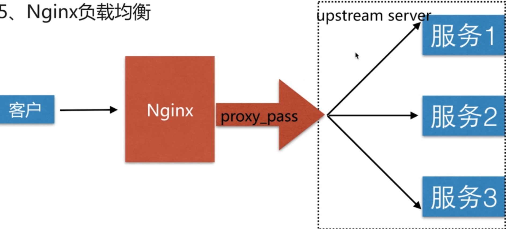
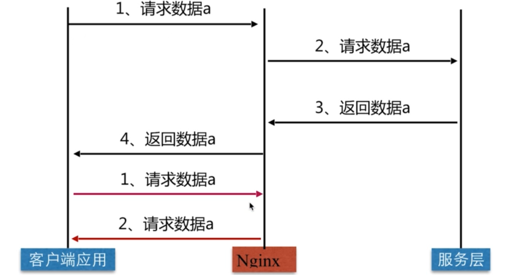

#	Nginx
##	是什么
+	Nginx 是一个开源且高性能, 可靠的HTTP 中间件, 代理服务

##	常用的HTTP 服务
+	HTTPD Apache基金会
+ 	IIS	微软
+  GWS	Google

##	为什么选择nginx
###	原因一: IO多路复用epoll
+	什么是IO复用
	-	多个描述符的IO 操作都能在一个线程内并发交替的顺序完成, 这就叫IO多路复用,这里的复用 指的是复用统一个线程
+	什么是epoll
	-	IO 多路复用的实现方式 select, poll, epoll
	- 	每当FD就绪, 采用系统的回调函数之间将fd放入,效率更高
	-  最大连接数没有限制
	-  主动


###	原因二: 轻量级
+	功能模块少
+ 	代码模块化

###	原因三: CPU亲和
+	是一种把CPU核心和Nginx工作进程绑定方式,把每个worker进程固定在一个cpu上执行,减少切换cpu的cache miss ,获得更好的性能

###	原因四: sendfile



##	安装
```js
yum install nginx

nginx -v
```

###	基本参数
####	安装目录
+	命令	rpm -ql nginx

| 路径 						| 类型 		| 作用 	|
| --- 						| --- 		| --- 	|
|/etc/logrotate.d/nginx				| 配置文件 | nginx日志轮转, 用于logrotate服务的日志切割|
|/etc/nginx							| 目录,配置文件 | nginx主配置文件|
|/etc/nginx/nginx.conf				| 目录,配置文件 | nginx主配置文件|
|/etc/nginx/conf.d					| 目录,配置文件 | nginx主配置文件|
|/etc/nginx/conf.d/default.conf	| 目录,配置文件 | nginx主配置文件|
|/etc/nginx/fastcgi_params			| 配置文件 | cgi配置相关,fastcgi配置|
|/etc/nginx/uwsgi_params			| 配置文件 | cgi配置相关,fastcgi配置|
|/etc/nginx/scgi_params				| 配置文件 | cgi配置相关,fastcgi配置|
|/etc/nginx/koi-utf					| 配置文件 | 编译转换映射转换文件|
|/etc/nginx/koi-win					| 配置文件 | 编译转换映射转换文件|
|/etc/nginx/win-utf					| 配置文件 | 编译转换映射转换文件|
|/etc/nginx/mime.types				| 配置文件 | 设置http协议的Content-type与扩展名对应关系|
|/usr/lib/systemd/system/nginx-debug.service| 配置文件 | 用于配置出系统守护进程管理器管理方式|
|/usr/lib/systemd/system/nginx.service	| 配置文件 | 用于配置出系统守护进程管理器管理方式|
|/etc/sysconfig/nginx						| 配置文件 | 用于配置出系统守护进程管理器管理方式|
|/etc/sysconfig/nginx-debug				| 配置文件 | 用于配置出系统守护进程管理器管理方式|
|/usr/lib64/nginx/modules					| 配置文件 | Nginx模块目录|
|/etc/nginx/modules							| 配置文件 | Nginx模块目录|
|/usr/sbin/nginx								| 命令 | Nginx服务的启动管理的终端命令|
|/usr/sbin/nginx-debug						| 命令 | Nginx服务的启动管理的终端命令|
|/var/cache/nginx							| 目录 | Nginx的缓存目录|
|/var/log/nginx								| 目录 | Nginx的日志目录|

####	安装编译参数
+	nginx -V

| 编译选项					| 作用 	|
| --- 						| --- 	|
|--prefix=/etc/nginx			| 安装目的目录或路径|
|--sbin-path=/usr/sbin/nginx	 | 安装目的目录或路径|
|--modules-path=/usr/lib64/nginx/modules| 安装目的目录或路径|
|--conf-path=/etc/nginx/nginx.conf	 	| 安装目的目录或路径|
|--error-log-path=/var/log/nginx/error.log| 安装目的目录或路径|
|--http-log-path=/var/log/nginx/access.log|安装目的目录或路径|
|--pid-path=/var/run/nginx.pid			| 安装目的目录或路径|
|--lock-path=/var/run/nginx.lock			| 安装目的目录或路径|

##	nginx.conf配置

| 属性					| 作用 	|
| --- 					| --- 	|
|user					| 设置nginx服务的系统使用用户|
|worker_processes	| 工作的进程数(跟cpu保持一致,过多会有cpu切换带来的损耗)|
|error_log			| nginx的错误日志|
|pid	 				| nginx服务启动时候pid|

### event模块

| 属性					| 作用 	|
| --- 					| --- 	|
| worker_connections| 每个进程允许最大连接数(一个进程最大连接数,最大65355, 10000个左右)|
|use					| 工作的进程数(内核模型)|

###	http 模块
+	http下可以配置多个server

+	keepalive_timeout	65  65秒
+ 	listen 监听端口
+ 	server_name 服务名/域名  
+  location 匹配路由
	-	root	页面的路径
	- 	index	首页文件 
+	error_path	配置错误页面


###	HTTP请求
+	request 包括请求行,请求头部,请求数据
+ 	response	包括状态行,消息报头,响应正文

###	日志
+	error_log	路径	级别(warn)
+ 	access_log  /var/log/nginx/access.log  main;
	-	main 是以什么格式输出	
	- 	log_format  main	 'xxx'

##	命令
+	nginx -tc /etc/nginx/nginx.conf   检查配置文件修改是否正确
+ 	nginx -s reload	重启


##	场景
###	静态资源web服务
###	CDN


###	压缩
```js
gzip on;	开启	
gzip_http_version 1.1;	http版本
gzip_comp_level 2;	压缩级别
gzip_types;	压缩类型

// 使用
location ~ .*\.(jpg|gif|png)$ {
	gzip on;
	gzip_http_version 1.1;
	gzip_comp_level 2;
	gzip_types text/plain application/javascript application/x-javascript 
	text/css application/xml text/javascript application/x-httpd-php image/jpeg image/gif image/png;
	root  /opt/app/code/images;
}
```

###	浏览器缓存


```js
expires 24h;

// 在响应头内会添加	过期时间
Cache-Control: max-age=xxxxx;
Expire: xxxxxx
```

###	跨站访问
+	浏览器为什么禁止跨域访问
	-	不安全,容易出现CSRF攻击
	


####	Nginx解决
+	Access-Control-Allow-Origin
+	add_header name value

```js
location ~ .*\.(htm|html)$ {
	#	* 的时候不安全,可以利用CSRF攻击
    add_header Access-Control-Allow-Origin *; 
    #	直接配置哪些网站可以跨域  推荐
    add_header Access-Control-Allow-Origin www.baidu.com; 
    add_header Access-Control-Allow-Methods GET,POST,PUT,DELETE,OPTIONS;
    root  /opt/app/code;
}
```

###	防盗链
+	目的: 防止网站资源盗用

####	防盗链设置思路
+	首要方式: 区别哪些请求是非正常的用户请求
+ 	基于http_refer防盗链配置模块

```js
location ~ .*\.(jpg|gif|png)$ {
	#	允许哪些情况 来源为none:直接访问网址, 允许不是http://开头的，不带协议的请求访问资源	#	ip ,或者匹配seo的网站 百度  谷歌等
    valid_referers none blocked 110.2.12.32 www.baidu.com ~wei\.png;
    if ($invalid_referer) {
        return 403;
    }
    root  /opt/app/code/images;
}
```

##	 代理服务



###	正向代理


###	反向代理

	
###	代理区别
+	代理的对象不一样
+ 	正向代理代理的对象是客户端
	-	为客户端服务的
	- 	请求发给代理,代理再去找相应的服务器
	-  	比如翻墙代理
+  	反向代理代理的对象是服务端
	-	为服务端服务的
	-	用户不知道有没有代理,只需要发送请求就够了
	- 	反向代理都在服务端

###	语法
```js
proxy_pass URL
#	反向代理
listen       80;
#	当访问index.html时 反向代理到本机8080端口上
location ~ /index.html$ {
   proxy_pass http://127.0.0.1:8080;
}
```

###	代理其他配置
```js

location / {
    proxy_pass http://127.0.0.1:8080;
    #	将可以共用的配置单独放一个文件,引入
    include proxy_params;
}

#	proxy_params 文件中的配置
proxy_redirect default;
#	设置host 和真实ip, 因为中间代理的原因,目标服务器可能获取不到真实的信息
proxy_set_header Host $http_host;
proxy_set_header X-Real-IP $remote_addr;

#	超时设置 单位秒
proxy_connect_timeout 30;
proxy_send_timeout 60;
proxy_read_timeout 60;

#	缓冲区大小
proxy_buffer_size 32k;
proxy_buffering on;
proxy_buffers 4 128k;
proxy_busy_buffers_size 256k;
proxy_max_temp_file_size 256k;
```

##	负载均衡


###	基于LVS的中间件架构
####	GSLB	全局负载均衡(以国家或者省 为单位)


####	SLB 用的最多的


###	Nginx 负载均衡


####	语法
```js
upstream name{...}
#	负载均衡三台服务器
#	默认轮询: 1-2-3-1-2-3这种方式
upstream mazy {
    server 116.62.103.228:8001;
    server 116.62.103.228:8002;
    server 116.62.103.228:8003;
}
#	反向代理到mazy上
location / {
    proxy_pass http://mazy;
    include proxy_params;
}
```

| 参数| 作用|
| --- | --- |
|	down			|	当前的server暂时不参与负载均衡|
|	backup			|	预留的备份服务器, 如果提供服务的挂掉,预留的备份服务器要顶上去|
|	max_fails		|	允许请求失败的次数	|
|	fail_timeout	|	经过max_fails失败后,服务暂停的时间|
|	max_conns		|	限制最大的接收的连接数	|

```js
upstream mazy {
    server 116.62.103.228:8001 down;	#挂掉的
    server 116.62.103.228:8002 backup;	#备份
    server 116.62.103.228:8003 max_fails=1 fail_timeout=10s; #允许请求失败1次,暂停10s再试
}
```

###	轮询规则
####	调度算法
|||
|---|---|
|	轮询		|	按时间顺序逐一分配到不同的后端服务器 |
|	加权轮询	|	weight值越大, 分配到的访问几率越高 |
|	ip_hash	|	每个请求按访问ip的hash结果分配,这样来自同一个ip的固定访问一个后端服务器 |
|	url_hash	|	按照访问的URL的hash结果来分配请求,是每个URL定向到同一个后端服务器 |
|	least_conn|	最少连接数,哪个机器连接数少就分发 |
|	hash关键数值|	hash自定义的key |


```js
#	当有7个请求过来,5个请求会分配到8003服务器
upstream mazy {
    server 116.62.103.228:8001 
    server 116.62.103.228:8002 
    server 116.62.103.228:8003 weight=5
}

#	配置ip_hash,不推荐使用,如果经过多层代理,就可能获取不到用户真实的ip地址
upstream mazy {
	ip_hash;
    server 116.62.103.228:8001 
    server 116.62.103.228:8002 
    server 116.62.103.228:8003
}

#	配置url_hash  hash关键数值
upstream mazy {
	hash $request_uri;
    server 116.62.103.228:8001 
    server 116.62.103.228:8002 
    server 116.62.103.228:8003
}
```

##	缓存服务
+	缓解服务器压力
+	分为客户端缓存, 代理缓存(nginx), 服务器端缓存



###	语法
```js
#	/opt/app/cache 缓存目录
#	levels=1:2	分层2层目录
#	keys_zone=mazy_cache 	命名空间
#	:10m max_size=10g inactive=60m; 初始化10m, 最大10g, 60分钟内缓存文件没有使用掉,就会被清理掉
#	use_temp_path=off 临时文件
proxy_cache_path /opt/app/cache levels=1:2 keys_zone=mazy_cache:10m max_size=10g
 inactive=60m use_temp_path=off;
 
#	在location中配置
location / {
	#	开启缓存 关闭为off		
    proxy_cache mazy_cache;	
    proxy_pass http://baidu.com;
    #	code为200 ,304的状态,12h过期
    proxy_cache_valid 200 304 12h;	
    #	除了200,302 十分钟过期
    proxy_cache_valid any 10m;	
    #	缓存的key规则
    proxy_cache_key $host$uri$is_args$args;
    #客户端是否命中信息
    add_header  Nginx-Cache "$upstream_cache_status";  
    #	如果出现了问题,跳过这台服务器,去找别的服务器提供服务
    proxy_next_upstream error timeout invalid_header http_500 http_502 http_503 http_504;
    include proxy_params;
} 
```

###		清理指定缓存
+	方式一: rm -rf 缓存目录
+ 	方式二: 第三方扩展模块ngx_cache_purge


###		部分页面不缓存
+	proxy_no_cache string


