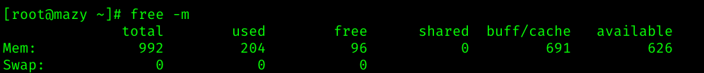
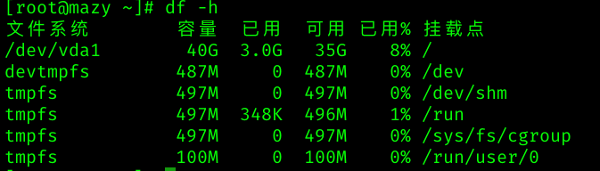
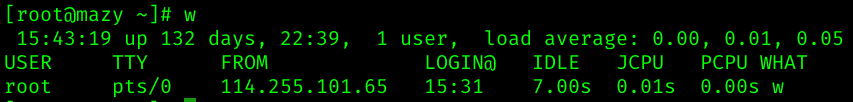
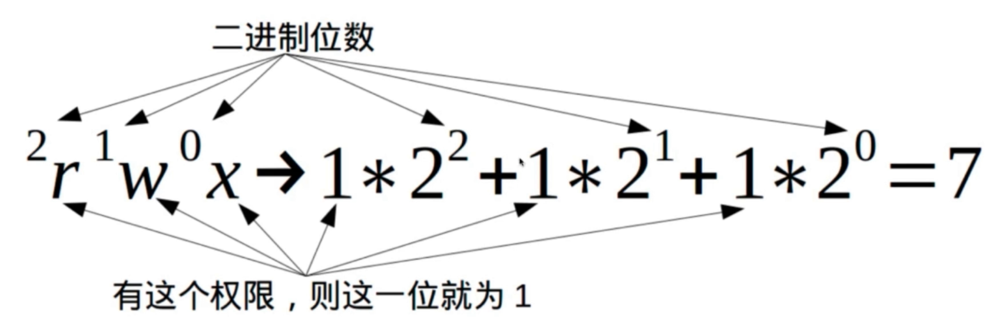

#	Linux
##	命令
###	软件操作命令
| 名称	| 命令 |
| --- | --- |
| 软件包管理器 | yum |
| 安装软件 |  yum install xxx|
| 卸载软件 | yum remove xxx |
| 搜索软件|  yum serach xxx|
| 清除缓存 | yum clean packages |
| 列出已安装| yum list |
| 软件包信息| yum info xxx |

###	服务器硬件资源和磁盘操作
| 名称	| 命令 |
| --- | --- |
| 内存	|  free -m |
| 硬盘	|  df -h |
| 负载	|  w/top |
| cpi个数和核数	|   |

####	内存

| 标识	| 作用 |
| --- | --- |
| total	|  内存大小 |
| used|   使用情况|
| free |  剩余情况 |

####	硬盘

| 标识	| 作用 |
| --- | --- |
| Filesystem	|  文件系统 |
| size|  容量|
| used |  已用|
| Avail|  可用|
| Use% |  已用百分比 |
| Mounted on|   挂载点|

####	负载

| 标识	| 作用 |
| --- | --- |
| load average	| 平均负载(最近1分钟, 最近五分钟,最近十五分钟的平均负载)|
| size|  容量|
| used |  已用|
| Avail|  可用|
| Use% |  已用百分比 |
| Mounted on|   挂载点|

+	平均负载 1的时候满负载, 超过1 有可能宕机,健康值在0.6-0.7左右

####	查看cpu相关信息
+	cat /proc/cpuinfo

###	文件和文件夹操作命令
####	linux 文件的目录结构
| 目录	| 目录 |
| --- | --- |
| 	根目录			| /|
|	家目录			|/home|
|	临时目录		|	/tmp|
|	配置文件目录	|	/etc|
| 	用户程序目录	|	/usr|

####	文件基本操作
| 命令	| 解释 |
| --- | --- |
| 	ls			| 	查看目录下的文件|
|	touch		|	新建文件|
|	mkdir		|	新建文件夹|
|	cd			|	进入目录|
|  rm			| 	删除文件和目录 |
|	cp 			| 	复制 |
| 	mv 			| 	移动 |
|  pwd			| 	显示路径 |

#####	rm
+	-r 循环删除
+ 	-rf 强制删除,不会提醒

#####	mkdir
+	-p	多层创建

#####	cp
+	cp path1 path2
	-	把哪个文件复制到哪个文件夹下
	- cp ./test.log /tmp/test.log
	
#####	mv
+	移动/剪切
+ 	用法跟cp一样

####	文本编辑器vim
+	服务器没有桌面操作界面,所有的gui界面都无法使用
+ 	vim是最出名的linux文本编辑器,可以对文件修改操作
+  	yum install vim

| 命令	| 解释 |
| --- | --- |
|  vim xxx  			| 		创建   |
|  i					| 	 	insert模式  |
|  : wq! 				| 		保存并退出  |
|  gg					| 		跳到文件头部   |
|  shift + g / G		| 		跳到文件尾部   |
|  dd  				| 		删除一行	   |
|  u 					| 	 	恢复  |
|  yy 					| 	 	复制  |
|  p 					| 		粘贴   |

####	文件权限 421

| 权限	| 权限值 |
| --- | --- |
|  r 			| 		4  |
|  w			| 	 	2 |
|  x			| 		1 |

+	前面三个表示所有者权限，
+ 	中间三个表示同组用户权限，
+  	最后一组表示其他用户权限

####	文件搜索,查找,读取
| 命令				|	解释 					|
| --- 				| --- 						|
|  tail			| 		从文件尾部开始读  	|
|  head			| 	 	从文件头部开始读	|
|  cat				| 		读取整个文件 		|
|  more			| 		分页读取			|
|  less			| 		可控分页 			|
|  grep			| 		搜索关键字 			|
|  find			| 		查找文件 			|
|  wc				| 		统计个数 			|

+	grep
	-	grep -n "11" test.log
		+	在test.log 文件中查找 "11" 并显示行数(-n:行数)
+	:set number	显示行数
+ 	cat test.log | wc -l
	-	 统计test.log 文件的行数
	-	 grep "111" test.log | wc -l
		+	在test.log 文件中查找 "111" 有多少行
+ 	find
	-	find .	
		+	当前文件夹下所有文件
	-	find . -name "*.js"
		+	查找当亲目录下 以.js结尾的文件
	-	find . -type f
		+	当前目录的文件
	-	find . -type d
		+	当前目录的文件夹
	-	find . -ctime -20
		+	将目录及子目录下所有最近20天更新过的文件
		
####	文件压缩与解压
+	tar 命令
	-	tar -cf index.tar index.js
		+	压缩
	-	tar -xf index.tar
		+	解压缩
	-	tar -zcvf index.tar.gz index.js
		+	压缩gz包
	-	tar -zxvf indx.tar.gz
		+	解压缩gz包

###	系统用户操作命令
| 命令				|	解释 					|
| --- 				| --- 						|
|  useradd		| 		添加用户  			|
|  adduser		| 	 	添加用户			|
|  userdel		| 		删除用户 			|
|  passwd			| 		设置密码			|

###	防火墙相关设置
+	保护服务器安全
+ 	设置防火墙规则
	-	开放80,22端口
+	关闭防火墙

| 操作			|	命令						|
| --- 			| --- 							|
| 安装			| yum install firewalld  	|
| 启动			|service firewalld start	|
| 检查状态		| service firewalld status	|
| 关闭或禁用	|service firewalld stop / disable|

###	提权操作sudo 和文件传输操作
####	提权 sudo
+	visudo 修改配置文件,将指定用户设置权限

####	文件下载
+	wget, curl
+ 	wget http://www.baidu.com
+  curl -o index.html http://www.baidu.com

####	文件上传
+	scp上传
	-	scp test.log root@11.22.12.32:/tmp/
+  scp下载
	-	scp root@11.22.12.32:/tmp/test.log ./

