#	前端性能优化
##	资源的合并与压缩
###	目标
+	理解减少http请求数量和减少请求资源大小的两个优化要点
+ 	掌握压缩与合并原理
+  掌握通过在线网站和fis3两种实现压缩与合并的方法

###	浏览器的一个请求从发送到返回经历了什么
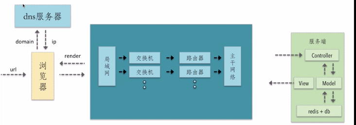

####	优化
+	dns可以通过缓存减少dns查询时间
+ 	网络请求的过程走最近的网络环境
+ 	cdn 静态资源(主站域名不要和cdn服务器域名一样,否则会携带cookies造成不必要的浪费)
+  减少http请求的大小
+  多次http请求合并成一次
+  服务端渲染(React,Vue对首屏加载很慢)

###	深入理解http请求的过程是前端性能优化的核心

###	资源的合并和压缩
+	减少http请求数量
+ 	减少请求资源的大小

###	html压缩
+	正常的html都是结构非常清晰的(就是有缩进,有回车之类,没有被压缩)
+	html本身是一个文本文件,但是只有编辑的时候回车和空格才有意义,浏览器并不需要,所以压缩
+	html代码压缩是压缩这些在文本文件中有意义,但是在html中不显示的字符,包括空格,制表符,换行符等,还有一些其他意义的字符,如html注释也可以被压缩

####	如何进行html压缩
+	使用在线网站进行压缩
+ 	nodejs提供了html-minifier工具
+  后端模板引擎渲染压缩

####	html压缩的原因
+	大型互联网公司,比如谷歌采用html压缩,每年可以节省上亿元的支出
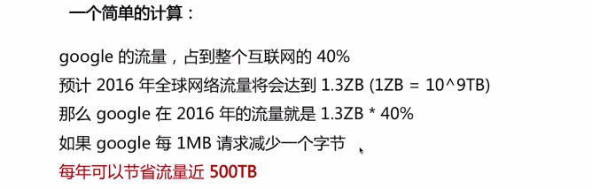

###	css压缩(必须要做的)
+	无效代码删除	
+ 	css语义合并

####	如何进行css压缩
+	使用在线网站进行压缩
+ 	使用html-minifier对html中的css进行压缩
+  使用clean-css对css进行压缩

###	js压缩和混乱(必须要做的)
+	无效字符的删除
+ 	剔除注释
+  代码语义的缩减和优化
	-	变量名不要起的太长,或者缩短变量名
+  代码保护
	-	不压缩,对于技术人员可以窥探你的代码,发现漏洞等
	- 	压缩将代码风格弄成不好读,看不懂

####	如何进行js压缩与混乱
+	使用在线网站进行压缩
+ 	使用 html-minifier 对 html 中的 js 进行压缩
+  使用 uglifyjs2 对 js 进行压缩

###	文件合并
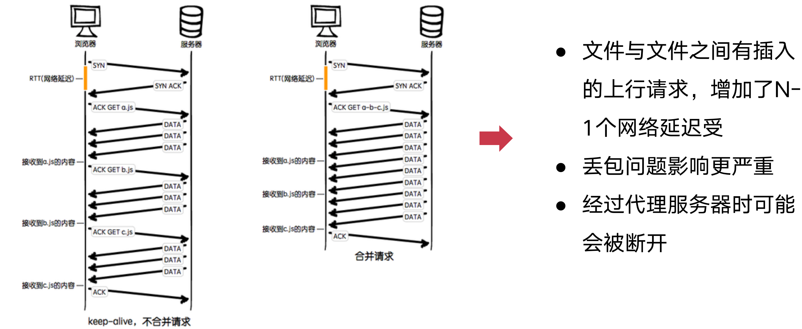

####	文件不合并的情况
+	文件与文件之间又插入了上行请求,增了N-1个网络延迟
+	受丢包问题影响更严重
+ 	经过代理服务器时可能会被断开(keep-alive状态可能被断开)

####	文件合并存在的问题
+	首屏渲染问题
	-	文件较大,加长首屏渲染的时间
+ 	缓存失效问题
	-	正常情况下浏览器会缓存js文件,但是当多个js文件合并到一起的话,就会导致整个js都要重新更新

####	建议
+	公共库合并
	-	因为公共库不会修改,所以将公共库合并
	- 	业务代码合并,业务代码发生改变不会影响公共库js的缓存
+	不同页面的合并
	-	单页面应用
	- 	不同页面的代码合并在一起,通过路由跳转实现异步加载js
+	见机行事,随机应变
	-	怎么合适怎么来

####	如何进行文件合并
+	使用在线网站进行文件合并
+ 	使用nodejs实现文件合并


##	图片优化
###	png之间的关系
+	png8 —— 256色 + 支持透明
+	png24 —— 2^24色 + 不支持透明
+	png32 —— 2^24色 + 支持透明

###	选择
每种图片格式都有自己的特点，针对不同的业务场景选择不同的图片格式很重要

###	不同格式图片常用的业务场景
+	jpg有损压缩，压缩率高，不支持透明
+	png支持透明，浏览器兼容好
+	webp压缩程度更好，在ios webview有兼容性问题 
+	svg矢量图，代码内嵌，相对较小，图片样式相对简单的场景

####	应用场景
+	jpg —— 大部分不需要透明图片的业务场景
+	png —— 大部分需要透明图片的业务场景
+	webp —— 安卓全部
+	svg矢量图 —— 图片样式相对简单的业务场景

###	图片压缩
针对真实图片情况,舍弃一些相对无关紧要的色彩信息(人眼察觉不出来的色彩信息)

###	CSS雪碧图(PC网站用的比较多)
+	把你的网站上用到的一些图片整合到一张单独的图片中
	-	优点: 减少你的网站的HTTP请求数量
	- 	缺点:图片会很大,如果加载过程出现问题,会导致整个页面出现问题(整合图片比较大时,一次加载比较慢)

###	Image inline
+	将图片的内容内嵌到html中
	-	减少网站的HTTP请求数量(base64)

###	使用矢量图
+	使用SVG进行矢量图的绘制
+ 	使用iconfont解决icon问题


###	在安卓下使用webp
+	WebP 的优势体现在它具有更优的图像数据压缩算法，能带来更小的图片体积，而且拥有肉眼识别无差异的图像质量；同时具备了无损和有损的压缩模式、Alpha 透明以及动画的特性，在 JPEG 和 PNG 上的转化效果都非常优秀、稳定和统一。

###	案例
+	facebook网站上采用了雪碧图,根据业务场景将同一业务下的图片压缩成雪碧图,冰面大量请求
+ 	移动端淘宝,使用了降级策略,图片的格式为xxx.jpg.webp, 如果支持webp格式就会显示,如果不支持就会显示jpg格式
	-	小图标可是使用base64内嵌到html中
+	小于4-8k的图片都可以inline进页面
	

#	css, js的加载与执行
##	网站在浏览器端是如何进行渲染的
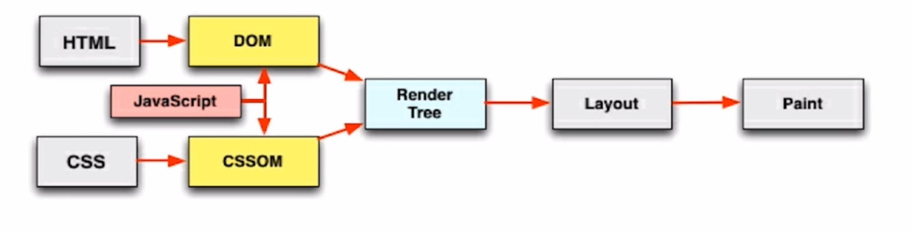

##	HTML渲染过程的一些特点
+	顺序执行,并发加载
	-	外部资源(js,css) 并发加载
	- 	cdn设置3-4个域名,因为浏览器同一个域名的并发是有数量限制的
+ 	是否阻塞
	-	css加载是否阻塞js加载 , css加载是否阻塞js执行
+  	依赖关系
	-	html中的依赖关系, 比如页面有时候闪一下 ,dom加载完毕,但是css 没有加载完毕, 样式从无到有这样有一个闪一下的效果, 如果css 放到header中, 等待cssom 加载之后 生成树 和dom 一起生成renderTree 这样就不会有闪过的问题.....
	-  js的执行顺序, js 的加载有两个关键字. defer 和asyn 这两个区别: defer 本身就是延迟,推迟的意思 ,待到文档解析完成，脚本才会执行. async就是异步的意思,async是异步下载并立即执行，然后文档继续解析.
总结一下就是: 如果不用这两个关键字,那么浏览器遇到script 标签就会停止html的解析, 开始下载脚本并执行脚本. 如果脚本不依赖于任何脚本，并不被任何脚本依赖，那么则使用 defer)
+  	引入方式
	-	css 可以用link 或者import 引入, import 会打断并行加载 这种方式不好.
或者在首页里不需要把所有的js 资源加载下来. 懒加载的过程

###	顺序执行,并发加载
+	词法分析
	-	对html从上到下的进行词法分析,分析所有的Tag
	- 	所以js,css的加载,dom树的生成都是从上到下的
+	并发加载
	-	html中的资源是并发加载的
+ 	并发上限
	-	对每个域名下的资源加载是有上限的

###	css阻塞
+	css head中阻塞页面的渲染
	-	等待link标签加载完css之后才会去渲染
	- 	所以页面渲染的时候是带样式的
+ 	css阻塞js的执行
	-	css加载完之前,后面的js处于阻塞
+  css不阻塞外部脚本的加载
	-	不会阻塞js的加载,会阻塞js的执行
	- 	因为js也会修改dom的样式和结构

###	js阻塞
+	直接引入的js阻塞页面的渲染
+	js不阻塞资源的加载
+	js顺序执行，阻塞后续js逻辑的执行

###	依赖关系
+	页面渲染依赖于css的加载
+	js的执行顺序的依赖关系
+	js逻辑对于dom节点的依赖关系

###	js引入方式
+	直接引入
+	defer
+	async
+	异步动态引入js

##	加载和执行的优化点
+	css 样式表置顶
+	用 link 代替 import
+	js 脚本置底
+	合理使用 js 的异步加载能力

#	懒加载和预加载
##		懒加载
+	图片进入可视区域之后请求图片资源
	-	动态设置img的src属性,就会重新加载图片
+ 	对于电商等图片很多,页面很长的业务场景适用
+  减少无效资源的加载
+  并发加载的资源过多会阻塞js的加载,影响网站的正常使用

##	预加载
+	图片等静态资源在使用之前的提前请求
+ 	资源使用到时能从缓存中加载,提升用户体验
+  页面展示的依赖关系维护

##	案例
+	淘宝移动端中,图片以及图标都不是立即加载出所有的
	-	只有当元素出现在可视区域的时候才会加载图片
+	九宫格抽奖就需要预加载,因为他的切换比较快
	-	如果图片没有预加载,那么图片加载回来的时候,使用的时机已经过去了
+	一般会使用loading 状态预先加载图片和音乐,等图片和音乐加载完loading结束
	-	进入页面中就不会有卡顿现象

###		懒加载实现
```js
//当我们的图片进入可视区域,去请求资源
//需要去监听scroll事件, 在scroll的回调中判断是否进入可视区域
//需要知道屏幕的height,还需要知道元素top,当top小于height的时候需要加载图片
//图片需要有占位符,也就是说要有height


// 可是区域的高度 
var viewHeight = document.documentElement.clientHeight
function lazyload() {
  var eles = document.querySelectorAll('img[data-original][lazyload]')
  Array.prototype.forEach.call(eles,function(item,index) {
    var rect
    if(item.dataset.original === ''){
      return 
    }
    rect = item.getBoundingClientRect()
    if(rect.bottom >= 0 && rect.top < viewHeight){
      !function(){
        var img = new Image()
        img.src = item.dataset.original
        img.onload = function() {
          item.src = img.src
        }
        item.removeAttribute('data-original')
        item.removeAttribute('lazyload')
      }()
    }
  })
}

lazyload()
// 手指一滑动,就开始执行lazyload事件
document.addEventListener('scroll', lazyload)

//也可以直接使用zepto库
//需要引入zepto, zepto.lazyload.js
$('img[data-original][lazyload]').lazyload()

```

###	预加载实现
```js
//第一种方式	设置一张图片,display为none,他会加载图片,并不会使用,等真正用到的时候会去缓存中拿


//第二种方式,同上面类似,用到js的Image对象
var img = new Image()
img.src = "xxx"

//第三种方式
// 但是会有跨域问题
var xmlHttpRequest =  new XMLHttpRequest()
xmlHttpRequest.onreadystatechange = callback
xmlHttpRequest.onprogress = progressCallback
xmlHttpRequest.open("GET","http://xxx.png",true)
xmlHttpRequest.send()

function callback(){
  if(xmlHttpRequest.readyState == 4 && xmlHttpRequest.status == 200){
    var responseText = xmlHttpRequest.responseText
  }else{
    //  没成功
  }
}
function progressCallback(e){
  e = e || event
  if(e.lengthComputable){
    console.log()
  }
}
```


#	重绘与回流
+	css性能会让js变慢吗?
	-	一个线程	=>	js解析
	- 	一个线程	=>	UI渲染
	-  浏览器的机制决定
+	频繁触发重绘和回流,会导致UI频繁渲染,最终导致js变慢

##	回流
+	当render tree中的一部分(或全部)因为元素的规模尺寸, 布局, 隐藏等改变而需要重新构建,这就称为回流(reflow)
+ 	当页面布局和几何属性改变时就需要回流

##	重绘
+	当render tree中的一些元素需要更新属性,而这些属性只能影响元素的外观, 风格, 而不会影响布局的, 比如 background-color. 则就称为重绘.

##	注意
回流必将引起重绘,而重绘不一定会引起回流

##	触发页面重新布局的属性 - 回流
+	盒子模型相关属性会触发重新布局
+ 	定位属性及浮动也会触发重新布局
+  改变节点内部文字结构也会触发重新布局

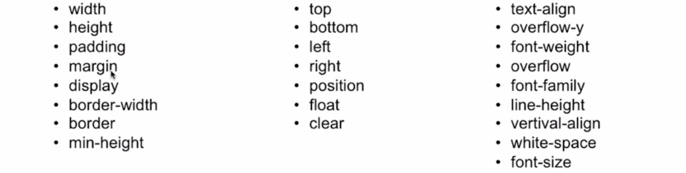

##	只触发重绘的属性
+	color border-style
+	border-radius
+	visibility
+	text-decoration
+	background
+	background-image
+	background-position
+	background-repeat
+	background-size
+	outline-color
+	outline
+	outline-style
+	outline-width
+	box-shadow


##	新建DOM的过程
1. 	获取DOM后分割为多个图层
2. 	对每个图层的节点计算样式结果（Recalculate style--样式重计算）
3. 	为每个节点生成图形和位置（Layout--回流和重布局）
4. 	将每个节点绘制填充到图层位图中（Paint Setup和Paint--重绘）
5. 	图层作为纹理上传至GPU
6. 	符合多个图层到页面上生成最终屏幕图像（Composite Layers--图层重组）

##	图层
+	将频繁重绘回流的 DOM 元素单独作为一个独立图层,那么这个 DOM 元素的重绘和回流的影响只会在这个图层中

###	如何将DOM元素编程新的独立图层
####	chrome 创建图层的条件
+	3D或透视变换（perspective transform）CSS属性
+	使用加速视频解码的 video 节点
+	拥有3D（WebGL）上下文或加速的2D上下文的 canvas 节点
+	混合插件（如Flash）
+	对自己的opacity做CSS动画或使用一个动画webkit变换的元素
+	拥有加速CSS过滤器的元素
+	元素有一个包含复合层的后代节点（一个元素拥有一个子元素，该子元素在自己的层里）
+	元素有一个z-index较低且包含一个复合层的兄弟元素（换句话说就是该元素在复合层上面渲染）

##	解决重绘,回流问题
+	避免使用触发重绘,回流的css属性
+ 	将重绘,回流的影响范围限制在单独的图层之内

##	案例
+	移动端淘宝页面的检测轮播图
	-		在切换图片的时候会经历以下步骤
		-	Animation Frame Fired
		-	Recalculate Style	重新计算样式
		- 	Update Layer Tree	更新布局树
		-	Paint					重新绘制
		- 	Composite Layers		合成图层
+	腾讯视频,播放页面
	-	其实有个video ,video标签是回创建单独一个图层
	- 	当使用rendering时 勾选 paint flashing 时 会发现在video 一直是标绿的
	-  就是说他一直在重绘
	-  当拉动开发者工具左右移动,或者上下移动,也会触发重绘回流,因为调用了resize函数

##	开启图层方式
+	transform: translateZ(0)
+ 	will-change: transform
	-	图层过多会发生大部分时间用在了合成图层上面,反而会导致页面卡而慢
	- 	加图层一定要跟之前的情况对比,是否真正做到了优化

##	优化点
###	用translate替代top改变
+	top会触发回流
	-	下图的layout 就是发生了回流
	- 	大概用了332us
+ 	translate不会
	-	第二张图中并没有发现layout ,所以并没有发生回流
	- 	大概时间是 244us
	
```js
.wrap{
  position: relative;
  width:100px;
  height: 100px;
  background: pink;
  top:0
}
<div class="wrap"></div>

var wrap = document.querySelector('.wrap')
setTimeout(() => {
	wrap.style.top = '100px'
}, 2000);
```
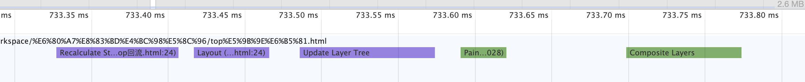

```js
.wrap{
  width:100px;
  height: 100px;
  background: pink;
  transform: translateY(0)
}
<div class="wrap"></div>
var wrap = document.querySelector('.wrap')
setTimeout(() => {
	wrap.style.transform = 'translateY(100px)'
}, 2000);
```


###	用opacity替代visibility
+	visibility会触发重绘
	-	下图的paint 就是发生了重绘
	- 	大概用了199us
+ 	opacity不会, 但是前提需要开启新图层
	-	第二张图中不但发现了layout,而且还有paint(有发生了回流,又发生了重绘)
	- 	需要开启新图层,第三张图
	- 	大概时间是 266us,同样会有重绘(理论不是这样,可能chrome后期升级了)

```js
visibility: visible;
<div class="wrap"></div>
var wrap = document.querySelector('.wrap')
setTimeout(() => {
	wrap.style.visibility = 'hidden'
}, 2000);
```
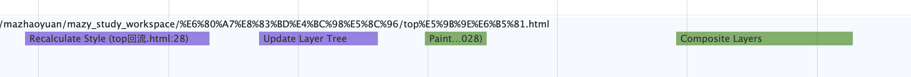

```js
opacity: 1;
<div class="wrap"></div>
var wrap = document.querySelector('.wrap')
setTimeout(() => {
	wrap.style.opacity = '0'
}, 2000);
```
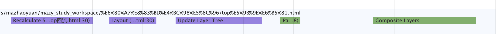

```js
opacity: 1;
transform: translateZ(0);
<div class="wrap"></div>
var wrap = document.querySelector('.wrap')
setTimeout(() => {
	wrap.style.opacity = '0'
}, 2000);
```
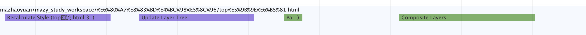


###	不要一条一条地修改 DOM 的样式，预先定义好 class，然后修改 DOM 的 className
+	就是减少回流和重绘
+ 	这个常用,
+  事先定义好样式,直接使用

```js
.rect{
    width:100px;
    height:100px;
    background-color: blue;
}
.action{
    top:100px;
    width:150px;
    height:150px;
    background-color: red;
    color:blue;
}

<div class="rect"></div>

setTimeout(function(){
    document.getElementsByClassName("rect")[0].className = 'action'
},2000)
```
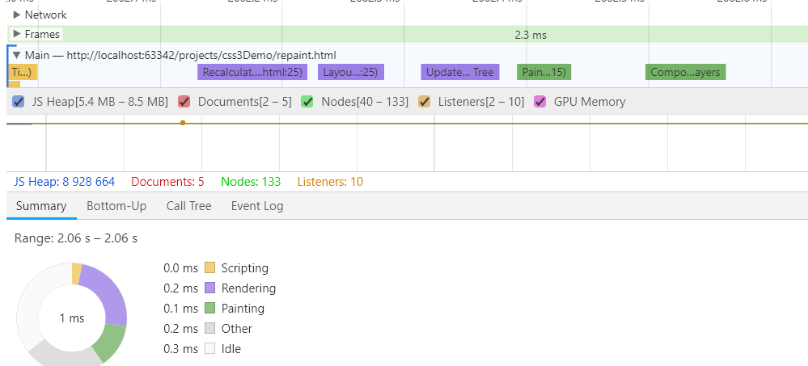

+	其实每次修改样式,也跟预先定义效果差不多
	-	chrome 底层做了缓冲, 会整合多个进行绘制
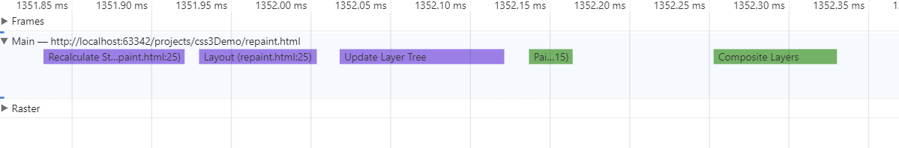
	

###	把 DOM 离线后修改，比如：先把 DOM 给 display:none (有一次 Reflow)，然后你修改100次，然后再把它显示出来

```js
.rect{
    width:100px;
    height:100px;
    background-color: blue;
    display:none;
}
   
<div class="rect"></div>
setTimeout(function(){
    console.log("change");
    document.getElementsByClassName("rect")[0].style.opacity = "0";
    document.getElementsByClassName("rect")[0].style.width = "150px";
    document.getElementsByClassName("rect")[0].style.height = "150px";
    document.getElementsByClassName("rect")[0].style.top = "100px";
    document.getElementsByClassName("rect")[0].style.backgroundColor = "red";
    document.getElementsByClassName("rect")[0].style.color = "blue";
    document.getElementsByClassName("rect")[0].style.width = "150px";
    document.getElementsByClassName("rect")[0].style.height = "150px";
    document.getElementsByClassName("rect")[0].style.top = "100px";
    document.getElementsByClassName("rect")[0].style.opacity = "1";
},2000)
```
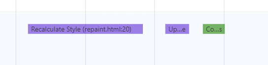

+	2秒之后让他显示出来
	-	 如果你不显示出来, 浏览器就不会回流重绘.



###	不要把 DOM 结点的属性值放在一个循环里当成循环里的变量(offsetHeight,offsetWidth,因为要获取实时的位置,所以会强制刷新缓冲区域
+	浏览器会设置一个缓冲区域,可能是一个队列,一秒钟回流5次,但是这两个api会强制刷新掉这些,会破坏浏览器的缓冲机制 

```js
var doms = [] // 通过选择器选择出了一个dom元素的数组
var domsTop = []
//  根据当前页面的可视区域的高度,计算这个dom元素的位置
var clientHeight = document.body.clientHeight
for(let i = 0; i < doms.length; i++) {
	domsTop.push(clientHeight + i)
}
```

###	不要使用 table 布局，可能很小的一个小改动会造成整个 table 的重新布局
+	对于搜索引擎的收录更加友好。
+	w3c规范. 
+	占用空间小 	
+	改样式费劲 
+	再加上回流这个

###	动画实现的速度的选择
+	别设置个1ms就动一次

###	对于动画新建图层&& 启用 GPU 硬件加速
+	开启GPU加速是有代价的,使用的时候一定要根据业务判断
+	扫描css , 有些css会启动GPU加速
	-	transform: translateZ(0)
	- 	transfrom: translate3d(0,0,0)

#	浏览器存储
##	多种浏览器存储方式并存,如何选择
###	cookie
+	因为http请求是无状态的
+ 	所以需要cookie去维持客户端状态
+  	cookie的生成方式
	-	http response header 中的set-cookie
	- 	js中可以通过document.cookie 可以读写cookie
	-	document.cookie = "username=z3"

	


####	作用
+	用于浏览器和服务器端的交互(用户状态)
+ 	客户端自身数据的存储
	-	过期时间 expire
+	维护客户端的状态(是cookie设计的初衷)
+ 	目前cookie中看几大电商的网页里, 主要还是存用户的信息, 主要是各种的id . cookie 主要用的是跟服务器的之间交互验证的过程, 本身cookie 能存的内容有限, 不是为了大规模存储数据而设计的
 
####	cookie存储的限制(缺陷)
+	作为浏览器存储,大小4KB左右
+ 	需要设置过期时间 expire

####	cookie存储数据能力被localstorage替代

####	httponly
+	不支持js读写

####	优化
+	cookie中相关域名下面(域名下的所有请求都会携带cookie,但是并不是都需要用cookie)
	-	cdn的流量损耗
	- 	解决方案
		+	cdn的域名和主站的域名要分开
		+ 	京东举例, cdn与主域名分开,每年要省上亿元


##		LocalStorage
+	H5 设计出来专门用于浏览器存储的
+ 	大小为5M左右
+  仅在客户端使用,不喝服务器进行通信
+  接口封装较好
+  浏览器本地缓存方案

```js
if(window.localStorage){
	localStorage.setItem('name','z3')
	localStorage.getItem('name')
}
// 利用localStorage 实现缓存
var cacheJs = localStorage.getItem("cacheJs");
if(cacheJs){
    eval(cacheJs);
}else{
    var xmlHttpRequest = new XMLHttpRequest();
    xmlHttpRequest.onreadystatechange = callback;
    xmlHttpRequest.onprogress = progressCallback;
    xmlHttpRequest.open("GET","./cache.js",true);
    xmlHttpRequest.send();
    function callback(){
        if(xmlHttpRequest.readyState == 4 && xmlHttpRequest.status == 200){
            var jsContent = this.response;
            eval(jsContent);
            localStorage.setItem("cacheJs",jsContent);
        }else{
            console.log("Request was unsuccessful:" + xmlHttpRequest.status);
        }
    }

    function progressCallback(e){
        e = e || event;
        if(e.lengthComputable){
            console.log("Received " + e.loaded + " of " + e.total + " bytes");
        }
    }
}
```

##		SessionStorage
+	会话级的浏览器存储
+ 	大小为5M左右
+  	仅在客户端使用,不喝服务器进行通信
+  接口封装较好
+  对于表单信息的维护

##		IndexedDB
+	IndexedDB	是一种低级API,	用于科幻段存储大量结构化数据,该API使用索引来实现对该数据的高性能搜索
+ 	虽然webStorage 对于存储较少量的数据很有用
+  	但是对于存储更大量的结构化数据来说,这个方法不太有用
+   IndexedDB提供了一个解决方案
+	为应用创建离线版本

###	indexedDB操作
```js
//建立打开IndexedDB
function openIndexDB(name,cb){
    var request = window.indexedDB.open(name);
    request.onerror = function(e){
        console.log("open indexdb error");
    }
    request.onsuccess= function(e){
        myDB.db = e.target.result;
        cb && cb();
    }
    //从无到有,或者升级版本
    request.onupgradeneeded = function (e) {
        var store = e.currentTarget.result.createObjectStore("books",{keyPath:"isbn"});
        console.log(store);
        store.createIndex("by_title",'title',{unique:true});
        store.createIndex("by_author","author");
        store.put({title:"三国演义",author:"罗贯中",isbn:123});
        store.put({title:"水浒装",author:"施耐庵",isbn:234});
        store.put({title:"西游记",author:"吴承恩",isbn:345});
        store.put({title:"红楼梦",author:"曹雪芹",isbn:456});
    }
}
var myDB = {
    name:"testDB",
    version: "1",
    db : null
}
openIndexDb(myDB.name,function(){
    console.log("successfully open indexDB ");
	//  myDB.db.close();
	//  deleteDB(myDB.name);
})
function addBook(db){

    var transaction = db.transaction("books",'readwrite');
    var store = transaction.objectStore('books');
    //获取当前indexedDB中的数据 ///查询
//        store.get(456).onsuccess = function(e){
//            console.log(e.target.result);
//        }
    //添加一条书的记录 //添加
//        store.add({
//            title:"论语",
//            author:"孔子",
//            isbn:666
//        })
    //删除
//        store.delete(456);
    //更新
    store.put({title:"红楼梦1",author:"Ethan",isbn:456});

}

function deleteDB(name){
    var deleteDb = window.indexedDB.deleteDatabase(name);
    deleteDb.onsuccess = function() {
        console.log('complete');
    };
}

setTimeout(function(){
    addBook(myDB.db)
},3000);
```

##		Service Workers 
+	大规模运算解决方案
+ 	多线程计算,主线程汇总(防止主线程阻塞)
+  Service Worker 是一个脚本,浏览器独立于当前页面,将其在后台运行
+  	为实现一些不依赖页面或者用户交互的特性打开了一扇大门
+   在未来这些特性将包括推送消息,背景后台同步,genfencing(地理围栏定位)
+   但他将推出的第一个首要特性,就是拦截和处理网络请求的能力,包括以编程方式来管理被缓存的响应

###	案例
+	使用拦截和处理网络请求的能力, 去实现一个离线应用
+ 	使用service worker 在后台运行同时能和页面通信的能力,去实现大规模后台数据的处理

##		PWA
+	pwa(progressive web apps) 是一种web app 新模型
+ 	并不是具体指某一种前言技术,活某一个单一知识点
+  	是一个渐进式的web app.是通过一系列新的web特性,配合优秀的ui交互设计,逐步的增强web app 的用户体验
+	lighthouse （下载地址：https://lavas.baidu.com/doc-assets/lavas/vue/more/downloads/lighthouse_2.1.0_0.zip

###	可靠	-	类似 手机App
+	在没有网络的环境中也能提供基本的页面访问, 而不会出现 "未连接到互联网" 的页面

###	快速	-	类似 手机App
+	针对网页渲染及网络数据访问有较好的优化

###	融入	-	类似 手机App
+	应用可以被增加到手机桌面,并且和普通应用一样有全屏,推送等特性

###	使用lighthouse 检测网站对 PWA 的支持情况

###	查看service workder 运行命令
chrome://serviceworker-internals/
chrome://inspect/#service-workers

#	缓存
##		httpheader
+	通过http header 配置缓存信息

###	Cache-Control(请求头和响应头都可以携带)
####	max-age
+	假如说请求一张图片, 在响应头包含cache-control: max-age=31560000 信息
+ 	那么当你在请求这张图片的时候,如果当前时间没有超过这个时间,那么就不用去服务器拿,直接拿缓存的
+	在max-age 的时间内这张图片都是有效的

####	s-maxage
+	优先级高于max-age
+	他是针对 public 设备的过期时间(大家都可以访问的资源,比如cdn)
+ 	所以他就不会从浏览器中拿这张图片,而是去public 设备中拿(cdn)
+  只有时间超过了s-maxage设置的时间, cdn才会去原服务器更新这张图片

####	private
+	只有浏览器,客户端才能使用的

####	public
+	大家都可以使用的缓存

####	no-cache
+	先去服务器中查询,浏览器中的cache是否过期

####	no-store
+	完全不使用缓存

###	Expires
+	缓存过期时间,用来指定资源到期的时间,是服务器端的具体的时间点
+ 	告诉浏览器在过期时间前浏览器可以直接从浏览器缓存中取数据,而无需再次请求
+  http1.0 的产物,所以他的优先级低于max-age(http1.1的产物)
+  直接读取浏览器的缓存,但是服务器上的文件变了,但是他还是拿的浏览器的缓存,导致前后不一致

###	Last-Modified / If-Modified-Since
+	基于客户端和服务器端协商的缓存机制
+ 	last-modified 	->	response header
+  if-modified-since	->	request header
	-	告诉服务器我当前知道的这个文件的最后修改时间
+  需要与cache-control 共同使用
+  当设置了max-age 那么他还是先去浏览器缓存中拿,只有他过期了才会用last-modified去服务器查询

####	last-modified 缺点
+	某些服务器不能获取精确的修改时间
+ 	文件修改时间改了,但是文件内容却没有变

###	Etag
+	文件内容的hash值
+ 	etag => response header
+  if-none-match 	=>	request header
+  需要与cache-control共同使用

###	分级缓存策略

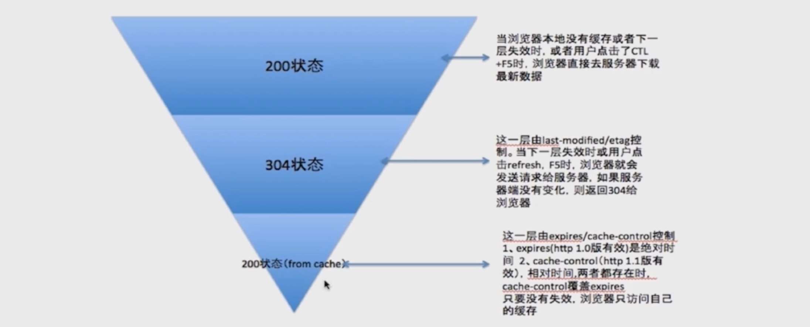

+	第一次访问的时候需要向服务器下载静态文件,都是200
+ 	根据last-modified 或者etag 向服务器请求是否有更新,都没有变就是304
+  从本地缓存中获取,如果时间没有过期就直接使用本地缓存,200

### 设置 max-age
+	在nginx 配置 add_header Cache-Control max-age=36500000
+	这样 浏览器就会收到这个header
+ 	从而浏览器再次请求的时候就会走 from memory cache 请求时间0ms

###	设置s-maxage
+	在nginx 配置 add_header Cache-Control s-maxage=36500000
+	响应头中会有s-maxage信息,和last-modified
+ 	再次请求会带上If-Modified-Since 将last-modified带回去,比较是否更新
+ 	不更新走缓存 304


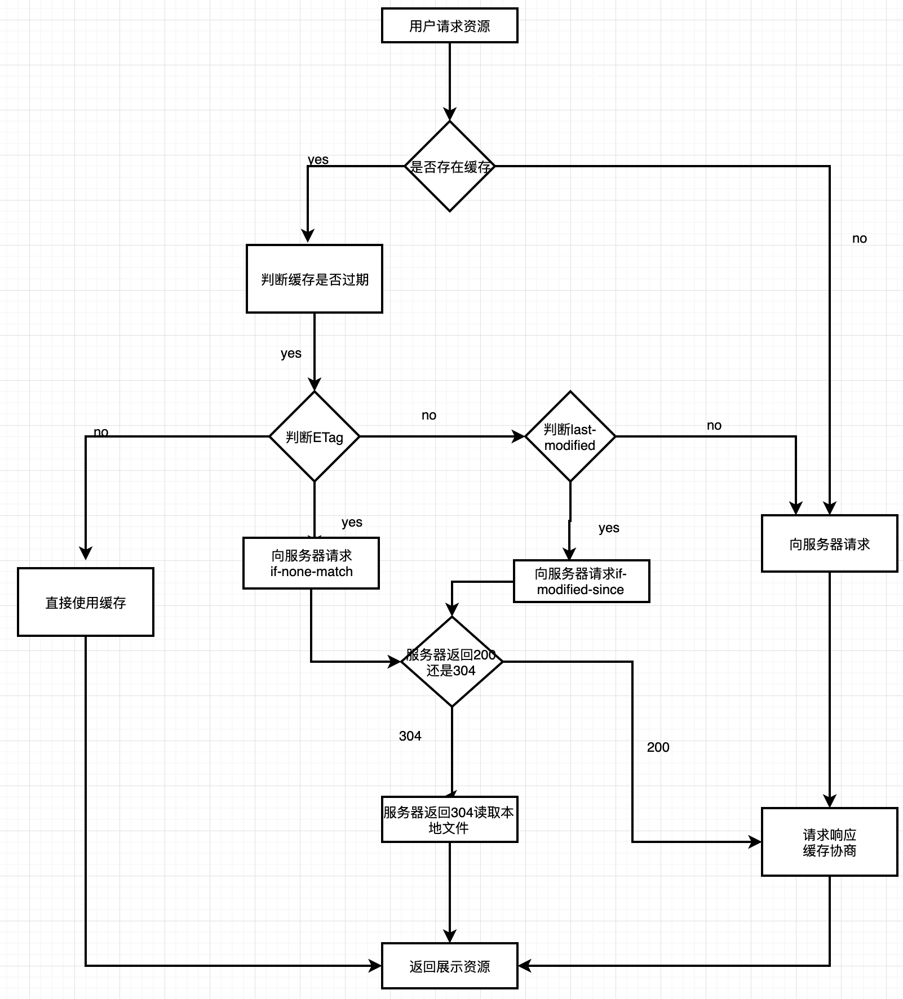

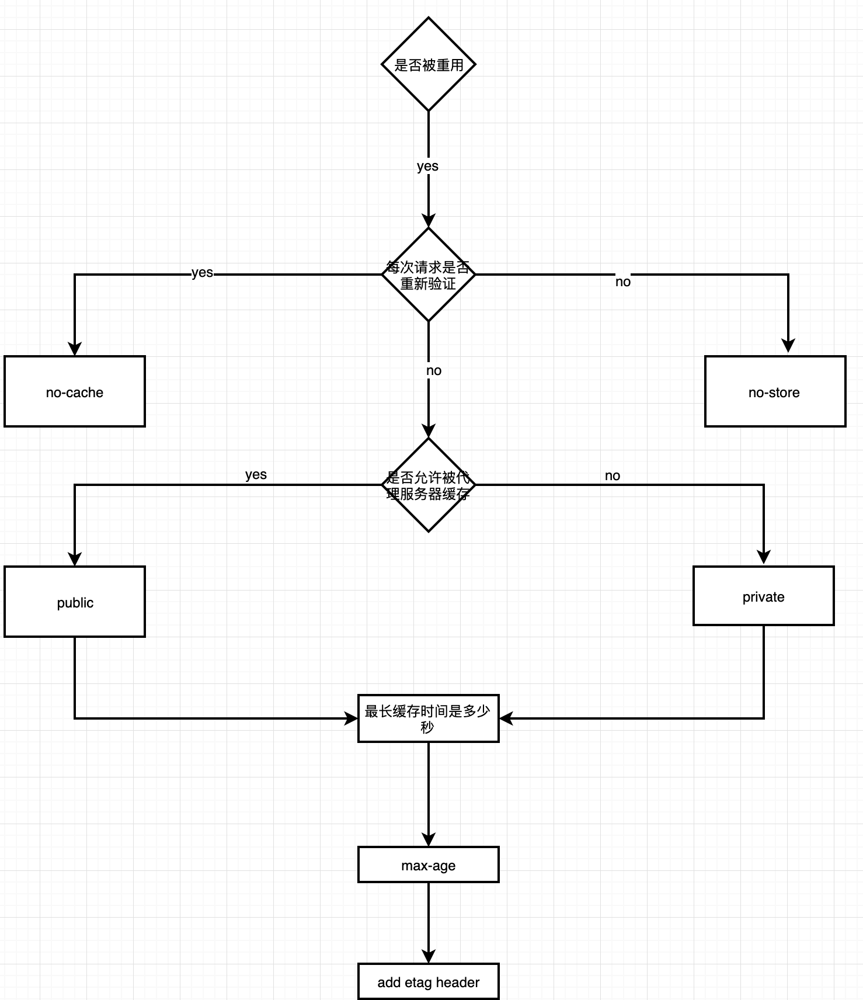


```js
exports.expires = {
  maxAge : 60*60*24*365,
  fileMatch: /^(gif|jpg|png|js|css)$/ig
}
exports.types = {
  'jpg':'image/jpeg',
  'png':'image/jpeg',
  'json':'application/json'
}

const server = http.createServer(function(req,res) {
  const pathname = url.parse(req.url).pathname
  const realPath = 'img'+pathname
  let ext = path.extname(realPath)
  ext = ext ? ext.slice(1): 'unknow'
  const contentType = mime[ext] || 'text/plain'

  if(ext.match(config.expires.fileMatch)){
    var expires = new Date()
    expires.setTime(expires.getTime() + config.expires.maxAge * 1000)
    res.setHeader('Expires', expires.toUTCString())
    res.setHeader('Cache-Control', 'max-age='+config.expires.maxAge)
  }

  fs.stat(realPath, function(err, stat){
    var lastModified = stat.mtime.toUTCString()
    res.setHeader('Last-Modified', lastModified)
    if(req.headers['If-Modified-Since'] && lastModified == req.headers['If-Modified-Since'] ){
      res.writeHead(304,'Not Modified')
      res.end()
    }else{
      fs.exists(realPath, function(exists) {
        if(!exists){
          res.writeHead(404,{
            'Content-Type': 'text/plain'
          })
          res.write('This request url '+ realPath+' was not found on the server')
          res.end()
        }else{
          fs.readFile(realPath, 'binary',function(err,file){
            if(err){
              res.writeHead(500,{
                'Content-Type': 'text/plain'
              })
              res.end()
            }else{
              res.writeHead(200,{
                'Content-Type': contentType
              })
              res.write(file,'binary')
              res.end()
            }
          })
        }
      })
    }

  })

  
})
```


