#	Web安全
+	代码层面
+ 	架构层面
+  运营层面

##	安全问题
+	用户身份被盗用
+ 	用户密码泄露
+  用户资料被盗取
+  网站数据库泄露

# 	跨站脚本攻击Xss
+	Cross site Scripting	(跨站脚本攻击Xss)

##	原理
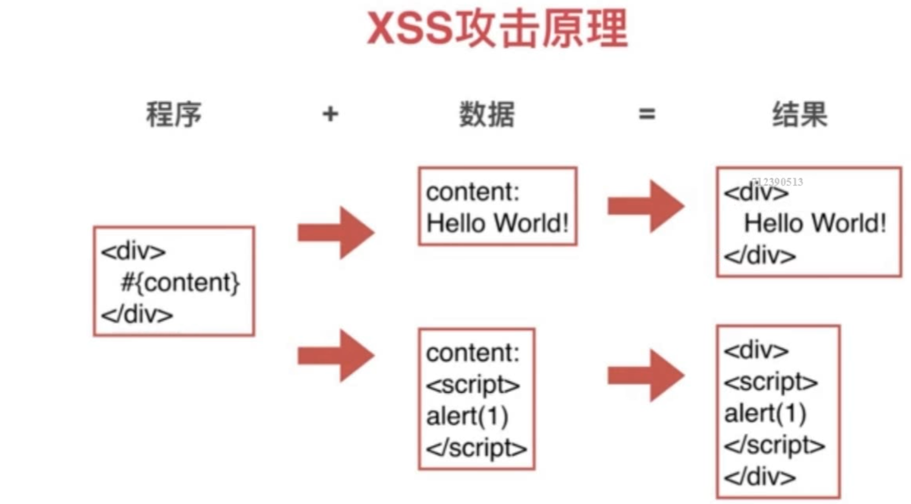
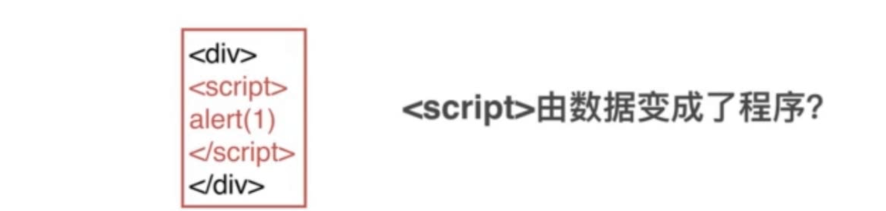

##	危害
+	获取cookie
+ 	获取页面数据
+	劫持前端逻辑
+ 	发送请求
+  偷取网站的任意数据
+  偷取用户的资料
+  偷取用户密码和登录状态
+  欺骗用户

##	XSS攻击分类
###	反射型(危害较小,用户看到有可能怀疑)
+	url参数直接注入
+	通过人为传播,给你一个url让你访问

###	例如
```js
www.baidu.com?form=<script>alert()</script>
//	脚本通过url 注入,页面直接使用这个form属性,就会弹出alert()
```

###	存储型(危害较大,用户看不到)
+	存储到DB中,读取时注入
+	当一个网站可以评论,在评论中注入脚本,不经过处理就会保存到数据库中,在读取的时候就会触发

##	XSS攻击注入点
+	HTML节点内容(动态生成)
+ 	HTML属性,(有可能是用户输入的,中间携带脚本)
+  	javascript代码(用户输入的信息,或者后台返回的变量,导致改变代码逻辑)
+   富文本


###	HTML节点内容(动态生成)
```js
<div>#{content}</div>
//可能输入下面结果
<div><script>alert()</script></div>
```

###	HTML属性,(有可能是用户输入的,中间携带脚本)
```js

//可能输入下面结果 #{image} 的值为  1" onerror="alert(1);

```

###		javascript代码(用户输入的信息,或者后台返回的变量,导致改变代码逻辑)
```js
var data = "#{data}";
//可能输入下面结果 #{data}的值为 hello";alert(1);"
var data = "hello";alert(1);"";
```
###	富文本
+	会保留html样式
+	HTML就有XSS攻击风险

##	防御
### 浏览器自带防御
+	设置头信息	X-XSS-Protection(参数出现在html内容或属性上)
	-	0：禁止XSS过滤。
	-	1:	启用XSS过滤（通常浏览器是默认的）。 如果检测到跨站脚本攻击，浏览器将清除页面（删除不安全的部分）。
	-	1;mode=block 启用XSS过滤。 如果检测到攻击，浏览器将不会清除页面，而是阻止页面加载

###	HTML节点内容
```js
<div>#{content}</div>
```

+	将内容中的<> 转义, 替换成& lt; & gt;
	-	<	=>	& lt;	=>	&# 60;
	-	> => 	& gt; => &# 62;
	-	一种是提交的时候转义
	- 	一种是显示的时候转义

###	HTML的属性
```js

```

+	将双引号,单引号转义
	-	& apos; 单引号 '	&# 39
	-	& quot; 双引号 "	&# 34
+	将空格转义
	-	&# 32
	
```js
var escapaHtml = function(str) {
	if(!str) return '';
	str = str.replace(/&/g,'&amp;');
	str = str.replace(/</g,'&lt;');
	str = str.replace(/>/g,'&gt;');
	str = str.replace(/'/g,'&quto;');
	str = str.replace(/"/g,'&#39;');
	return str;
};
```

###	Javascript代码中的XSS防御
```js
var data = "#{data}";
//可能输入下面结果 #{data}的值为 hello";alert(1);"
var data = "hello";alert(1);"";
```

+	将双引号转义

```js
// 不推荐
var escapaHtml = function(str) {
	if(!str) return '';
	str = str.replace(/\\/g,'\\\\');
	str = str.replace(/"/g,'\\"');
	return str;
};
//推荐
JSON.stringify(str)
```

### 富文本
+	按白名单保留部分标签和属性
+ 	一般在输入的时候进行过滤

####	使用第三方库
+	需要安装cheerio包, 用法跟jquery类似

```js
var whiteList = {
	'img' : ['src'],
	'font' : ['color','size'],
	'a': ['href']
};
var xssFilter = function(html){
	if(!html) return '';
	var cheerio = require('cheerio');
	var $ = cheerio.load(html);

	$('*').each(function(index, elem){
		if(!whiteList[elem.name]){
			$(elem).remove();
			return ;
		}
		for(var attr in elem.attribs){
			if(whiteList[elem.name].indexOf(attr) === -1){
				$(elem).attr(attr, null);
			}
		}
	});
	return $.html();
};
```

+	或者安装xss包, github上搜索xss
+ 	https://github.com/leizongmin/js-xss

```js
var xssFilter = function(html) {
	if(!html) return '';
	var xss = require('xss')
	var ret = xss(html);
	return ret;
};
```

###	CSP
+	Content Security Policy
+ 	内容安全策略
+  用于指定哪些内容可执行
+	https://developer.mozilla.org/zh-CN/docs/Web/HTTP/CSP

##	演示
+	输入一个脚本,脚本用来创建一张图片,src指向远程接口,并将cookie信息绑定到后面,远程就能获取到你的登录态

#		跨站请求伪造攻击CSRF
+	Cross Site Request Forgy
+ 	跨站请求伪造攻击

```js
<body>
	hello，这里什么也没有。
	<script>
		document.write(`
			<form name="commentForm" target="csrf" method="post" 
			action="http://localhost:1521/post/addComment">
				<input name="postId" type="hidden" value="1">
				<textarea name="content">来自CSRF！</textarea>
			</form>`
		);

		var iframe = document.createElement('iframe');
		iframe.name = 'csrf';
		iframe.style.display = 'none';
		document.body.appendChild(iframe);

		setTimeout(function(){
			document.querySelector('[name=commentForm]').submit();
		},1000);
	</script>
</body>
```

+	一个单独的页面,通过js写了一个form表单,action中是你登录过得网站
+ 	创建一个iframe, 给一个name ,并且让form的target指向这个name
+  把iframe加入到页面中,一秒钟提交一次
	-	这样就可以利用你的登录状态,去做一些事情,这个时候你并不知情
	- 	提交的时候你并没有看到任何变化,是因为form的target指向了iframe

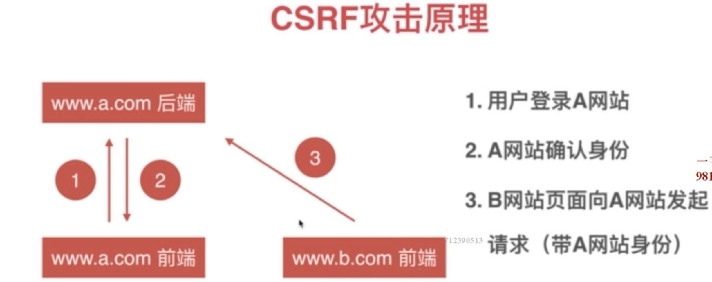

##	危害
+	利用用户登录状态	盗取用户资金(转账,消费)
+ 	用户不知情			冒充用户发帖
+  	完成业务请求		损坏网站名誉

##	防御
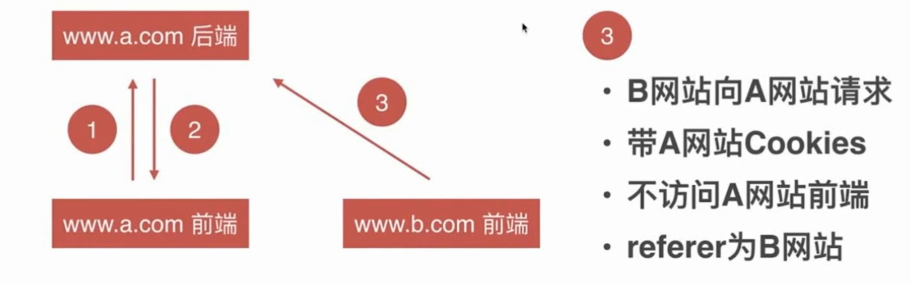

1.	禁止第三方网站携带cookie ===> sameSite
	+	sameSite 效果很好,但是兼容性不好
2.	验证码	(ccap 验证码图形库 作用就是要求要进入网站前端操作)
3. token	后台需要验证,因为三方不能拿到token,就会报错(一个随机字符串,只有进入网站前端才可以拿到)
4.	referer为B网站: http请求头,从哪个网站访问,就是哪个网站,通过验证referer就可以拒绝访问


```js
ctx.cookies.set('userId', user.id,{
	httpOnly:false,
	sameSite:'strict'
})
```

#		前端	Cookies 的安全性
+	前端数据存储
+	后端通过http头设置
+ 	请求时通过http头传给后端
+  前端可读写
+  遵守同源策略

##	Cookies特性
+	域名			同一域名下才可以使用cookie
+ 	有效期			可以设置有效期
+  	路径			可以设置那个路径下可以使用
+   http-only		只有http请求才可以使用
+   secure		只有https才可以使用

+	cookie不能删除,只能设置一个已经过期的时间就可以

##	Cookies作用
+	存储个性化设置
+ 	存储未登录时用户唯一标识
+  存储已登录用户的凭证
+  存储业务数据

###	Cookies - 登录用户凭证
+	前端提交用户名和密码
+ 	后端验证用户名和密码
+  	后端通过http头设置用户凭证
+   后续访问时后端验证用户凭证

####	如何使用
+	用户id - 设置cookie 具有巨大隐患 
	-	解决 用户id + 签名
	- 	cookies中保存两个值,一个是用户id, 另一个通过用户id加密的字符串
	-  当后台获取到用户id,和加密字符串,会将用户id加密,看看是否跟传过来的相同
+	SessionId
	-	随机的字符串
	- 	前端不会存用户的信息,只会存一个sessionId,然后通过这个发到后台,后台获取用户信息

##	Cookies 和 XSS 的关系
+	XSS 可以偷走Cookies js可以获取Cookies,并修改
	-	设置cookies 的http-only 就不会被偷走了

##	Cookies 和 CSRF 的关系
+	CSRF利用了用户的 Cookies
+ 	攻击网站是不可以读写Cookies的 但是可以携带cookies
+  	最好能阻止第三方使用cookies

##	案例
+	某学校教务系统使用了三方开源CMS系统
+ 	该系统使用userName用作唯一标识
+  CMS文章作者暴露了这个userName
+  别人就可以使用这个userName随意进入后台

##	Cookies 安全策略
+	加签名的方式防止被篡改
+ 	私有变换 (加密)
+	http-only 方式xss攻击
+ 	secure  只有在https中才可以读写cookies
+	same-site	防止csrf攻击(兼容性不是很好)

```js
let crypto = require('crypto')

let KEY = '@#$!@$%DSFWER@#%2342341@!EWR!@3'
// 加密
let cipher = crypto.createCipher('des', KEY)
let text = cipher.update('helloworld', 'utf8', 'hex')
text += cipher.final('hex')
console.log(text)

// 解密
let decipher = crypto.createDecipher('dex', KEY)
let originalText = decipher.update(text, 'hex', 'utf8')
originalText += decipher.final('utf8')
console.log(originalText)
```
#		点击劫持攻击
+	通过用户的点击,但是并不是自己的意愿,以为是点击了别的按钮,其实是被劫持了,去做了别的操作
+ 	比如很多网站, 类似于跟没有有约,点击一下视频之类的,其实都是点击劫持,当你点击了按钮,你可能做了别的事情但是你并不知情

```js
<body style="background:url(xxx.png) no-repeat">
	<iframe style="opacity:0" src="目标网站" width="800" height="800"></iframe>
</body>
```

+	你所看到的网页,网页上有个按钮,但是这只是一张图片,是一张背景图
+ 	有个iframe 设置了宽高,但是他设置了透明度为0 你就看不到iframe内的东西了
+  然而,透明度下面也就是iframe里面,其实是一个目标网站,他的按钮跟你在页面中看到的按钮重叠了,
+  所以你点击按钮的时候其实点击了目标网站的按钮,因此发生了点击劫持.

## 危害
+	用户亲手操作		盗取用户资金(转账,消费)
+ 	用户不知情			获取用户的敏感信息

##	原理
+	设置一张够吸引人的背景图片
+ 	内嵌一个iframe里面是目标网站
+  通过引导,引导用户点击按钮,实现点击劫持


##	防御
+	js禁止内嵌 (正常情况下 top === window的,但是如果页面中有iframe 他们两个就不会想相等)
	-	js是可以禁用的,所以不一定能解决问题

```js
if(top.location != window.location){
	top.location = window.location
}
```

+	X-FRAME-OPTIONS 禁止内嵌(推荐)

```js
//禁止内嵌
ctx.set('X-FRAME-OPTIONS','DENY')
//	同一个网站才可以内嵌
ctx.set('X-FRAME-OPTIONS','SAME-ORIGIN')
```

+	添加辅助手段,但是不能从彻底防御


#		传输过程安全问题
##		HTTP传输窃听
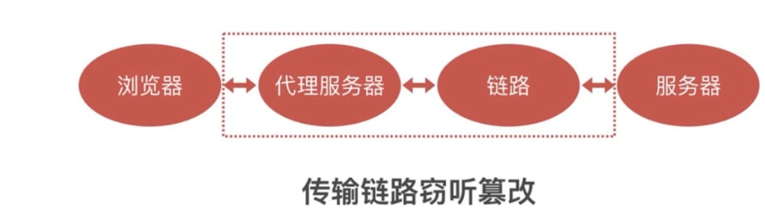

+	可以通过命令查看http请求经过的节点
	-	traceroute www.baidu.com
+	http请求经过的任何节点都可以窃听和篡改我们的请求

##		HTTP窃听
+	窃听用户密码
+ 	窃听传输敏感信息
+  非法获取个人资料(身份证号,手机号,银行卡,照片等)

##		HTTP 篡改
+	插入广告, 中间链路给你加了一堆广告
+ 	重定向网站, 给你重定向一个网站
+  无法防御XSS和CSRF攻击(可以修改头信息,之前做过的工作都可以被修改掉)

##		案例
+	当你上网的时候,可能中国移动给你跳转到了活动页面,或者续费页面
+	当你上网的时候,发现右下角有个流量球,提醒你还有多少流量,这个就是运营商劫持.
+	公共wifi,你做的所有请求,都通过了这个路由器(发的朋友圈,登录的银行....)

##	原理
+	为什么可以窃听和篡改
	-	因为http请求都是明文的,对于各个节点是透明的

##	防御
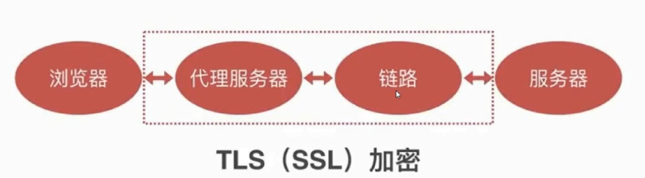
	
+	在http的基础上通过TLS 进行加密,服务器进行解密,使中间过程无法解析
	
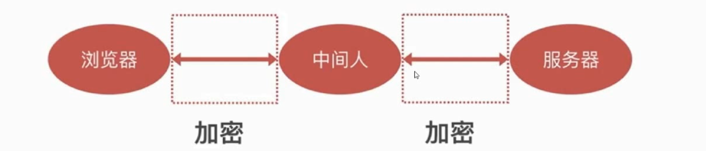

+	中间人机制,浏览器以为他是服务器,服务器以为他是浏览器,
+ 	所以在中间他就可以继续窃听和篡改http请求

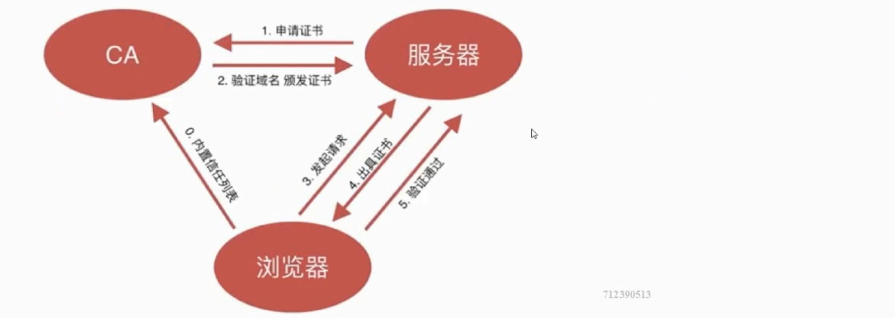

+	增加证书机制
+ 	证书无法伪造
+	证书的私钥不被泄露(泄露了就不安全了)
+ 	域名管理权泄露
+  CA坚守原则

#		用户密码安全问题
##	密码的作用	
+	证明你是你


###	密码的泄露渠道
+	数据库被偷
+ 	服务器被入侵
+  通讯被窃听
+  内部人员泄露数据
+  其他网站(装库, 每个人可能注册过很多个网站,但是每个网站的账号密码都相同)

##	密码的存储
+	严禁明文存储(防泄漏)
+ 	单项变换 (防泄漏, 密码加密,得到密码并不知道之前密码是什么)
+  变换复杂度要求(防猜解)
+  密码复杂度要求(防猜解)
+  加盐(防猜解)

###	密码- 哈希算法
+	明文 - 密文	一一对应
+ 	雪崩效应(两个密码只有一个不一样,也会有天差地别的差距)
+  密文 - 明文 无法反推
+  密文固定长度
+  常见的哈希算法	md5	sha1	sha256
+  防止彩虹表(有人穷举大批量的密码进行加密存到数据库,进行比对),可以使用组合方式
	-	md5(sha256(sha1(明文))) = 密文

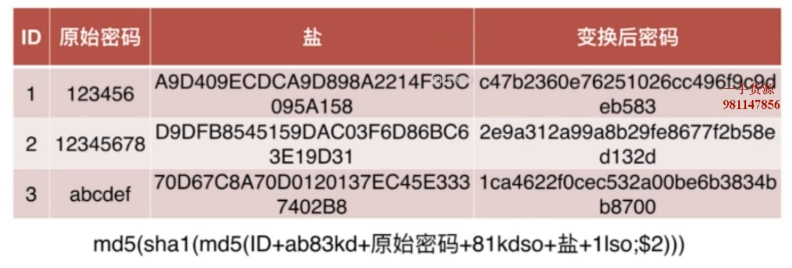

###	变换次数越多越安全
+	加密成本几乎不变(生成密码时速度慢一些)
+ 	彩虹表失效(数量太大,无法建立通用性)
+  解密成本增大N倍

```js
var md5 = function(str) {
	var crypto = require('crypto')
	var md5Hash - crypto.createHash('md5')
	md5Hash.update(str)
	return mdtHash.digest('hex')
}
password.getSalt = function(){
	return md5(Math.random() * 99999 + Date.now())
}
//	salt 盐值
password.encryptoPassword = function(salt, password){
	return md5(salt + '@SD#%!@DFHsdfe43^*&$%' + password)
}
```

##	密码的传输
###	密码传输的安全性
+	https传输
+ 	频率限制(防止一直破解密码,比如一分钟3次错误,就不让你在登录了)
+  前端加密意义有限
	-	前端加密, 中间的窃听者并不能获得你的原始密码(原始密码不泄露,就不会拿密码去别的网站去试)
	- 	但是,他可以用你加密后的密码登录,http传输是明文的

```js
//	前端加密
var md5 = require('js-md5')
data.password = md5(data.username + data.password)
```

##	生物特征密码的问题
+	指纹(唇纹)
+ 	声纹
+  虹膜(人眼)
+  人脸

##	危害
+	私密性-	容易泄露
+ 	安全性-	碰撞(可能性判断,不是直接判断是不是你,而是相似度)
+	唯一性-	终身唯一	无法修改

#		SQL注入攻击
##	关系型数据库
+	存放结构化数据
+ 	可高效操作大量数据
+  方便处理数据之间的关联关系

##	Sql注入
```js
select * from user where username = '${data.username}' and password = '${data.password}'
data.password = 1' or '1'='1
//后面的 or 直接否认了前面的判断
select * from user where username = 'hongyanhuoshui' and password = '1' or '1'='1'
```

##	sql注入危害
+	猜解密码
+ 	获取数据
+  删除删表
+  拖库

##	SQL注入防御
+	关闭错误输出
+ 	检查数据类型
+  对数据进行转义
+  使用参数化查询
+  使用ORM(对象关系映射)

##	NOSQL注入和防御
+	检查数据类型
+ 	类型转换
+  写完整条件

#	上传
+	上传文件
	-	再次访问上传的文件
	- 	上传的文件被当成程序解析

##	上传问题防御
+	限制上传后缀
+ 	文件类型的检查
+	文件内容检查
+ 	程序输出(通过流读出来,不需要执行)

```js
let file = data.files.img
let ext = path.extname(file.name)
//后缀名
if(ext === '.js'){
	throw new Error('格式错误')
}
//	格式
if(file.type !== 'image/png'){
	throw new Error('格式错误')
}
```
#		信息泄露和社会工程学
##	信息泄露
+	泄露系统敏感信息(服务器配置,密码....)
+	泄露用户敏感信息(身份证,照片,银行卡)
+	泄露用户密码

##	信息泄露的途径
+	错误信息失控
+ 	SQL注入
+  水平权限控制不当
	-	按级别谁能看谁不能看
	-	水平权限就是,A跟B相同的权限,但是A可以去修改B的东西
+	XSS 和 CSRF

##	社会工程学
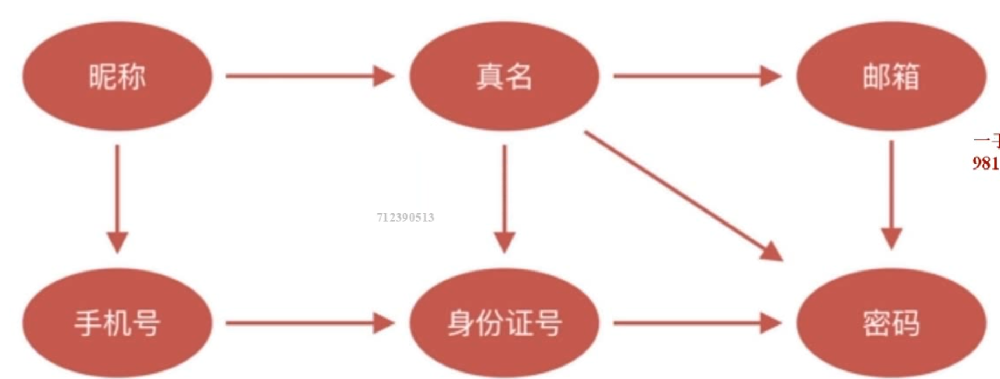

+	靠你的一些信息猜测密码(密保,密码)
+ 	你的身份由你掌握的资料确定
+  别人掌握了你的资料
+  别人就可以伪装你的身份
+  利用你的身份干坏事(骂人,诈骗,骗父母,微信号,QQ号骗朋友钱)

##	社会工程学案例
+	电信诈骗(徐玉玉案)
+ 	伪装公检法(给你打电话,收你犯罪了)
+  QQ视频借钱
+  微信伪装好友(头像,用户名类似,伪装你好友)

##	OAuth 思想
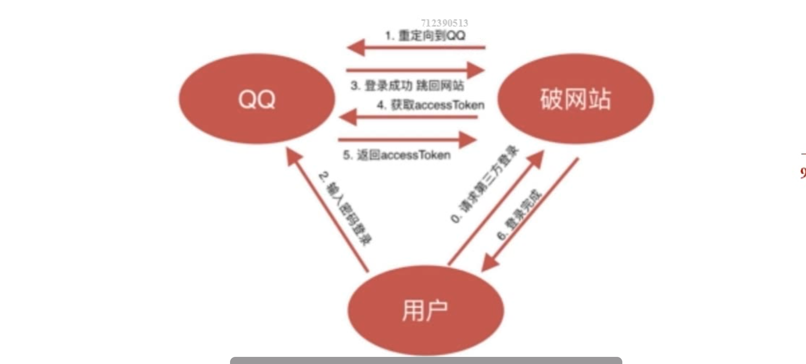

+	一切行为由用户授权
+ 	授权行为不泄露敏感信息
+  授权会过期

##	利用OAuth思想防止资料泄露
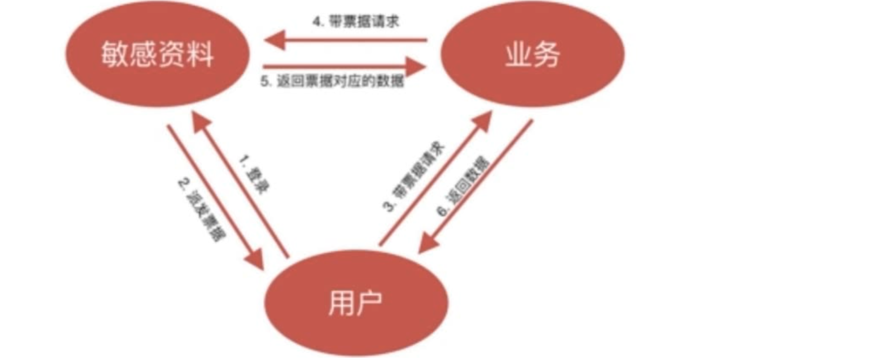

+	用户授权读取资料
+ 	无授权的资料不可读取
+  不允许批量获取数据
+  	数据接口可风控审计

#		其他安全问题
##	拒绝服务攻击 DOS
+	模拟正常用户
+ 	大量占用服务器资源
+  	无法服务正常用户(正忙于处理黑客攻击的服务)
	-	TCP半连接(等待,影响正常请求)
	- 	HTTP连接
	-  DNS

##	大规模分布式拒绝服务攻击 DDOS
+	流量可达几十上百G
+ 	分布式(肉鸡, 代理)
+  极难防御(每个请求都很正常)

###	案例
+	游戏私服互相DDOS
+ 	换目标,攻击DNS服务器
+  DNS服务器下线
+  数十万网站DNS解析瘫痪
+  暴风影音后台疯狂请求解析
+	导致各地local DNS 瘫痪 无法上网

##	DOS攻击防御
+	防火墙
+	交换机,路由器
+ 	流量清洗(分析,特征,哪些是正常的请求)
+	高仿IP(大规模数据清洗服务)

##	DOS攻击预防
+	避免重逻辑业务(快)
+ 	快速失败快速返回(失败了就返回,大流量网站,服务器不要做重试机制,只会越来越多失败,占据并发)
+  防雪崩机制(失败越来越多,任务越来越多,错误越来越多,越积越大)
+	有损服务(一个服务挂了 ,其余的也挂了)
+ 	CDN

##	重放攻击
+	请求被窃听或者记录
+ 	再次发送相同的请求
+  产生意外的结果

###	后果
+	用户被多次消费(多次支付)
+ 	用户登录态被盗取
+  多次抽奖(刷票)


###	防御
+	加密(https)
+	时间戳
+ 	token
+  nonce(一次性的数字)
+  签名

#	总结
##	简述XSS的原理


##	简述XSS的防御方法

##	


