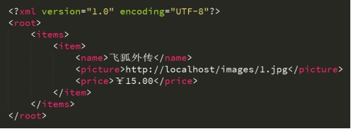

# ajax

```
ajax 的概念 
同步交易以及异步交互的概念.
(页面不刷新就可以与服务器进行数据交互)
ajax 的原理 (使用XMLHttpRequest 对象发送http 请求，接收服务器响应的数据) 
ajax 的基本交互流程 (创建对象，打开连接，发送数据，接收数据)
ajax get交互与post 交互
get 交互请求的数据都在地址的后面，send() 方法不能省略
post 方式提交需要设置特殊的请求头 Content-Type:application/form-data
作业:检测用户名是否存在
```

问题：我们做ajax 异步交互，是页面不刷新就可以去获取服务器的数据，我刚刚获取的数据非常的简单，实际开发过程当中，我们去请求的服务器的数据返回的数据是非常复杂的。为了这个服务器返回的数据到客户端方便解析

这个时候就市场上面出现新的数据格式。

xml，必有历史悠久的一个数据格式。早起的这种系统都是使用xml

json，互联网的项目的数据交互都是采用json

有一些大型的公司，它要对外提供接口，让别人去调用，它也要响应数据格式。一般他们都会支持两种数据格式.

# XML 格式数据

##概念 

XML是一种标记语言，很类似HTML，其宗旨是用来传输数据，具有自我描述性（固定的格式的数据）。软件的配置文件。 可扩展标记语言.

�记�3[C�

1、必须有一个根元素，xml 也是由标签组成。开始标签，结束标签

2、不可有空格、不可以数字或.开头、大小写敏感

3、可以嵌套，不可交叉嵌套

4、属性双引号（浏览器自动修正成双引号了）

5、特殊符号要使用实体

6、注释和HTML一样

虽然可以描述和传输复杂数据，但是其解析过于复杂并且体积较大，所以实现开发已经很少使用了。

## 使用

###服务端  服务器怎么去响应xml 格式的数据，

```
怎么去响应xml 格式的数据
设置一个响应头,告诉客户端，服务器返回的是一个xml 格式的文本。
header("Content-Type:text/xml;charset=utf-8");
输出XML格式的数据
echo "";
```

###客户端 

```
怎么去接收XML格式的数据并解析，
xml 跟 html 的语法非常相似，解析html 的时候我们使用dom 对象，然后调用dom 的api 去进行解析.
xml 假设可以转换成html，就可以按照html 方式去进行解析。

怎么将xml 数据的格式，转换成dom 对象
1:服务器，必须设置一个响应头  Content-Type:text/xml;charset=utf-8
2:客户端接收数据，接收普通文本  responseText，接收的是有格式的xml

使用 xhr.responseXML;
```

## JSON 格式数据

### 概念

```
即 JavaScript Object Notation，另一种轻量级的文本数据交换格式，独立于语言。
```

### 语法规则

```
json 的数据格式是以键值对的方式进行存储,key=value,key=value
数据在名称/值对中
数据由逗号分隔(最后一个健/值对不能带逗号)
花括号保存对象方括号保存数组
使用双引号
```

### 怎么表示数据

```
表示一条记录
{"id":11,"username":"xiaoqin","loginName":"xiaoxuanfeng","password":"111111"}
表示多条记录(数组)
[
    {"id":11,"username":"xiaoqin","loginName":"xiaoxuanfeng","password":"111111"},
    {"id":22,"username":"heixuanfeng","loginName":"heixuanfeng","password":"111111"}
]
表示复杂数据
{
	    response:{
            	rows:[
       		 {"id":11,"username":"xiaoqin","loginName":"xiaoxuanfeng","password":"111111"},
        	 {"id":22,"username":"heixuanfeng","loginName":"heixuanfeng","password":"111111"}
			]
	    },
        "status":200
}

```

json 格式数据使用

```
服务器端怎么发送json 格式的数据
   实际上在开发的过程当中，服务器返回的数据都是从数据库取出来的，取出来的可能是一条记录，也可能是多条记录，我们怎么把这些格式的数据响应到客户端，然后在客户端进行解析。
   
服务端：
	 怎么将数据库的数据获取到转换成json 格式的数据，向客户端输出。
	 header("Content-Type:text/json;charset=utf-8");
客户端：
     怎么接收到服务器端返回的数据并解析.		
	 第一种解析方式:  eval();
     第二种解析方式:  JSON.parse();
```

案例：异步去获取服务器的用户的数据

## ajax 封装


我为什么要封装一个ajax，封装的主要目的，一个页面可能发多次ajax 请求，每次请求的都是4步，创建对象，

打开连接，发送数据，接收数据。调用一次，写一次这样的代码，太累了。所以，我们需要封装到一个方法里面去.在一个页面可能发送多次请求，每次请求的时候时候都需要调用这段代码.这样的话不利于我们去维护代码，以及会有代码冗余。

```
//利用XMLHttpRequest对象去进行交互.
//交互分为四步
//1:创建对象
var xhr=new XMLHttpRequest();
//2:打开连接
//提交方式，提交的地址
xhr.open("get","login.php?username=zhangsan");
//3:发送数据
xhr.send(null);
//4:接收数据，只能通过异步的方式，就是只能通过回调函数的方式.
//时刻监听这服务器端状态的改变. onreadystatechange 也是xhr 的一个属性.
xhr.onreadystatechange=function(){
         //服务器数据响应成功之后会调用这个函数.
         //因为我跟服务器进行交互，服务器会进行处理
        //在处理的过程当中会不断的给我一些状态.  0,1,2,3，4
        //每个状态代表的是不同的含义
        //状态我通过xhr 去获取到试一下.
        //readyState 属性去获取到
        //如果状态等于 4 代表响应完成
        if(xhr.readyState==4){  //响应完成.
                //console.log("响应完成") 如果响应的是200 才代表响应成功
                //我们要获取到服务器端状态吗.
                if(xhr.status==200){
                    //真正的处理.
                    //响应完成的，响应是成功的.
                    //接收服务器端返回的数据.responseText 用来接收服务器响应的数据的
                    var data=xhr.responseText;
                    document.querySelector("span").innerHTML=data;
                }
        }
}
```

  封装第一步，把相同的逻辑提炼到一个方法

```
//这个函数可以实现基本的功能
            //发送请求，接收数据，还可以支持get 发送，以及post 发送
            function ajax(type,url,data,success){
                  var xhr=new XMLHttpRequest();
                  //因为get 方式提交，请求的参数在地址的后面.
                  url=url+"?"+data;
                  xhr.open(type,url);
                  xhr.send(null);
	//这个是一个回调函数，这个函数不会立即执行，这个函数需要等待服务器响应数据的时候才会执行
                  xhr.onreadystatechange=function(){
                       //服务端的数据响应完毕以及响应成功的时候才会执行下面的代码.
                       if(xhr.readyState==4 && xhr.status==200){
                          //响应回来的数据
                          var data1=xhr.responseText;
                         //调用函数.
                          success(data1);
                       }
           }
}
```

封装的这个函数需要支持get 以及post 方式提交.

```
 function ajax(type,url,data,success){
                    var xhr=new XMLHttpRequest();
                    //进行一个处理，用户可能get 方式提交，也可能post方式提交.
                    //要让type 的提交方式支持大小写
                    type=type.toLocaleLowerCase();  //将一个字符串转换为小写.
                    if(type=="get"){
                         url=url+"?"+data;
                         data=null;
                    }
                    xhr.open(type,url);
                    //如果是post 方式提交，需要设置一个请求头
                    if(type=="post"){
                         xhr.setRequestHeader("Content-Type","application/x-www-form-urlencoded");
                    }
                    xhr.send(data);
                    xhr.onreadystatechange=function(){
                         if(xhr.readyState==4 && xhr.status==200){
                              var data=xhr.responseText;
                              //请求的数据完成以及成功的时候调用.
                              success(data);
                         }
                    }
            }
```

传递参数太多为了方便维护，把参数封装在一个对象里面。

```
 function ajax(obj){
            var xhr=new XMLHttpRequest();
            //进行一个处理，用户可能get 方式提交，也可能post方式提交.
            //要让type 的提交方式支持大小写
            obj.type=obj.type.toLocaleLowerCase();  //将一个字符串转换为小写.
            if(obj.type=="get"){
                obj.url=obj.url+"?"+obj.data;
                obj.data=null;
            }
            xhr.open(obj.type,obj.url);
            //如果是post 方式提交，需要设置一个请求头
            if(obj.type=="post"){
                xhr.setRequestHeader("Content-Type","application/x-www-form-urlencoded");
            }
            xhr.send(obj.data);
            xhr.onreadystatechange=function(){
                if(xhr.readyState==4 && xhr.status==200){
                    var data=xhr.responseText;
                    //请求的数据完成以及成功的时候调用.
                    obj.success(data);
                }
            }
        }
```

为了避免自己封装的函数跟其它的库不产生冲突，把封装的方法火山属性包装在一个函数里面。

```
//一般我们都是以面向对象的方式去组织页面上面的代码
        //将方法，以及属性包在一个对象里面.
        var $={
             ajax:function(obj){
                 var xhr=new XMLHttpRequest();
                 //进行一个处理，用户可能get 方式提交，也可能post方式提交.
                 //要让type 的提交方式支持大小写
                 obj.type=obj.type.toLocaleLowerCase();  //将一个字符串转换为小写.
                 if(obj.type=="get"){
                     obj.url=obj.url+"?"+obj.data;
                     obj.data=null;
                 }
                 xhr.open(obj.type,obj.url);
                 //如果是post 方式提交，需要设置一个请求头
                 if(obj.type=="post"){
                     xhr.setRequestHeader("Content-Type","application/x-www-form-urlencoded");
                 }
                 xhr.send(obj.data);
                 xhr.onreadystatechange=function(){
                     if(xhr.readyState==4 && xhr.status==200){
                         var data=xhr.responseText;
                         //请求的数据完成以及成功的时候调用.
                         obj.success(data);
                     }
                 }
             }
        };
```

封装扩展

```
  var $={
                  //新增的函数，函数的功能，将一个对象转换成字符串
                  params:function(obj){
                        //将对象的key 作为参数名，key 对应的值作为参数值。这个地方怎么编写逻辑.
                        var str="";
                        //username=zhangsan&age=11&sex=nan
                        for(var key in obj){
                             str+=key+"="+obj[key]+"&";
                        }
                        //组装的字符串多了一个&,截取之后返回一个新的字符串
                        str=str.substr(0,str.length-1);
                        return str;//出来是要发送到后台的数据，参数名，参数值.
                  },
                  ajax:function(obj){
                         //1:创建对象
                         var xhr=new XMLHttpRequest();
                         //新增功能1:我要处理，这个data 对应的值支持是一个对象
                         //将 对象={username:"zhangsan",age:11,sex:"nan"}  转换成 字符串的格式  username=zhangsan&age=11&sex=nan

                         //新增功能4：请求发送之前调用. 如果该函数return false ，我就组织改代码继续往下执行.
                         var flag=obj.beforeSend();
                         if(flag==false){
                                return;
                         }
                         //对obj.data 的类型进行判断，如果是对象类型，我才去进行处理.
                         if(typeof obj.data=="object"){
                              //在这里进行处理
                              //提炼一个方法，参数是obj={} 出来的字符串username=zhangsan&age=11&sex=nan
                              //this 现在指向到 $
                               obj.data=this.params(obj.data);
                         }
                         //2:打开对象
                         //注意：如果是get 方式提交，参数在地址的后面
                         if(obj.type.toLowerCase()=="get"){
                             obj.url=obj.url+"?"+obj.data;
                             obj.data=null;
                         }
                         xhr.open(obj.type,obj.url);
                         //注意：处理post 我们需要给一个请求头
                         if(obj.type.toLowerCase()=="post"){
                             xhr.setRequestHeader("Content-Type","application/x-www-form-urlencoded");
                         }
                        //3:发送数据
                         xhr.send(obj.data);
                        //4:接收数据
                         xhr.onreadystatechange=function(){
                               if(xhr.readyState==4){  //响应完成
                                      if(xhr.status==200){ //响应成功
                                            var data=xhr.responseText;
                                            obj.success(data);
                                      }else{
                                            //失败的时候去调用error
                                            //新增功能2
                                            obj.error();
                                      }
                                      //新增功能3
                                      //请求完成的时候调用
                                      obj.complete();
                               }
                         }
                  }
            }
```

完整封装

```
var $={
    //新增的函数，函数的功能，将一个对象转换成字符串
    params:function(obj){
        //将对象的key 作为参数名，key 对应的值作为参数值。这个地方怎么编写逻辑.
        var str="";
        //username=zhangsan&age=11&sex=nan
        for(var key in obj){
            str+=key+"="+obj[key]+"&";
        }
        //组装的字符串多了一个&,截取之后返回一个新的字符串
        str=str.substr(0,str.length-1);
        return str;//出来是要发送到后台的数据，参数名，参数值.
    },
    ajax:function(obj){
        //1:创建对象
        var xhr=new XMLHttpRequest();
        //新增功能1:我要处理，这个data 对应的值支持是一个对象
        //将 对象={username:"zhangsan",age:11,sex:"nan"}  转换成 字符串的格式  username=zhangsan&age=11&sex=nan

        //新增功能4：请求发送之前调用. 如果该函数return false ，我就组织改代码继续往下执行.
        //console.log(obj.beforeSend);
        if(obj.beforeSend){ //因为用户在调用的时候，可能没有传递,所以需要进行判断.
            var flag=obj.beforeSend();
            if(flag==false){
                return;
            }
        }
        //对obj.data 的类型进行判断，如果是对象类型，我才去进行处理.
        if(typeof obj.data=="object"){
            //在这里进行处理
            //提炼一个方法，参数是obj={} 出来的字符串username=zhangsan&age=11&sex=nan
            //this 现在指向到 $
            obj.data=this.params(obj.data);
        }
        //2:打开对象
        //注意：如果是get 方式提交，参数在地址的后面
        if(obj.type.toLowerCase()=="get"){
            obj.url=obj.url+"?"+obj.data;
            obj.data=null;
        }
        xhr.open(obj.type,obj.url);
        //注意：处理post 我们需要给一个请求头
        if(obj.type.toLowerCase()=="post"){
            xhr.setRequestHeader("Content-Type","application/x-www-form-urlencoded");
        }
        //3:发送数据
        xhr.send(obj.data);
        //4:接收数据
        xhr.onreadystatechange=function(){
            if(xhr.readyState==4){  //响应完成
                if(xhr.status==200){ //响应成功
                    var data=xhr.responseText;
                    obj.success(data);
                }else{
                    //失败的时候去调用error
                    //新增功能2
                    //等价于
                   /* if(obj.error){
                        obj.error();
                    }*/
                    obj.error && obj.error();

                }
                //新增功能3
                //请求完成的时候调用
                // if(obj.complete){
                //     obj.complete();
                // }
                    obj.complete && obj.complete();

            }
        }
    }
}
```


