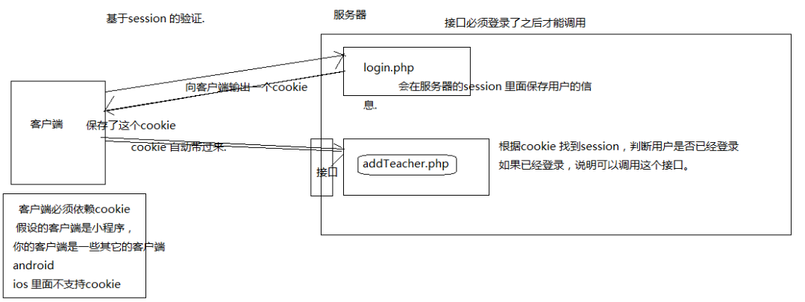

# 模板引擎

​       模板作用:我们ajax 开发一般都是通过XMLHttpRequest 发送请求，然后服务器返回数据，当我们通过js 得到数据之后，然后通过解析json 的方式去解析数据，解析完json 之后，我们再将数据通过dom 的方式放在页面上面。如果json 的数据格式特别复杂，我们可能要做很多的js 凭借，非常麻烦，性能也非常低下。这个时候我们就需要用到模板：我们可以在模板里面解析json，然后跟html 内容拼接，性能会更好。

##流行模板引擎

**BaiduTemplate**：http://tangram.baidu.com/BaiduTemplate/  b百度

**ArtTemplate：**https://github.com/aui/artTemplate  t腾讯

**velocity.js**：https://github.com/shepherdwind/velocity.js/ a阿里

**Handlebars：**http://handlebarsjs.com/

**参考资料:**

http://blog.jobbole.com/56689/

# 1.3 **artTemplate**

1、引入template-native.js

2、<% 与  %> 符号包裹起来的语句则为模板的逻辑表达式

3、<%= content %>为输出表达式

使用步骤:

- 引入模板文件
- 创建模板
- 将数据跟模板进行绑定
- 在模板里面编写代码解析数据
- 绑定数据和模板之后得到内容
- 将数据内容写到页面上面。

# 同源&跨域

##跨域的概念

从一个站点访问一个资源，然后在这个资源当中又去访问另外的一个站点的资源，这个就是跨域。

## 同源

同源策略是浏览器的一种安全策略，所谓同源是指，域名，协议，端口完全相同。

## 跨域

不同源则跨域

例如http://www.example.com/

| http://api.example.com/detail.html       | 不同源 | 域名不同       |
| ---------------------------------------- | ------ | -------------- |
| https//www.example.com/detail.html       | 不同源 | 协议不同       |
| http://www.example.com:8080/detail.html  | 不同源 | 端口不同       |
| http://api.example.com:8080/detail.html  | 不同源 | 域名、端口不同 |
| https://api.example.com/detail.html      | 不同源 | 协议、域名不同 |
| https://www.example.com:8080/detail.html | 不同源 | 端口、协议不同 |
| http://www.example.com/detail/index.html | 同源   | 只是目录不同   |

+	1、JSONP 跨域

其本质是利用了<script src=""></script>标签具有可跨域的特性，由服务端返回一个预先定义好的Javascript函数的调用，并且将服务器数据以该函数参数的形式传递过来，此方法需要前后端配合完成。

jQuery 的.ajax() 方法当中集成了JSONP的实现，可以非常方便的实现跨域数据的访问。

- jsonp 跨域解决方案 

  ​       利用script 标签发送请求，在客户端定义一个回调函数，给服务器传递回调函数的名称，服务端返回的是

  一个回调函数的调用。服务端的数据包在函数里面.


+	2·  CORS 跨域（跨域资源共享）

```
通过服务端响应头的方式
通过想客户端输出一个响应头
header("Access-Control-Allow-Origin:*");
```

### 案例 jsonp 实现360 搜索案例

    function getInfo(obj){
    	var html=template("soId",obj);
    }
     window.onload=function(){
                //把事件进行绑定.
                document.getElementById("keyword").onkeyup=function(){
                   if(this.value.length>0){
                     //发送请求，获取数据，解析数据放在页面对应的位置
                       var script=document.createElement("script");
                       script.src="https://sug.so.360.cn/suggest?callback=getInfo&encodein=utf-8&encodeout=utf-8&format=json&fields=word&word="+this.value;
                           //挂载到页面.
                           document.body.appendChild(script);
                 }else{
                            //隐藏当前元素.
                            document.getElementsByClassName("area")[0].style.display="none";
              }
          }
    }
jsonp 的跨域，它只支持get 方式的请求，因为它是使用script 标签去发送请求，而且服务端需要做处理，客户端也需要做处理。如果跨域的时候传递的数据非常多，jsonp 的方式就不太可取。

### cors 跨域 

跨域资源共享，它的原理就是在请求服务器的时候，服务器给一个响应头，告诉客户端，这些数据可以访问.

```
通过想客户端输出一个响应头
header("Access-Control-Allow-Origin:*");  跨域资源共享
```

这种方式是服务器直接可一个给定一个响应头Access-Control-Allow-Origin，告诉客户端浏览器，这些数据可以获取。这个Access-Control-Allow-Origin也是属于http 协议规定的.

###jsonp 与 cors 的区别

jsonp 是最早期的这种跨域解决方案，因为是使用script 标签发送请求，所以兼容性会比较好，只支持get 方式.

cors 是后期的一种解决方案. 它只需要改服务器的配置，客户端不需要做任何的处理。一个响应. ,兼容性稍微差一些，因为Access-Control-Allow-Origin 是后期http 协议规定的，如果浏览器不支持这个响应头,支持get ，以及post。

其它方式:  通过后台服务器转发，通过设置代理服务器。

### 文件上传案例

```
页面代码
<input type="file"   id="fileuploadId" name="lifePhoto" data-url="../api/fileupload.php">
/*文件上传的代码*/
 $("#fileuploadId").fileupload({
     autoLoad:true,
     done:function(e,data){
     	//imageViewId
        var img=document.createElement("img");
        //i响应的地址是一个这样的地址.images/circle.png
        img.src="../"+data.result;
        //images/circle.png
        imageSrc=data.result;
        img.width="100";
        //往对应的位置追加
        $("#imageViewId").append(img);
        //执行动画.
        $("#imageViewId").animate({opacity:1,marginLeft:100},2000);
    }
})
```

### 案例 讲师管理小系统.

需求：后台可以对讲师讲师进行添加，有分页的功能。


移动端展示:

用户可以在pc 端获取到讲师的信息，并且能够下拉刷新，滚动的加载讲师的数据。

pc 端展示:

用户可以获取到讲师的数据，滚动加载。

系统架构：前后端分离

```
为什么选择前后端分离
在以前传统的网站开发中，前端一般扮演的只是切图的工作，只是简单地将UI设计师提供的原型图实现成静态的HTML页面，而具体的页面交互逻辑，比如与后台的数据交互工作等，可能都是由后台的开发人员来实现的，或者是前端是紧紧的耦合后台。比如，以前淘宝的Web基本上都是基于MVC框架webx，架构决定了前端只能依赖后端。所以他们的开发模式依然是，前端写好静态demo，后端翻译成VM模版，这种模式的问题就不说了，被吐槽了很久。
而且更有可能后台人员直接兼顾前端的工作，一边实现API接口，一边开发页面，两者互相切换着做，而且根据不同的url动态拼接页面，这也导致后台的开发压力大大增加。前后端工作分配不均。不仅仅开发效率慢，而且代码难以维护。而前后端分离的话，则可以很好的解决前后端分工不均的问题，将更多的交互逻辑分配给前端来处理，而后端则可以专注于其本职工作，比如提供API接口，进行权限控制以及进行运算工作。而前端开发人员则可以利用nodejs来搭建自己的本地服务器，直接在本地开发，然后通过一些插件来将api请求转发到后台，这样就可以完全模拟线上的场景，并且与后台解耦。前端可以独立完成与用户交互的整一个过程，两者都可以同时开工，不互相依赖，开发效率更快，而且分工比较均衡。
```

前后端分离接口安全问题

基于session 的验证



基于token 的验证


