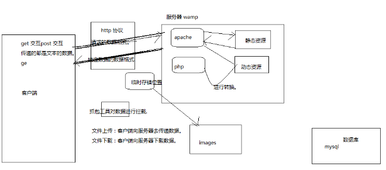
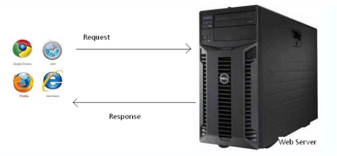
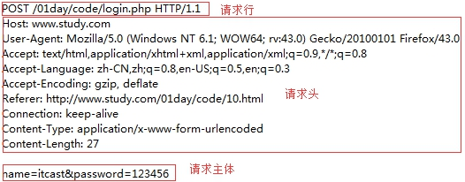
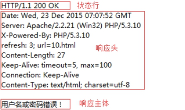
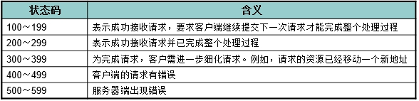
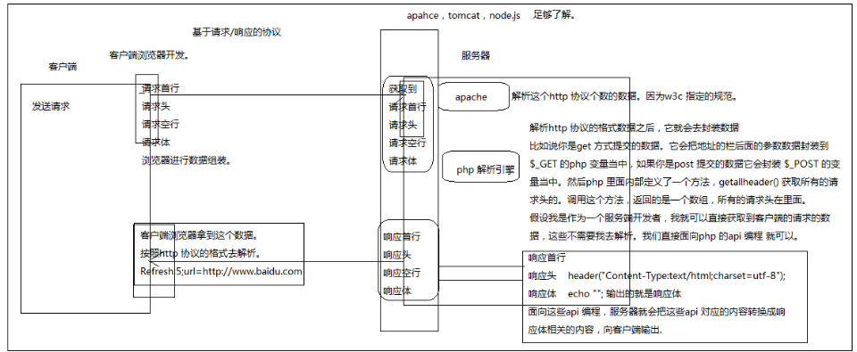

# 网络基础
##	IP 地址

所谓IP地址就是给每个连接在互联网上的主机分配的一个32位地址。(就像每部手机能正常通话需要一个号码一样)

查看本机IP地址 ping、ipconfig、ifconfig

公网ip，局域网ip

##域名

由于IP地址基于数字，不方便记忆，于是便用域名来代替IP地址，域名是一个IP地址的“面具”

查看域名对应的IP地址 ping、tracert。

DNS服务

DNS记录了 IP 地址和域名的映射（对应）关系；

查找优先级 本机hosts文件、DNS服务器。

##	端口

端口号是计算机与外界通讯交流的出口，每个端口对应不同的服务。

现实生活中，银行不同的窗口办理不同的业务。

查看端口占用情况 netstat -an。

常见端口号 80、8080、3306、21、22。

##客户端：
具有向服务器索取服务能力的终端，如比如 手机、电脑等，通过安装不同的客户端软件，可以获取不同的服务，
比如通过QQ获得即时通讯服务、通过迅雷获得下载服务等。常见的客户端软件：浏览器、QQ、迅雷、Foxmail等。
以浏览器为宿主环境，结合 HTML、CSS、Javascript等技术，而进行的一系列开发，通常称之为前端开发。
服务端：
服务器是对外提供服务的计算机

##计算机要提供服务：
计算机+操作系统（windows，linux，unix）+ 安装应用软件来提供服务,通过安装不同类型的应用软件来提供不同类型的服务。
学习的web，我就要对外提供web 服务。需要安装web 服务器软件。,需要安装一个apche 软件来提供web 服务

##服务器
+	计算机+操作系统+apahce,我要对外提供服务，必须占用一个端口对外提供服务
 默认的是占用的80端口对外提供的服务的
        提供即时通讯的服务，邮件服务
        可以装不同的应用软件去占用不同的端口对公服务.
      一台计算机大概有5w 多个端口.

+	我要搭建一个web 服务器，公网的，搭建可以访问的。我写一个页面上面。
  阿里云，腾讯也做了一个腾讯云.


##资源分为两种类型的资源
+	静态资源：静态资源是可以直接被浏览器解析的 html,css,js,img,video
+	动态资源： hp,jsp,asp。

+	客户端去请求服务器，实际上请求的是服务器上面的资源，资源就是一些文件
服务器就会根据我访问的地址进行查找。
如果找到静态资源，就直接响应给浏览器客户端。
如果找到动态资源，就会在服务器把动态资源转换成静态资源。响应给客户端浏览器.

+	静态资源是在客户端浏览器运行的。
+	动态资源是在服务器被解析运行的.

+	客户端跟服务器进行交互
客户端给浏览器发送请求，服务器给客户端响应数据。
对话的。

+	客户端： 怎么发送请求

```text
客户端发送请求
    1：地址栏输入地址.  get
    2：超链接  get
    3：表单   get 请求  post 请求。
发送请求有两种方式，常见.
    1:get
    2:post
发送数据到服务器的，数据是以参数的形式到服务器的。
参数是以参数名以及参数值到服务器的。

```
       
+	服务器： 怎么处理

```text
    1：接收请求（接收客户端的数据）
    2：处理数据（往数据库里面进行操作）
    3：给客户端浏览器一个响应.
```

## 网络通讯协议

  指服务器和客户端间进行通信时的约束和规范，客户端与服务端的数据交互并不是杂乱无章的，需要遵照（基于）一定的规范进行。

  

###常见协议

  1、HTTP、HTTPS 超文本传输协议 

  2、FTP 文件传输协议

  3、SMTP 简单邮件传输协议

  4、即时通讯协议XMPP

### http 协议 

  即超文本传输协议，网站是基于HTTP协议的，例如网站的图片、CSS、JS等都是基于HTTP协议进行传输的。

  HTTP协议是由从客户机到服务器的请求(Request)和从服务器到客户机的响应(Response)进行了约束和规范。

  即HTTP协议主要由请求和响应构成。

   

  常用请求方法 POST、GET、PUT、DELETE

###  **请求/请求报文**

  请求由客户端发起，其规范格式为：请求行、请求头、请求主体。

   

+	1、请求行

   

  由请求方式、请求URL和协议版本构成

+	2、请求头

  Host：localhost请求的主机

  Cache-Control：max-age=0控制缓存

  Accept：*/* 接受的文档MIME类型

  User-Agent：很重要

  Referer：从哪个URL跳转过来的

  Accept-Encoding：可接受的压缩格式

+	3、请求主体

  即传递给服务端的数据

  **注：当以post形式提交表单的时候，请求头里会设置**

  **Content-Type: application/x-www-form-urlencoded，以get形式当不需要**

  特殊的请求头介绍：

  Content-Type:""

  referer: 请求头

  refresh 响应头

  Content-Type: 响应头

### **响应/响应报文**

  响应由服务器发出，其规范格式为：状态行、响应头、响应主体。

   

+	1、状态行

   

  由协议版本号、状态码和状态信息构成

+	2、响应头

  Date：响应时间

  Server：服务器信息

  Content-Length：响应主体长度

  Content-Type：响应资源的MIME类型

  **MIME是标识文件类型的，文件后缀并不能正确无误的标识文件的类型。**

  **客户端与服务器在进行数据传输的时候都是以字节形式进行的，咱们可以理解成是以“文本形式”传输，这时浏览器就需要明确知道该怎么样来解析这些文本形式的数据，MIME就是明确告知浏览器该如何来处理。**

+	3、响应主体

  即服务端返回给客户端的内容；

  状态码

   

  常见的有200代表成功、304文档未修改、403没有权限、404未找到、500服务器错误,302 代表的是请求重定向。

  ####**调试工具**

  利用HTTP抓包工具在开发中可以帮我们进行调试，常用抓包工具HttpWatch、Fiddler、Charles、FireBug等

  **浏览器插件**

  Firebug、HttpWatch、chrome dev tools

  **代理软件**

  Charles、Fiddler

### get 请求与post 请求介绍

1.	get 发送的数据都在地址栏当中，不安全
2.	get 发送的数据对数据大小由限制。
3.	get 没有请求体
4.	post 发送的数据在请求体当中，相对安全
5.	post 对请求的数据的大小没有限制
6.	post 有一个特殊的请求头 Content-Type:application/x-www-form-urlencoded
7.	get 的请求头相对较少，性能稍微要高一些.

```
案例1
        //解决乱码，给客户端一个响应头
        header("Content-Type:text/html;charset=utf-8");
        //1:获取请求头 获取所有的请求头.
          $arrHeader=getallheaders();
        //2:我获取的是User-Agent 请求头对应的值
          $headeValue=$arrHeader["User-Agent"];
         // echo $headeValue;
        //3:php 里面有一个函数 strstr() 判断字符串是否包含指定的字符串.
        if(strstr($headeValue,"Chrome")){
             echo "您当前使用的google 浏览器，棒棒哒!";
        }else if(strstr($headeValue," Firefox")){
             echo "您当前使用的火狐 浏览器，双击666";
        }else if(strstr($headeValue,"MSIE")){
             echo "您当前使用的浏览器版本较低，请<a href='http://www.360.com'>升级</a>";
        }
```

```
案例2
<?php
        header("Content-Type:text/html;charset=utf-8");
        //1:给一个响应头
        header("Refresh:5;url=http://www.baidu.com");
        //2：给文字提示.
        echo " <span>5</span> 秒钟之后会自动跳转页面，如果没有跳转，请点击<a 		href='http://www.baidu.com'>这里</a>";
?>
<script>
                var i=5;
                var ids=window.setInterval(function(){
                        i--;
                        if(i==0){
                                window.clearInterval(ids);
                                return;
                        }
                        document.querySelector("span").innerHTML=i;
                },1000);
</script>
```

#### http 协议详解



###	http 协议：
协议就是规范，是用来约束双方。
http 协议 它是超文本传输协议。
约束的是客户端浏览器与服务器进行通讯的一个标准。
客户端与服务器通讯是基于请求和响应的。
客户端发送一个请求给服务器，服务器给客户端一个响应. http 协议
客户端与服务器进行交互，交互的目的就是传递数据。
http 协议 就是约束客户端与服务器之间进行传递的数据格式.

http 协议的数据格式分为两块去进行分析

客户端发送到服务器的请求，称为请求的数据格式.

+	我们可以把请求的数据格式分为四部分
1.	请求首行
2.	请求头
3.	请求空行
4.	请求体

+	get 请求的数据格式.

```js
	1: 请求首行
	GET 请求的提交方式
	/day_02/code/01_fileupload.html  根据地址去找服务器上面的资源.
	HTTP/1.1 定义的协议的版本.
	GET /day_02/code/01_fileupload.html?username=zhangsan&age=11 HTTP/1.1
	主机地址:127.0.0.1
	Host	127.0.0.1
	Upgrade-Insecure-Requests	1
	//告诉服务器客户端浏览器的版本，以及操作系统的版本.
	User-Agent	Mozilla/5.0 (Windows NT 6.1; Win64; x64) AppleWebKit/537.36 (KHTML, like Gecko) Chrome/67.0.3396.87 Safari/537.36
	//接收，告诉服务器，我客户端接收的数据格式.
	Accept	text/html,application/xhtml+xml,application/xml;q=0.9,image/webp,image/apng,*/*;q=0.8
	//告诉服务器，我的请求来自于那个页面.
	Referer	http://127.0.0.1/day_02/code/
	//接收的服务器的压缩类型
	Accept-Encoding	gzip, deflate, br
	//接收的语言。
	Accept-Language	zh-CN,zh;q=0.9,ko;q=0.8,zh-HK;q=0.7
	//版本匹配
	If-None-Match	"2a000000005186-273-56efe0a46c0d8"
	//修改
	If-Modified-Since	Tue, 19 Jun 2018 12:44:16 GMT
	
	POST 请求的数据格式
	请求首行
	POST /day_02/code/api/02_post.php HTTP/1.1
	
	//请求头 请求头的名称 以及请求头的值。
	Host	127.0.0.1
	Content-Length	15
	Cache-Control	max-age=0
	Origin	http://127.0.0.1
	Upgrade-Insecure-Requests	1
	//POST 提交有一个默认的请求头 Content-Type  application/x-www-form-urlencoded
	Content-Type	application/x-www-form-urlencoded
	User-Agent	Mozilla/5.0 (Windows NT 6.1; Win64; x64) AppleWebKit/537.36 (KHTML, like Gecko) Chrome/67.0.3396.87 Safari/537.36
	Accept	text/html,application/xhtml+xml,application/xml;q=0.9,image/webp,image/apng,*/*;q=0.8
	Referer	http://127.0.0.1/day_02/code/01_fileupload.html
	Accept-Encoding	gzip, deflate, br
	Accept-Language	zh-CN,zh;q=0.9,ko;q=0.8,zh-HK;q=0.7
	请求空行
	
	请求体
	lifephoto	WWWWW

```

###get 方式提交跟post 方式提交的具体的区别:
    1: get 发送的数据都在地址栏当中，不安全 ，请求的参数在地址栏当中
    2：get 发送的数据对数据大小有限制。 请求的参数在地址栏当中
    3：get 没有请求体，请求的参数在地址栏当中
    4：post 发送的数据在请求体当中，相对安全
    5：post 对请求的数据的大小没有限制，文件上传就必须使用post
    6：post 有一个特殊的请求头 Content-Type:application/x-www-form-urlencoded
    7: get 的请求头相对较少，性能稍微要高一些.
    
####服务器响应到客户端的内容，称为响应的数据格式.
    响应的数据格式是服务器发送到客户端的。
    响应首行
    响应头
    响应空行
    响应体

```js
响应首行
HTTP/1.1 200 OK
服务器的事件
Date	Tue, 19 Jun 2018 13:45:04 GMT
Server	Apache/2.2.21 (Win32) PHP/5.3.10
//文件的最后修改文件
Last-Modified	Tue, 19 Jun 2018 13:30:43 GMT
//文件的版本.
ETag	"3600000000518d-253-56efeb066168b"
//字节
Accept-Ranges	bytes
//告诉客户端浏览器，响应体的长度.
Content-Length	595
//告诉客户端浏览器，响应的数据格式.  text/html
Content-Type	text/html

//响应体.
<!DOCTYPE html>
<html lang="en">
<head>
    <meta charset="UTF-8">
    <title>Title</title>
</head>
<body>
        <!--
        文件上传客户端的处理
                1:文件上传必须表单提交
                2：必须是post 方式提交
                3：表单属性  encType="multipart/form-data"
                4：input type="file"
        -->
        <form action="./api/02_post.php" method="post">
             照片:<input type="text" name="lifephoto"> <br> <br>
                <input type="submit" value="上传">
        </form>
</body>
</html>
```

###介绍里面一些常用的.
+	请求头:告诉服务器，客户端浏览器的版本，以及操作系统的版本.
      User-Agent	Mozilla/5.0 (Windows NT 6.1; Win64; x64) AppleWebKit/537.36 (KHTML, like Gecko) Chrome/67.0.3396.87 Safari/537.36

      案例：
            当客户端访问服务器，服务器获取到客户端浏览器的版本，告诉客户端浏览器，您当前使用的浏览器的版本.
            如果是chrome 您当前使用的google 浏览器
            如果使用的firefox ，您当前使用的火狐 浏览器
            如果使用的IE，您当前使用的浏览器版本较低，请<a href="">升级</a>

      响应头，服务器给客户端
      Refresh
      告诉客户端浏览器，几秒钟之后去跳转某个具体的页面 。
      
##http 协议的内容梳理
+	http 协议
	1.	基于请求响应的协议
	2.	协议是用来约束客户端浏览器服务器进行数据通讯的标准
	3.	协议数据分为两部分
    	1.	客户端发送到服务器的数据称为请求的数据格式
           +	请求首行
           +	请求头
           +	请求空行
           +	请求体
       2.	服务器响应到客户端的数据称为响应的数据格式
           +	响应首行
           +	响应头
           +	响应空行
           +	响应体

##get 提交与post 提交的区别:
1.	get 发送的数据都在地址栏当中，不安全
2.	get 发送的数据对数据大小由限制。
3.	get 没有请求体
4.	post 发送的数据在请求体当中，相对安全
5.	post 对请求的数据的大小没有限制
6.	post 有一个特殊的请求头 Content-Type:application/x-www-form-urlencoded
7.	get 的请求头相对较少，性能稍微要高一些.
8.	案例：
   +	基于User-Agent 请求头的案例，向客户端输出浏览器的版本
   +	基于Refresh 响应头的案例，告诉客户端几秒之后跳转
##响应的状态吗
1.	200 代表ok 响应成功
2.	404 请求的资源没有找到，请求路径写错出现这个问题
3.	500 服务器内部错误
4.	304 请求的文件没有改变
5.	302 请求重定向.

