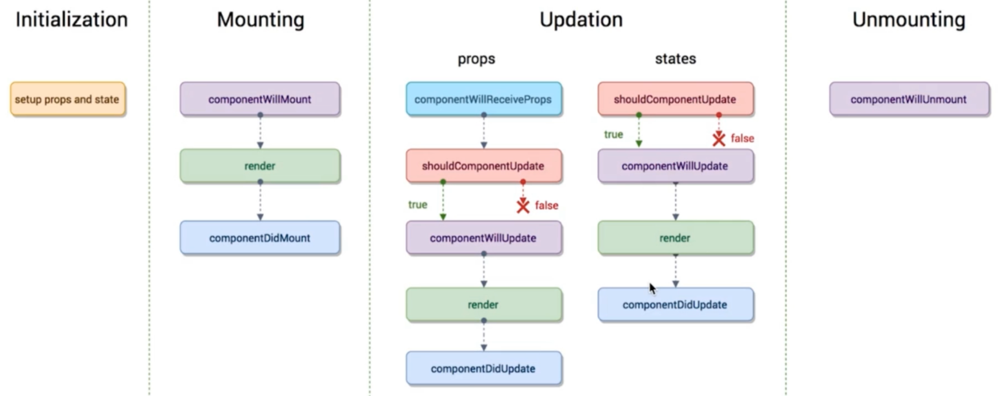

#		React简书
+	13年推出 比较早
+ 	函数式编程
+  使用人事最多的框架
+  健全的文档与完善的社区

##		16版本之后称之为ReactFiber 

##		创建项目
```js
npx create-react-app my-app
cd my-app
npm start
```

##		组件
+	网页可以拆分成很多部分,每个部分都是组件,或者组件的集合

##		Fragment 占位符组件
+	在平时写代码的时候知道, react 多个元素外面必须有一个元素来包裹他们,但是生成的dom节点就会多一层
+ 	有些时候我们不想要这个元素,但是还要满足react的要求
+  在React16 提出了  Fragments 允许你将子列表分组，而无需向 DOM 添加额外节点
+	还可以使用短语法

```js
render() {
    return (
      <>
        <td>Hello</td>
        <td>World</td>
      </>
    );
  }
```

##		响应式设计和事件绑定
+	关注点从dom 切换到数据上

##	this.setState
```js
this.setState((preState)=> ({
	item: prevState.item
}))
```


##		props校验
```js
List.propTypes = {
	onDeleteItem: PropTypes.func,
	context: PropTypes.string,
	text: PropTypes.string.isRequired
}
List.defaultProps = {
  text: 'hello',
}
```

###	更详细
```js
  // 你可以将属性声明为 JS 原生类型，默认情况下
  // 这些属性都是可选的。
  optionalArray: PropTypes.array,
  optionalBool: PropTypes.bool,
  optionalFunc: PropTypes.func,
  optionalNumber: PropTypes.number,
  optionalObject: PropTypes.object,
  optionalString: PropTypes.string,
  optionalSymbol: PropTypes.symbol,

  // 任何可被渲染的元素（包括数字、字符串、元素或数组）
  // (或 Fragment) 也包含这些类型。
  optionalNode: PropTypes.node,

  // 一个 React 元素。
  optionalElement: PropTypes.element,

  // 你也可以声明 prop 为类的实例，这里使用
  // JS 的 instanceof 操作符。
  optionalMessage: PropTypes.instanceOf(Message),

  // 你可以让你的 prop 只能是特定的值，指定它为
  // 枚举类型。
  optionalEnum: PropTypes.oneOf(['News', 'Photos']),

  // 一个对象可以是几种类型中的任意一个类型
  optionalUnion: PropTypes.oneOfType([
    PropTypes.string,
    PropTypes.number,
    PropTypes.instanceOf(Message)
  ]),

  // 可以指定一个数组由某一类型的元素组成
  optionalArrayOf: PropTypes.arrayOf(PropTypes.number),

  // 可以指定一个对象由某一类型的值组成
  optionalObjectOf: PropTypes.objectOf(PropTypes.number),

  // 可以指定一个对象由特定的类型值组成
  optionalObjectWithShape: PropTypes.shape({
    color: PropTypes.string,
    fontSize: PropTypes.number
  }),

  // 你可以在任何 PropTypes 属性后面加上 `isRequired` ，确保
  // 这个 prop 没有被提供时，会打印警告信息。
  requiredFunc: PropTypes.func.isRequired,

  // 任意类型的数据
  requiredAny: PropTypes.any.isRequired,
   // 你可以指定一个自定义验证器。它在验证失败时应返回一个 Error 对象。
  // 请不要使用 `console.warn` 或抛出异常，因为这在 `onOfType` 中不会起作用。
  customProp: function(props, propName, componentName) {
    if (!/matchme/.test(props[propName])) {
      return new Error(
        'Invalid prop `' + propName + '` supplied to' +
        ' `' + componentName + '`. Validation failed.'
      );
    }
  },

  // 你也可以提供一个自定义的 `arrayOf` 或 `objectOf` 验证器。
  // 它应该在验证失败时返回一个 Error 对象。
  // 验证器将验证数组或对象中的每个值。验证器的前两个参数
  // 第一个是数组或对象本身
  // 第二个是他们当前的键。
  customArrayProp: PropTypes.arrayOf(function(propValue, key, componentName, location, propFullName) {
    if (!/matchme/.test(propValue[key])) {
      return new Error(
        'Invalid prop `' + propFullName + '` supplied to' +
        ' `' + componentName + '`. Validation failed.'
      );
    }
  })
```

##		state, props, render
+	当state 或者props 发生改变的时候, render函数就会执行
+ 	为什么数据发生改变页面上的内容会跟着改变
	-	因为状态修改就会执行render函数
	- 	而页面内容是render函数渲染出来的,当重新渲染的时候拿到的就是最新的值
+	父组件的render函数被执行,那么子组件的render 也会执行

##		虚拟DOM
+	虚拟DOM就是一个js对象,用来描述dom结构
	-	当第一次渲染的时候会生成虚拟DOM
	- 	当数据发生改变, 又会生成一个新的虚拟DOM
	-  	然后新旧虚拟dom进行对比, 找出差异, 然后针对差异进行替换渲染
+	写 jsx => React.createElement => 虚拟dom => 真实dom

###	优点
+	性能提升了(真实dom比对, 换成了虚拟dom比对)

###	Diff算法
+	虚拟dom在进行比较的时候会逐层比较, 如果一层的又差异, 就不会继续比较下面的子节点,而是把这一层以及子节点都换成新的虚拟dom
+ 	当循环时, 需要给每个子元素key值, 这个key值要稳定,不要使用index
	-	因为 index是下标, 当其中一个被删除之后, 子元素和index的对应关系就发生了变化, 性能变差

##		ref

```js
// 将input这个dom元素绑定到this.input上, 这样就可以操作这个dom元素, 非常不建议使用
<input ref={(input) => {this.input = input}}/>
```


##		生命周期函数
+	在某一个时刻组件会自动执行的函数



+	componentWillReceiveProps
	-	子组件从父组件接收参数
	- 	当父组件的render被重新执行了执行了, 子组件的componentWillReceiveProps 就会执行


##		 项目总结
###		Fragment 的使用
+	以前写代码最外层都是嵌套一层没用的div
+ 	现在可以使用Fragment 组件占位, 并且不会生成一个dom节点

```js
function App() {
  return (
    <Fragment>
      <GlobalStyle/>
      <IconWrap/>
      <Provider store = {store}>
        <BrowserRouter>
          <Route path="/"             exact component={Home}/>
          <Route path="/login"        exact component={Login}/>
        </BrowserRouter>
      </Provider>
    </Fragment>
  );
}
```

###	store的创建
```js
import { createStore, compose, applyMiddleware } from 'redux';
import thunk from 'redux-thunk'
import reducer from './reducer'

//	浏览器需要安装react-devtools插件
const composeEnhancers = window.__REDUX_DEVTOOLS_EXTENSION_COMPOSE__ || compose
const store = createStore(reducer, /* preloadedState, */ composeEnhancers(
  applyMiddleware(thunk)
))
export default store 
```

###	reducer的创建
+	reducer是所有reducer纯函数的总集
+ 	可以使用combineReducers 函数将所有的分散在业务组件中的reducer 组合起来

```js
import { combineReducers } from 'redux-immutable'
import {reducer as headerReducer} from '../common/header/store'
import {reducer as homeReducer} from '../pages/home/store'
import {reducer as detailReducer} from '../pages/detail/store'
import {reducer as loginReducer } from '../pages/login/store'

export default combineReducers({
  header: headerReducer,
  home: homeReducer,
  detail: detailReducer,
  login: loginReducer
})
```

###	传值问题
+	所有的状态数据都统一放在store里,
+ 	这就有一个问题: 每个业务组件如何获取store的数据呢

```js
// 1. 首先是Provider 组件, 他是最外层的组件, 
//	在他内部的组件都可以用特殊的方式获取store数据
<Provider store = {store}>
	<BrowserRouter>
	  <Route path="/"             exact component={Home}/>
	  <Route path="/login"        exact component={Login}/>
	</BrowserRouter>
</Provider>

//2.connect 桥梁
//	当需要获取数据的时候需要使用connect 函数, 
//	他可以把ui组件转换成容器组件, 且将你需要的状态或者方法传入到这个组件中
import {connect} from 'react-redux'
// 将需要使用的状态,提去出来
const mapStateToProps = (state) => {
  return {
    title: state.getIn(['detail', 'title']),
    content: state.getIn(['detail', 'content'])
  }
}
//	将需要派发的函数,统一声明
const mapDispatchToProps = (dispatch) => {
  return {
    getDetail(id){
      dispatch(actionCreator.getDetail(id))
    }
  }
}
//3 . 最重要的一点, 将组件转换为容器组件
export default connect(mapStateToProps, mapDispatchToProps)(Detail)
```

###	redux项目的套路模块
+	需要用dispatch统一派发的action 统一抽离为actionCreator

```js
import * as contants from './contants'
/** 暴露函数 */
export const toggleTopShow = (show) => {
  return ({
    type: contants.TOGGLE_SCROLL_TOP,
    show
  })
}
```

+	将type抽离成常量

```js
export const CHANGE_HOME_INFO = 'home/CHANGE_HOME_INFO'
export const ADD_ARTICLE_LIST = 'home/ADD_ARTICLE_LIST'
export const TOGGLE_SCROLL_TOP = 'home/TOGGLE_SCROLL_TOP';
```

+	处理数据的纯函数reducer

```js
import { fromJS } from 'immutable'
import * as contants from './contants'
// 初始化状态
const defaultState = fromJS({
  topicList: [],
})
// 修改state 并不是直接修改state,
const changeHomeInfo = (state,action) => {
  return state.merge({
    topicList: action.topicList,
  })
}

export default (state = defaultState, action) => {
  switch(action.type){
    case contants.CHANGE_HOME_INFO:
      return  changeHomeInfo(state,action)
    default:
      return state
  }
}
```

+	可以将这些统一引入到index.js文件中, 然后统一向外暴露

```js
import reducer from './reducer'
import * as actionCreator from './actionCreator'
export  {reducer, actionCreator}
```

###	css in React
+	使用 styled-components 第三方库,实现创建dom元素
+	业务组件中直接使用这个组件,就会携带样式

```js
import styled from 'styled-components';

export const LoginWrapper = styled.div`
	z-index: 0;
	position: absolute;
	left: 0;
	right: 0;
	bottom: 0;
	top: 56px;
	background: #eee;
`;

render() {
    return (
      <HomeWrapper>
        <HomeLeft>
			 <List />
		  </HomeLeft>	
      </HomeWrapper>
    )
  }
```

###	immutable.js
+	官方说, state的状态值是不能改变的,所以使用 immutable 就完全实现不可更改

```js
//	fromJS转换的已经不是不用对象了 而是immutable 对象, 
//	所以更改的时候也要转换为immutable对象
import { fromJS } from 'immutable'
const defaultState = fromJS({
  focused: false,
})

// 当需要修改state的时候
state.set('login',action.login)

// 当需要修改很多个state的时候
state.merge({
    articleList:state.get('articleList').concat(fromJS(action.articleList)),
    articlePage: action.nextPage
})

// 当需要获取state的时候
state.getIn(['home','showScroll'])
state.get('home').get('showScroll')
```

###	优化
+	当父组件的状态改变的时候, 子组件也会跟着渲染
+ 	所以,有一些子组件的渲染是没有必要的,且浪费性能
+  组件可以继承 PureComponent , 他底层实现了shouldComponentUpdate, 提升了性能


