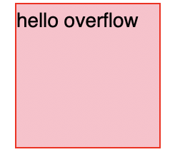
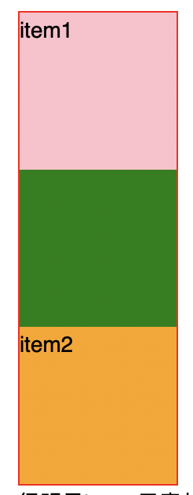
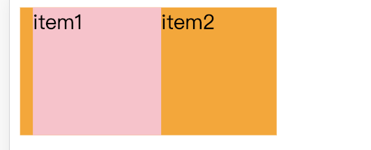
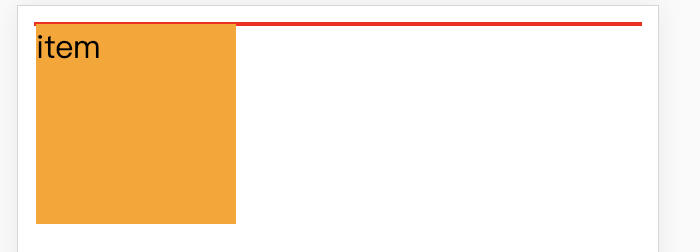
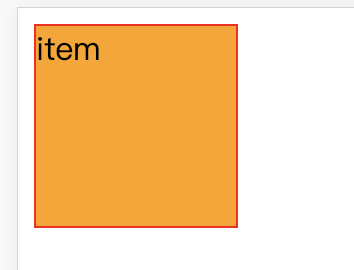
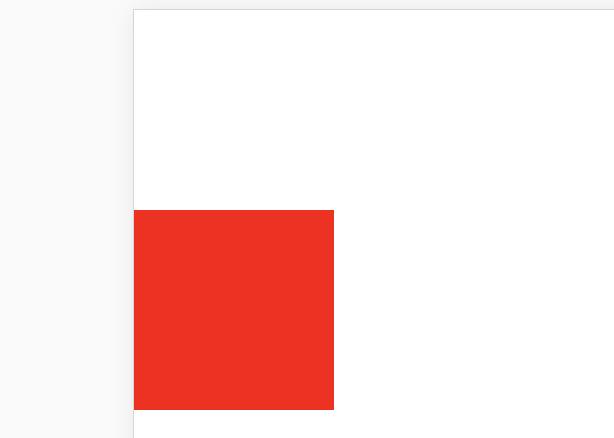

## overflow
1.	visible 不对超出的内容进行处理
2. hidden 剪切超出的内容
3. scroll 不管内容是否超出,都显示滚动条
4. auto 超出显示滚动条

### 实例
1.	如果子元素浮动了,可以在父元素上使用overflow:hidden 清除浮动



```js
 .box{
    border: 1px solid red;
    overflow: hidden;
  }
  .item {
    float: left;
    width: 100px;
    height: 100px;
    background-color: pink;
  }
  
<div class="box">
    <div class="item">
      hello overflow
    </div>
</div>
```

子元素浮动了,导致父元素无法自适应子元素的高度


## BFC
### 特点
1.	在一个块格式化上下文中,块框会朝着垂直方向一个接一个的排列,从包含框的定不开始,如果两个及以上的框在同一个块格式化上下文中,那么他们相邻垂直方向的margin会合并成一个,值由大的那个决定



```js
 .box{
    width:100px;
    background-color: green;
  }

  .box > div {
    width: 100px;
    height: 100px;
  }

  .item1 {
    margin-bottom: 50px;
    background-color: pink;
  }

  .item2{
    margin-top: 100px;
    background-color: orange;
  }
  
  <div class="box">
	  <div class="item1">item1</div>
	  <div class="item2">item2</div>
	</div>
```

很明显item1元素从包含快box的顶部开始摆放,他和item2垂直排列,item1和item2相邻垂直方向的margin合并了

2.	在一个块格式化上下文中,盒子从包含快的最左边摆放,即使存在浮动,也还是靠在最左边



```js

  .item11 {
    float:left;
    width: 100px;
    height: 100px;
    margin-left: 10px;
    background-color: pink;
  }
  .item21 {
    width: 200px;
    height: 100px;
    background-color: orange
  }


<div class="box">
  <div class="item11">item11</div>
  <div class="item21">item21</div>
</div>
```

2.在一个块格式化上下文中, 包含块包含所有元素但不包含创建了新块格式化上下文的元素




```js
 .box {
    border: 1px solid red;
    position: absolute;
  }
  .item1 {
    float:left;
    width: 100px;
    height: 100px;
    background-color: orange;
  }

<div class="box">
  <div class="item1">item</div>
</div>
```

图1 当子元素使用了float脱离标准流,所以包含块中将不包含他
图2 用绝对定位给父元素重新创建块格式化上下文,所以包含块包含了他


##折叠外边距
在css中如果有两个或以上的盒子他们之间的相邻外边距可以被合并成一个外边距,这种合并的外边距成为折叠外边距



```js
  body {
    margin: 0
  }

  div{
    width:100px;
    height:100px;
  }

  .box{
    margin-top: 50px;
    background-color: orange
  }

  .item{
    margin-top: 100px;
    background-color: red
  }
  </style>
  <body>
    
    <div class="box">
      <div class="item"></div>
    </div>
```

### 注意
1.	根元素html的外边距是不折叠
2. 不用必须是兄弟元素,子元素和父元素垂直方向的外边距也会折叠
3. 水平外边距不会折叠
4. 当有多个子元素时,只有第一个元素的margin-top和最后一个元素的margin-bottom会和父元素外边距折叠(元素没有宽和高的情况除外)
5. 如果子元素同时是另一个元素的父元素,那么同样会出现外边距折叠的情况
6. 负的外边距折叠,会从正的相邻外边距的最大值中扣除响铃外边距的绝对值的最大值
7. 创建了新块格式化上下文的元素不会出现外边距折叠


